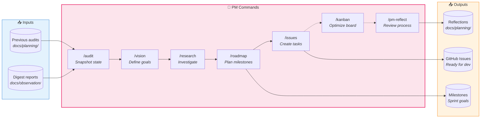
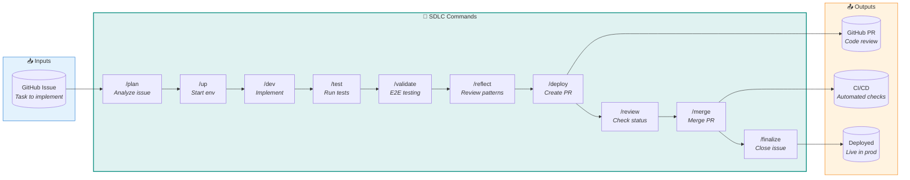
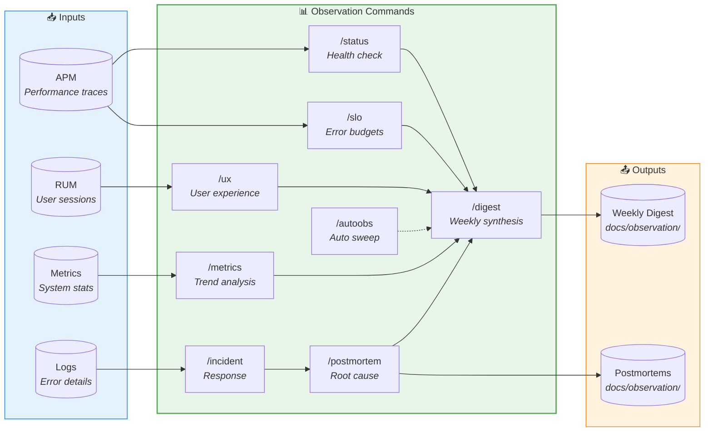
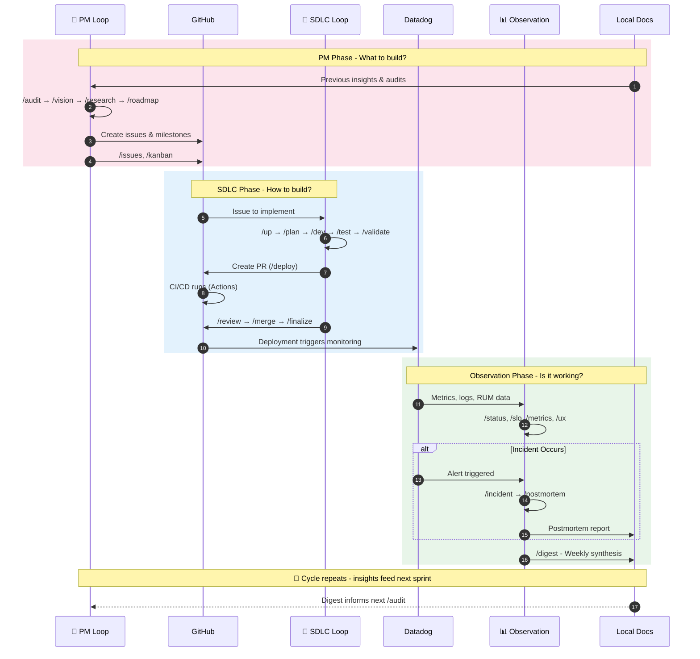

# Claude Code Commands for Vertical Farm

Production-ready commands and workflows specifically configured for the Vertical Farm Management Platform.

## 🔄 Workflow Overview

Three interconnected loops form a continuous cycle: **Plan → Build → Observe → Plan...**

### System Diagram 

Shows `Input → Process → Output` for each process loop.

#### 🎯 PM Loop — What to build?



More details: [PM Commands](tools/01_project_management/README.md)

#### 🔧 SDLC Loop — How to build?



More details: [SDLC Commands](tools/02_development/README.md)

#### 📊 Observation Loop — Is it working?



More details: [Observation Commands](tools/03_observation/README.md)

### Artifact Flow

How artifacts flow between loops and systems during a development cycle:



**Cycle Summary:**
1. **PM** reads docs → plans work → creates GitHub issues
2. **SDLC** picks up issue → develops → ships via PR/CI
3. **Observation** monitors Datadog → writes insights to docs
4. **Repeat**: insights inform next PM planning cycle

### Command Reference

Each slash command has specific inputs, processes, and outputs. These tables provide quick reference for what each command does internally.

#### PM Loop Commands

| Command | Purpose | Input | Process | Output |
|---------|---------|-------|---------|--------|
| [`/audit`](tools/01_project_management/audit.md) | Snapshot project state | None | [project-audit](workflows/00_project_management/project-audit.md), Explore agent | `docs/planning/audits/{date}.md` |
| [`/vision`](tools/01_project_management/vision.md) | Define product goals | User prompts | [vision-definition](workflows/00_project_management/vision-definition.md) | `docs/planning/vision.md` |
| [`/research`](tools/01_project_management/research.md) | Deep research | Topic argument | [deep-research](workflows/00_project_management/deep-research.md), search-specialist | `docs/planning/research/{date}-{topic}.md` |
| [`/roadmap`](tools/01_project_management/roadmap.md) | Plan milestones | None | [roadmap-planning](workflows/00_project_management/roadmap-planning.md) | `docs/planning/roadmap.md`, GitHub milestones |
| [`/issues`](tools/01_project_management/issues.md) | Generate GitHub issues | User confirmation | [issue-generation](workflows/00_project_management/issue-generation.md) | GitHub issues with labels/milestones |
| [`/kanban`](tools/01_project_management/kanban.md) | Optimize board | User direction | [kanban-optimization](workflows/00_project_management/kanban-optimization.md) | Board updates, health report |
| [`/pm-reflect`](tools/01_project_management/pm-reflect.md) | Review PM effectiveness | None | [pm-reflection](workflows/00_project_management/pm-reflection.md), business-analyst | `docs/planning/reflections/{date}.md` |

#### SDLC Loop Commands

| Command | Purpose | Input | Process | Output |
|---------|---------|-------|---------|--------|
| [`/up`](tools/02_development/up.md) | Start dev environment | None | Supabase, Docker, health checks | Running services, `.env.local` |
| [`/plan`](tools/02_development/plan.md) | Analyze issue | Issue # or URL | Agent orchestration (inline) | Implementation plan, updated issue |
| [`/dev`](tools/02_development/dev.md) | Feature development | Issue # or description | Agent orchestration (inline) | Code changes, tests |
| [`/test`](tools/02_development/test.md) | Run local CI | `--quick`, `--security` | nektos/act (GitHub Actions locally) | Test results, artifacts |
| [`/validate`](tools/02_development/validate.md) | E2E validation | Issue # | Agent orchestration (inline) | Validation report, screenshots |
| [`/reflect`](tools/02_development/reflect.md) | Development reflection | Commits, scope | Agent orchestration (inline) | `.claude/reports/reflections/{date}.md` |
| [`/deploy`](tools/02_development/deploy.md) | Create PR | Issue # | Agent orchestration (inline) | GitHub PR with review guide |
| [`/review`](tools/02_development/review.md) | Check PR status | PR # | code-reviewer agent | Review summary, PR comments |
| [`/merge`](tools/02_development/merge.md) | Merge PR | PR #, strategy | Pre-merge validation, `gh pr merge` | Merged PR, local sync |
| [`/finalize`](tools/02_development/finalize.md) | Close issue | Issue # | Agent orchestration (inline) | Issue closed, prompting log |
| [`/pipeline`](tools/02_development/pipeline.md) | Debug CI failures | PR # | Agent orchestration (inline) | Applied fixes, re-triggered workflow |

#### Observation Loop Commands

| Command | Purpose | Input | Process | Output |
|---------|---------|-------|---------|--------|
| [`/status`](tools/03_observation/status.md) | System health check | None | Health endpoints, alert queries | Service status table, trends |
| [`/slo`](tools/03_observation/slo.md) | Error budget tracking | Service (optional) | 30-day SLO calculation, burn rate | Budget table, forecast |
| [`/metrics`](tools/03_observation/metrics.md) | Trend analysis | Scope (optional) | 4-week baseline, anomaly (>2σ) | Metric tables, anomaly report |
| [`/ux`](tools/03_observation/ux.md) | User experience | None | RUM data, journey completion | Session stats, UX score |
| [`/incident`](tools/03_observation/incident.md) | Incident response | `new` or ID | Severity classification, timeline | `docs/observation/incidents/INC-{id}.md` |
| [`/postmortem`](tools/03_observation/postmortem.md) | Incident postmortem | Incident ID | 5 Whys, impact calculation | `docs/observation/postmortems/PM-{id}.md` |
| [`/digest`](tools/03_observation/digest.md) | Weekly synthesis | None | Aggregates metrics, UX, incidents | `docs/observation/digests/{date}.md` |
| [`/autoobs`](tools/03_observation/autoobs.md) | Autonomous sweep | None | Runs: status→slo→metrics→ux→digest | Complete state, digest |

## 📁 Directory Structure

```
.claude/commands/
├── README.md                       # This file
└── tools/
    ├── 01_project_management/      # 🎯 PM Loop
    │   ├── audit.md
    │   ├── vision.md
    │   ├── research.md
    │   ├── roadmap.md
    │   ├── issues.md
    │   ├── kanban.md
    │   ├── pm-reflect.md
    │   └── autopm.md               # Autonomous PM sweep
    ├── 02_development/             # 🔧 SDLC Loop
    │   ├── up.md
    │   ├── plan.md
    │   ├── dev.md
    │   ├── test.md
    │   ├── validate.md
    │   ├── reflect.md
    │   ├── deploy.md
    │   ├── review.md
    │   ├── merge.md
    │   ├── finalize.md
    │   ├── pipeline.md
    │   └── autodev.md              # Autonomous dev cycle
    └── 03_observation/             # 📊 Observation Loop
        ├── status.md
        ├── slo.md
        ├── metrics.md
        ├── ux.md
        ├── incident.md
        ├── postmortem.md
        ├── digest.md
        └── autoobs.md              # Autonomous observation sweep
```