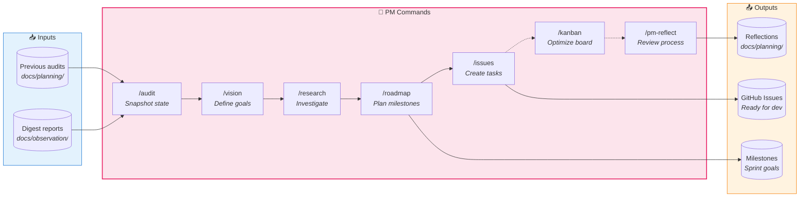

# Project Management Workflow Commands

Plan what to build. These commands form a continuous planning loop that feeds GitHub issues into the SDLC development loop.

## PM Loop — What to build?



## Commands

| Command | Purpose | Input | Process | Output |
|---------|---------|-------|---------|--------|
| [`/audit`](audit.md) | Snapshot project state | None | Agent orchestration (inline) | `docs/planning/audits/{date}.md` |
| [`/vision`](vision.md) | Define product goals | User prompts | Agent orchestration (inline) | `docs/planning/vision.md` |
| [`/research`](research.md) | Deep research | Topic argument | Agent orchestration (inline) | `docs/planning/research/{date}-{topic}.md` |
| [`/roadmap`](roadmap.md) | Plan milestones | None | Agent orchestration (inline) | `docs/planning/roadmap.md`, GitHub milestones |
| [`/issues`](issues.md) | Generate GitHub issues | User confirmation | Agent orchestration (inline) | GitHub issues with labels/milestones |
| [`/kanban`](kanban.md) | Optimize board | User direction | Agent orchestration (inline) | Board updates, health report |
| [`/pm-reflect`](pm-reflect.md) | Review PM effectiveness | None | Agent orchestration (inline) | `docs/planning/reflections/{date}.md` |
| [`/changelog`](changelog.md) | Generate weekly changelog | None | Agent orchestration (inline) | `docs/changelogs/{date}.md` |

## Command Parameters

| Command | Accepts | Examples |
|---------|---------|----------|
| `/audit` | No arguments | `/audit` |
| `/vision` | Interactive prompts | `/vision` |
| `/research` | Topic string (required) | `/research "auth patterns"`, `/research IoT` |
| `/roadmap` | No arguments | `/roadmap` |
| `/issues` | Optional milestone filter | `/issues`, `/issues v2.0` |
| `/kanban` | Optional action | `/kanban`, `/kanban stale`, `/kanban priorities` |
| `/pm-reflect` | No arguments | `/pm-reflect` |

## Workflow Patterns

| Pattern | When to Use | Commands |
|---------|-------------|----------|
| **Full Cycle** | Quarterly planning | `/audit` → `/vision` → `/research` → `/roadmap` → `/issues` |
| **Sprint** | Weekly planning | `/audit` → `/kanban` |
| **Ad-hoc Research** | Exploring a topic | `/research {topic}` → `/issues` |
| **Retrospective** | Process improvement | `/pm-reflect` → `/audit` |

## Output Locations

```
docs/planning/
├── vision.md              # Living vision document
├── roadmap.md             # Current roadmap
├── audits/
│   └── YYYY-MM-DD.md      # Project state snapshots
├── research/
│   └── YYYY-MM-DD-{topic}.md  # Research findings
└── reflections/
    └── YYYY-MM-DD.md      # PM retrospectives
```

## Handoff to SDLC Loop

After `/issues` creates GitHub issues, transition to development:

```
PM Loop: /issues creates #123
    ↓
SDLC Loop: /plan 123 → /dev 123 → /test → /validate 123 → /deploy 123
```

The PM loop defines **what** to build. The SDLC loop handles **how** to build it.
