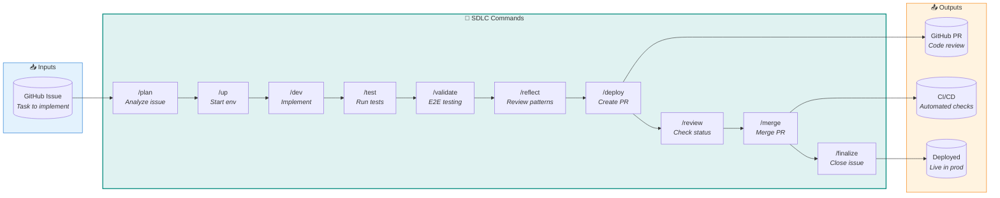

# Development Workflow Commands

Build features from GitHub issues. These commands form the development lifecycle from planning through deployment.

## SDLC Loop — How to build?



## Commands

| Command | Purpose | Input | Process | Output |
|---------|---------|-------|---------|--------|
| [`/up`](up.md) | Start dev environment | None | Supabase, Docker, health checks | Running services, `.env.local` |
| [`/plan`](plan.md) | Analyze issue | Issue # or URL | Agent orchestration (inline) | Implementation plan, updated issue |
| [`/dev`](dev.md) | Feature development | Issue # or description | Agent orchestration (inline) | Code changes, tests |
| [`/test`](test.md) | Run local CI | `--quick`, `--security` | nektos/act (GitHub Actions locally) | Test results, artifacts |
| [`/validate`](validate.md) | E2E validation | Issue # | Agent orchestration (inline) | Validation report, screenshots |
| [`/reflect`](reflect.md) | Development reflection | Commits, scope | [development-reflection](../workflows/maintenance/development-reflection.md) | `.claude/reports/reflections/{date}.md` |
| [`/deploy`](deploy.md) | Create PR | Issue # | Agent orchestration (inline) | GitHub PR with review guide |
| [`/review`](review.md) | Check PR status | PR # | code-reviewer agent | Review summary, PR comments |
| [`/merge`](merge.md) | Merge PR | PR #, strategy | Pre-merge validation, `gh pr merge` | Merged PR, local sync |
| [`/finalize`](finalize.md) | Close issue | Issue # | Agent orchestration (inline) | Issue closed, prompting log |
| [`/pipeline`](pipeline.md) | Debug CI failures | PR # | Agent orchestration (inline) | Applied fixes, re-triggered workflow |

## Workflow Patterns

| Pattern | When to Use | Commands |
|---------|-------------|----------|
| **Complete** | Full lifecycle | `/up` → `/plan` → `/dev` → `/test` → `/validate` → `/deploy` → `/review` → `/merge` → `/finalize` |
| **Standard** | Typical development | `/plan` → `/dev` → `/validate` → `/deploy` → `/merge` |
| **Quick** | Well-defined issues | `/dev` → `/test` → `/validate` → `/deploy` → `/merge` |
| **Standalone** | No GitHub issue | `/dev "feature"` → `/test` → `/validate` → `/deploy` |
| **PR Only** | PR ready for review | `/deploy` → `/review` → `/merge` → `/finalize` |

## Command Parameters

### Issue-based Commands
- Accept issue numbers: `123`
- Accept issue URLs: `https://github.com/user/repo/issues/123`
- Accept hash format: `#123`

### PR-based Commands
- `/review <pr>` - PR number required
- `/merge <pr>` - PR number required
- `/merge <pr> --strategy squash|merge|rebase` - Optional merge strategy (default: squash)

### Feature-based Commands
- `/dev "Add temperature monitoring"` - Quote descriptions with spaces
- `/dev 123` - Or use issue number

### Test Flags
- `/test` - Full test suite
- `/test --quick` - Fast subset
- `/test --security` - Security-focused tests

## Output Locations

```
.claude/reports/
├── reflections/
│   └── YYYY-MM-DD.md      # Development retrospectives
└── validations/
    └── {issue}-{date}.md  # E2E validation reports

docs/planning/
└── audits/                # Referenced by /plan for context
```

## Handoff to Observation Loop

After `/finalize` merges and closes the issue, production monitoring begins:

```
SDLC Loop: /finalize closes #123
    ↓
Observation Loop: /status → /slo → /metrics → /ux → /digest
```

The SDLC loop handles **how** to build. The Observation loop monitors **is it working**.

## Context Efficiency Guidelines

> **Context Rule**: Inline agent selection in command files. Only create separate workflow files when 3+ commands share identical orchestration logic.

### When to Inline vs Separate

| Scenario | Approach |
|----------|----------|
| Command-specific logic | **Inline** in command file |
| Shared by 3+ commands | **Separate** workflow file |
| Complex multi-agent orchestration (single command) | **Inline** with tables |
| Reusable decision frameworks | **Separate** workflow file |

### Why This Matters

Each workflow file reference costs:
- Additional file read operation
- Token overhead for parsing references
- Potential for context fragmentation
- Increased chance of LLM losing track of instructions

The `/dev` command demonstrates the inline pattern: agent selection logic is embedded directly in `dev.md` rather than referencing an external workflow file.
