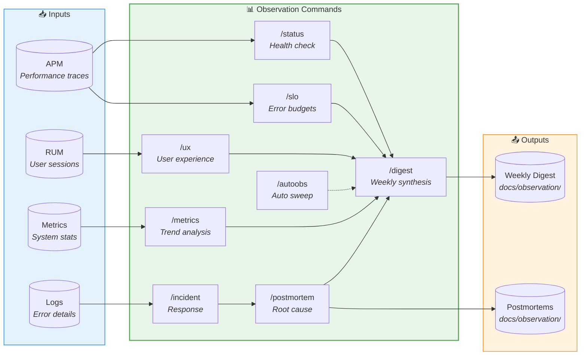

# Observation Workflow Commands

Monitor production and close the feedback loop. These commands surface insights that feed back into PM planning.

## Observation Loop — Is it working?



## Commands

| Command | Purpose | Input | Process | Output |
|---------|---------|-------|---------|--------|
| [`/status`](status.md) | System health check | None | Health endpoints, alert queries | Service status table, trends |
| [`/slo`](slo.md) | Error budget tracking | Service (optional) | 30-day SLO calculation, burn rate | Budget table, forecast |
| [`/metrics`](metrics.md) | Trend analysis | Scope (optional) | 4-week baseline, anomaly (>2σ) | Metric tables, anomaly report |
| [`/ux`](ux.md) | User experience | None | RUM data, journey completion | Session stats, UX score |
| [`/incident`](incident.md) | Incident response | `new` or ID | Severity classification, timeline | `docs/observation/incidents/INC-{id}.md` |
| [`/postmortem`](postmortem.md) | Incident postmortem | Incident ID | 5 Whys, impact calculation | `docs/observation/postmortems/PM-{id}.md` |
| [`/digest`](digest.md) | Weekly synthesis | None | Aggregates metrics, UX, incidents | `docs/observation/digests/{date}.md` |
| [`/autoobs`](autoobs.md) | Autonomous sweep | None | Runs: status→slo→metrics→ux→digest | Complete state, digest |

## Core Principle: Signal Over Noise

All commands query **aggregated, trend-based metrics** to surface meaningful patterns:

- **Statistical baselines**: Compare against 4-week rolling averages
- **Percentile focus**: Use p50, p95, p99 instead of individual requests
- **Week-over-week deltas**: Surface patterns, not transient spikes
- **Impact categorization**: User-affecting issues prioritized over infra noise
- **Significance threshold**: Only surface >2σ deviations from baseline

## Workflow Patterns

| Pattern | When to Use | Commands |
|---------|-------------|----------|
| **Weekly Cycle** | Standard observation | `/status` → `/slo` → `/metrics` → `/ux` → `/digest` |
| **Incident Response** | When alerts fire | `/incident new` → Resolution → `/postmortem {id}` |
| **Full Sweep** | Autonomous mode | `/autoobs` |

## Command Parameters

| Command | Accepts | Examples |
|---------|---------|----------|
| `/status` | No arguments | `/status` |
| `/slo` | Optional service filter | `/slo`, `/slo api`, `/slo edge-functions` |
| `/metrics` | Optional scope | `/metrics`, `/metrics frontend`, `/metrics database` |
| `/ux` | No arguments | `/ux` |
| `/incident` | `new` or incident ID | `/incident new`, `/incident INC-42` |
| `/postmortem` | Incident ID (required) | `/postmortem INC-42` |
| `/digest` | No arguments | `/digest` |
| `/autoobs` | No arguments | `/autoobs` |

## Output Locations

```
docs/observation/
├── digests/
│   └── YYYY-MM-DD.md      # Weekly synthesis reports
├── incidents/
│   └── INC-{id}.md        # Incident documentation
└── postmortems/
    └── PM-{id}.md         # Postmortem analyses
```

## Datadog Integration

**Environment Variables:**
- `DD_API_KEY` - Datadog API key
- `DD_APP_KEY` - Datadog application key
- `DD_SITE` - Datadog site (default: datadoghq.com)

**Data Sources:**
- APM traces and metrics
- RUM (Real User Monitoring)
- Infrastructure metrics
- Log aggregations

## Handoff to PM Loop

Observation digests inform the next planning cycle:

```
Observation Loop: /digest creates docs/observation/digests/{date}.md
    ↓
PM Loop: /audit reads digests → /vision → /roadmap
```

The Observation loop monitors **is it working**. The PM loop decides **what to build next**.
