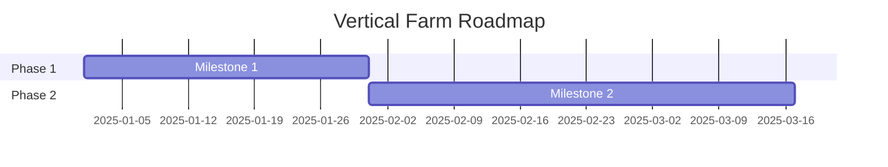

Create or update the implementation roadmap based on vision and research:

[Extended thinking: This workflow transforms vision gaps and research findings into an actionable roadmap with milestones, priorities, and dependencies. It also creates/updates GitHub milestones to track progress.]

**Gather Context**
- Read `docs/planning/vision.md` for goals and gaps
- Read recent research from `docs/planning/research/`
- Read current roadmap if exists: `docs/planning/roadmap.md`
- Check current GitHub milestones: `gh api repos/{owner}/{repo}/milestones`

**Prioritization**
Consider factors for ordering work:
1. **Dependencies** - What must be done first?
2. **Value** - What delivers the most impact?
3. **Risk** - What has the most uncertainty?
4. **Effort** - What can be done quickly vs requires investment?

Use AskUserQuestion if prioritization is unclear:
- "How would you rank these items by priority?"
- "Are there any hard deadlines or external dependencies?"

**Milestone Definition**
For each major goal or epic:
- Define clear scope and boundaries
- List key deliverables
- Identify acceptance criteria
- Estimate relative effort (S/M/L/XL)
- Note dependencies on other milestones

**Scoping Checklist (Linear Method)**
Before finalizing a milestone, verify:

1. Can it be completed in **1-3 weeks** with **1-3 people**?
2. Can individual deliverables be done in **hours**, not days?
3. If NO to either: break into sequential **stages**

Example scoping:
- TOO BIG: "Build complete IoT integration"
- RIGHT SIZE: "Stage 1: Device discovery API" (1 week)
  → "Stage 2: Command routing" (1 week)
  → "Stage 3: Automation rules" (2 weeks)

**Key principle:** Ship Stage 1 before finalizing Stage 2 details.
Smaller scope forces prioritization and creates rapid feedback loops.

**GitHub Milestone Sync**
Use gh CLI to create/update milestones:
```bash
# Create milestone
gh api repos/{owner}/{repo}/milestones -f title="v2.0 - Feature Name" -f description="..." -f due_on="YYYY-MM-DD"

# Update existing
gh api repos/{owner}/{repo}/milestones/{number} -X PATCH -f title="..." -f description="..."
```

**Output Format**
Create or update `docs/planning/roadmap.md`:

```markdown
# Product Roadmap

**Last Updated:** YYYY-MM-DD
**Planning Horizon:** [timeframe]

## Current Focus
[What we're working on now]

## Roadmap Overview



## Milestones

### Milestone 1: [Name]
**Status:** [Not Started / In Progress / Complete]
**Target:** [Date or Sprint]
**GitHub Milestone:** [link]

**Goals:**
- Goal 1
- Goal 2

**Key Deliverables:**
- [ ] Deliverable 1
- [ ] Deliverable 2

**Acceptance Criteria:**
- ...

**Dependencies:**
- None / [list]

**Effort Estimate:** [S/M/L/XL]

---

### Milestone 2: [Name]
...

## Parking Lot
Items considered but not currently scheduled:
- Item 1 - Reason for deferral
- Item 2 - Reason for deferral

## Dependencies Map
```
Milestone 1 → Milestone 2 → Milestone 3
                ↘ Milestone 4
```

## Risks & Mitigations
| Risk | Impact | Mitigation |
|------|--------|------------|
| ... | ... | ... |
```

Update context with milestone information for `/issues` command.
