# Agent Orchestration Sequence Diagram

This diagram shows detailed agent orchestration patterns for each Claude Code workflow, focusing on the sophisticated agent coordination happening behind the scenes.

```mermaid
sequenceDiagram
    title Agent Orchestration in Claude Code Workflows
    
    participant WF as Workflow Engine
    participant ARCH as 🏗️ Backend<br/>Architect
    participant SQL as 🗄️ SQL<br/>Pro
    participant TS as 📘 TypeScript<br/>Pro
    participant FE as ⚛️ Frontend<br/>Developer
    participant PY as 🐍 Python<br/>Pro
    participant TEST as 🧪 Test<br/>Automator
    participant REV as 👁️ Code<br/>Reviewer
    participant PLAY as 🎭 Playwright<br/>Validator

    Note over WF,PLAY: Agent Orchestration Patterns by Workflow

    %% /plan - Issue Analysis
    rect rgb(240, 240, 255)
        Note right of WF: 📋 /plan Workflow
        Note over ARCH,SQL: Parallel Requirements Analysis
        
        par Architectural Analysis
            WF->>+ARCH: Analyze issue requirements
            ARCH->>ARCH: Determine FastAPI vs PostgREST needs<br/>Identify integration patterns<br/>Plan service architecture
            ARCH-->>-WF: Architecture decisions & approach
        and Database Planning
            WF->>+SQL: Plan database schema changes
            SQL->>SQL: Design RLS policies for multi-tenant data<br/>Plan migrations<br/>Identify constraints
            SQL-->>-WF: Schema plan & security policies
        end
        
        WF->>WF: Synthesize analysis<br/>Create GitHub subtasks<br/>Update issue
    end

    %% /dev - Feature Development
    rect rgb(255, 240, 240)
        Note right of WF: ⚡ /dev Workflow
        Note over ARCH,PY: Complex Multi-Agent Development
        
        par Initial Analysis
            WF->>+ARCH: Finalize implementation approach
        and
            WF->>+SQL: Prepare database migrations
        end
        ARCH-->>-WF: FastAPI/PostgREST final decision
        SQL-->>-WF: Migration scripts ready
        
        alt FastAPI Backend Required
            Note over WF,PY: External Integration Path
            WF->>+PY: Implement FastAPI backend
            PY->>PY: Create Home Assistant integration<br/>Build payment processing<br/>Implement automation logic<br/>Set up background tasks
            PY-->>-WF: Backend services complete
        else PostgREST Sufficient
            Note over WF,SQL: Database-Only Path
            WF->>+SQL: Create additional RLS policies
            SQL-->>-WF: PostgREST setup complete
        end
        
        par Frontend Implementation
            WF->>+TS: Build service layer
            TS->>TS: Create singleton services<br/>Implement Supabase client patterns<br/>Add error handling & validation
            TS-->>-WF: Service layer complete
        and
            WF->>+FE: Create React components
            FE->>FE: Build Next.js Server/Client components<br/>Implement responsive design<br/>Add accessibility features<br/>Create farm visualization layers
            FE-->>-WF: Components complete
        end
        
        WF->>+TEST: Create comprehensive test strategy
        TEST->>TEST: Unit tests for services<br/>Playwright E2E tests<br/>Performance tests<br/>Integration test planning
        TEST-->>-WF: Test suite implemented
        
        WF->>+REV: Review implementation quality
        REV->>REV: Check service layer compliance<br/>Verify RLS usage<br/>Review TypeScript patterns<br/>Validate architecture decisions
        REV-->>-WF: Quality review complete
    end

    %% /validate - Feature Validation
    rect rgb(240, 255, 255)
        Note right of WF: ✅ /validate Workflow
        Note over WF,PLAY: Comprehensive E2E Validation
        
        WF->>WF: Analyze git diff<br/>Identify changed features<br/>Plan validation scenarios
        
        WF->>+PLAY: Execute comprehensive validation
        PLAY->>PLAY: Start development servers<br/>Navigate to modified features<br/>Test user workflows end-to-end<br/>Check responsive design<br/>Validate accessibility<br/>Test error handling<br/>Take screenshots for evidence
        PLAY-->>-WF: Validation results & evidence
        
        WF->>WF: Generate validation report<br/>Document findings
    end

    %% /deploy - Deployment
    rect rgb(255, 240, 255)
        Note right of WF: 🚀 /deploy Workflow
        Note over WF,REV: Quality Gate Review
        
        WF->>+REV: Final code review before deployment
        REV->>REV: Architecture compliance check<br/>Security pattern verification<br/>Performance impact analysis<br/>Breaking change assessment<br/>Documentation completeness
        REV-->>-WF: Deployment approval & recommendations
        
        WF->>WF: Git operations<br/>Create pull request<br/>Update GitHub issue<br/>Trigger CI/CD pipeline
    end

    %% /reflect - Continuous Improvement
    rect rgb(240, 240, 240)
        Note right of WF: 🔍 /reflect Workflow
        Note over ARCH,REV: Pattern Analysis & Improvement
        
        par Improvement Analysis
            WF->>+ARCH: Analyze architecture patterns & trends
            ARCH->>ARCH: Review decision patterns<br/>Identify recurring challenges<br/>Update workflow templates<br/>Improve agent prompts
            ARCH-->>-WF: Architecture improvements
        and
            WF->>+REV: Analyze code quality metrics
            REV->>REV: Review quality trends<br/>Update review criteria<br/>Identify training needs<br/>Refine quality standards
            REV-->>-WF: Quality improvements
        end
        
        WF->>WF: Document learnings<br/>Update workflow files<br/>Apply improvements system-wide
    end

    Note over WF,PLAY: Intelligent Orchestration Adapts to Context
```

## Agent Orchestration Patterns

### 🔄 **Parallel Execution**
Agents work simultaneously when tasks are independent:
- **Planning**: Architecture analysis + Database planning
- **Development**: Frontend + Backend implementation
- **Reflection**: Architecture + Quality analysis

### 🔀 **Conditional Logic**
Agents are invoked based on analysis results:
- **Python Pro**: Only when FastAPI backend is needed
- **SQL Pro**: Different roles based on database requirements

### 🔗 **Sequential Dependencies**
Some agents must complete before others:
1. Architecture decisions → Implementation approach
2. Service layer → Component development  
3. Implementation → Quality review
4. Quality review → Deployment approval

### 🎯 **Specialized Expertise**
Each agent brings domain-specific knowledge:
- **Backend Architect**: System design & integration patterns
- **SQL Pro**: Database design & security (RLS policies)
- **TypeScript Pro**: Service layer & type safety
- **Frontend Developer**: React/Next.js & UX patterns
- **Python Pro**: FastAPI & external integrations
- **Test Automator**: Comprehensive testing strategies
- **Code Reviewer**: Quality & compliance validation
- **Playwright Validator**: E2E testing & user workflows

### 🧠 **Intelligent Adaptation**
The workflow engine makes decisions about:
- Which agents to invoke for each specific task
- Whether to run agents in parallel or sequence
- How to handle conditional agent execution
- When to iterate vs proceed to next phase

## Key Benefits

1. **Efficiency**: Parallel execution where possible
2. **Quality**: Multi-agent review and validation
3. **Expertise**: Specialized knowledge for each domain
4. **Adaptability**: Context-aware agent selection
5. **Consistency**: Standardized patterns across workflows