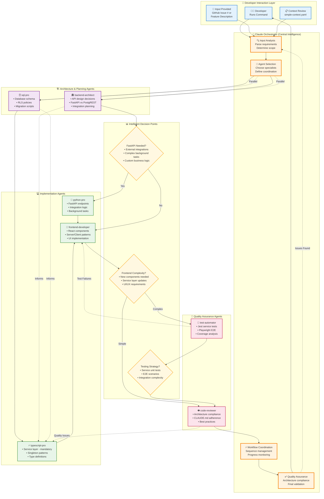

# Agent Orchestration & Intelligence Layer

This comprehensive diagram illustrates how Claude intelligently orchestrates specialized agents during the development workflow, featuring adaptive decision-making and continuous learning mechanisms.

## Overview

The orchestration system analyzes requirements, makes architectural decisions, and dynamically coordinates specialized AI agents based on project needs, ensuring optimal resource allocation and architectural compliance.

## Core Orchestration Flow

## Intelligence Layer - Decision Flow

The system's intelligence layer provides adaptive decision-making through sophisticated analysis and pattern recognition:

### 🔍 Input Analysis Framework

The orchestrator begins by analyzing the input type and extracting requirements:

**GitHub Issue Processing**
- Fetch complete issue details and comments
- Parse structured requirements and acceptance criteria
- Extract stakeholder context and priorities
- Identify technical constraints and dependencies

**Feature Description Processing**
- Natural language parsing for technical requirements
- Scope boundary identification
- Success criteria definition
- Risk assessment and mitigation planning

### 🏛️ Architecture Decision Matrix

The system makes intelligent architecture choices based on requirement patterns:

#### FastAPI Selection Criteria (Use when ANY of these apply)
✅ **External Integrations Required**
- Home Assistant device control
- Payment processor integrations (Square POS)
- Weather API connections
- Third-party service orchestration

✅ **Complex Background Processing**
- Automation orchestration workflows
- Data transformation pipelines
- Async job processing
- Real-time data streaming

✅ **Custom Business Logic**
- Complex calculations beyond SQL
- Multi-step transaction workflows
- External API aggregation
- Custom authentication flows

#### PostgREST Selection Criteria (Default choice - 90% of operations)
✅ **Standard CRUD Operations**
- Farm, device, user, grow, crop management
- Simple create, read, update, delete workflows
- Direct database operations

✅ **Database-Driven Features**
- Row Level Security (RLS) enforcement
- Database constraints and triggers
- Simple validation rules
- Referential integrity management

✅ **Real-time Subscriptions**
- Supabase channel-based updates
- Live data synchronization
- Change notifications

### 📊 Intelligent Agent Selection

The orchestrator dynamically selects agents based on task requirements:

| Task Type | Primary Agents | Support Agents | Execution Mode |
|-----------|---------------|----------------|----------------|
| **New Feature** | typescript-pro, frontend-developer | sql-pro, backend-architect | Sequential with parallel planning |
| **API Integration** | python-pro, backend-architect | typescript-pro | Parallel architecture, sequential implementation |
| **Database Changes** | sql-pro, backend-architect | typescript-pro | Sequential (schema first) |
| **UI Updates** | frontend-developer | typescript-pro | Parallel when possible |
| **Bug Fix** | code-reviewer, typescript-pro | test-automator | Sequential diagnosis, parallel fix |

### 🎯 Execution Strategy Optimization

The system determines optimal execution patterns:

**Parallel Execution Triggers**
- Independent task components
- No data dependencies between agents
- Sufficient context for all agents
- Time-critical requirements

**Sequential Execution Triggers**
- Strong dependencies between outputs
- Complex coordination requirements
- Learning from previous steps needed
- Quality gates between phases

## Agent Specializations & Capabilities

### Core Architecture Agents

#### 🏛️ backend-architect
**Expertise**: System design, API architecture, integration patterns
- RESTful API design and endpoint planning
- Database relationship modeling
- Integration architecture decisions
- Performance optimization strategies
- Security pattern implementation

#### 🗄️ sql-pro
**Expertise**: PostgreSQL, database design, query optimization
- Schema design with normalization
- Row Level Security (RLS) policy creation
- Migration script generation
- Index optimization
- Complex query writing with CTEs and window functions

### Implementation Specialists

#### ⚡ typescript-pro
**Expertise**: TypeScript, service layer, Supabase integration
- Mandatory service layer implementation
- Singleton pattern enforcement
- Type-safe interfaces and generics
- Error handling patterns
- Supabase client integration

#### 🎨 frontend-developer
**Expertise**: React, Next.js 15, responsive design
- Server/Client component architecture
- Responsive mobile-first layouts
- Accessibility compliance (WCAG)
- State management patterns
- Performance optimization

#### 🐍 python-pro
**Expertise**: FastAPI, async Python, integrations
- Async/await pattern implementation
- External API integration
- Background task processing
- Pydantic model design
- Error handling and logging

### Quality Assurance Specialists

#### 🧪 test-automator
**Expertise**: Jest, Playwright, test strategies
- Service unit test creation
- E2E test scenario design
- Test coverage analysis
- Performance testing setup
- CI/CD test integration

#### 👁️ code-reviewer
**Expertise**: Architecture patterns, security, best practices
- CLAUDE.md compliance verification
- Security vulnerability detection
- Performance bottleneck identification
- Code quality assessment
- Documentation review

## Adaptive Learning Components

### 🧠 Context Integration System

The orchestrator maintains and learns from context through multiple mechanisms:

**Historical Pattern Recognition**
- Successful implementation approaches cached
- Common error patterns and solutions stored
- Performance metrics from previous runs
- Developer preference learning

**Continuous Improvement Metrics**
- Decision accuracy tracking (correct vs incorrect architecture choices)
- Agent performance monitoring (success rates, execution time)
- Workflow efficiency measurement (end-to-end completion)
- Quality outcome assessment (bug rates, test coverage)

### 🔄 Feedback Loop Architecture

The system incorporates multiple feedback mechanisms:

1. **Immediate Correction**: Quality issues trigger re-evaluation
2. **Test-Driven Adjustment**: Failed tests inform implementation changes
3. **Performance Optimization**: Slow operations influence future choices
4. **User Preference Learning**: Developer feedback refines decisions

## Communication Patterns

The orchestration follows structured communication principles:

### Information Flow
1. **Context Broadcast**: All agents receive relevant project context
2. **Dependency Chain**: Sequential execution where outputs feed inputs
3. **Parallel Coordination**: Independent tasks run concurrently
4. **Quality Gates**: Validation checkpoints between phases
5. **Feedback Integration**: Issues trigger re-orchestration

### Agent Coordination Protocols
- **Handoff Points**: Clear output specifications between agents
- **Shared Context**: Common understanding of project patterns
- **Error Escalation**: Failed operations trigger orchestrator intervention
- **Progress Tracking**: Real-time status updates to orchestrator

## Success Metrics & Validation

The system tracks comprehensive metrics to ensure quality:

### Architecture Compliance
- ✅ 100% service layer pattern adherence
- ✅ All database tables have RLS policies
- ✅ No direct database access from components
- ✅ Proper Server/Client component separation

### Quality Metrics
- 📊 Test coverage: >80% critical paths, >60% overall
- ⚡ API response time: <200ms p95
- 🎯 UI interaction: <100ms response
- 🐛 Zero architecture violations

### Performance Targets
- 🚀 Agent orchestration: <5s startup
- 💾 Context loading: <1s
- 🔄 Parallel execution: 2-3x faster than sequential
- 📈 Learning improvement: 10% efficiency gain per iteration

## Benefits of Intelligent Orchestration

1. **🎯 Optimal Resource Allocation**: Right agents for the right tasks
2. **🚀 Faster Development**: Parallel processing and smart sequencing
3. **🔒 Architecture Compliance**: Enforced through decision gates
4. **📊 Risk-Based Testing**: Adaptive test strategies based on complexity
5. **🔄 Continuous Learning**: System improves with each iteration
6. **💡 Context Awareness**: Historical patterns inform current decisions
7. **⚡ Maximum Efficiency**: Minimized redundancy, optimal parallelization
8. **🛡️ Quality Assurance**: Multiple validation layers ensure reliability