# Hook-Based Workflow Architecture

This comprehensive diagram illustrates the hook-based event-driven architecture that powers the Claude development workflow, showing timing, data flow, and execution sequences.

## Command Flow Overview

The system uses three primary hooks that orchestrate the entire workflow:
- **UserPromptSubmit Hook**: Triggered when user enters a slash command
- **PostToolUse Hook**: Triggered after Task tool completes
- **Stop Hook**: Triggered when Claude finishes response

## /plan Command Execution Flow

### Visual Swim Lane Diagram



```mermaid
flowchart TB
    subgraph "User Input"
        U1("/plan 123")
    end
    
    subgraph "UserPromptSubmit Hook"
        H1("🪝 on-slash-command.sh plan<br/>Update git context<br/>Set phase: planning<br/>Log: Context initialized")
    end
    
    subgraph "Command Execution"
        C1(" Validate Input<br/>Parse issue number")
        C2(" Begin Analysis<br/>Show output messages")
        C3(" Execute Workflow<br/>issue-analysis.md<br/>→ github-issue-analyzer")
    end
    
    subgraph "PostToolUse Hook"
        P1("🪝 after-task-complete.sh<br/>Save analysis results<br/>Update requirements<br/>Store subtasks")
    end
    
    subgraph "Stop Hook"
        S1("🪝 context-phase-update.sh<br/>Rotate agents<br/>Finalize context")
    end
    
    subgraph "Context State"
        X1("📂 simple-context.yaml<br/>phase: planning<br/>analysis: populated<br/>agents: updated")
    end
    
    U1 --> H1
    H1 --> C1
    C1 --> C2
    C2 --> C3
    C3 --> P1
    P1 --> S1
    S1 --> X1
    
    style U1 fill:#e1f5e1
    style H1 fill:#fff3cd
    style P1 fill:#fff3cd
    style S1 fill:#fff3cd
    style X1 fill:#d4edda
```

### Detailed Execution Table

| Step | Component | Action | Context Updates |
|------|-----------|--------|-----------------|
| 0 | User | Types `/plan 123` | `phase: null` |
| 1 | UserPromptSubmit | 🪝 Triggered by `/plan*` matcher | - |
| 2 | UserPromptSubmit | Run `on-slash-command.sh` | `phase: planning`, git state updated |
| 3 | Command | Validate input, parse issue # | - |
| 4 | Command | Show "🤖 Starting..." messages | - |
| 5 | Command | Execute workflow, call analyzer | - |
| 6 | PostToolUse | 🪝 Triggered by Task completion | - |
| 7 | PostToolUse | Save analysis, requirements, subtasks | `analysis: populated` |
| 8 | Command | Show "📂 Context saved" | - |
| 9 | Stop | 🪝 Triggered on completion | - |
| 10 | Stop | Rotate agents, finalize | `agents: rotated`, Ready for `/dev` |

## /dev Command Execution Flow

### Visual Swim Lane Diagram



```mermaid
flowchart TB
    subgraph "User Input"
        U1("/dev 123")
    end
    
    subgraph "UserPromptSubmit Hook"
        H1("🪝 on-slash-command.sh dev<br/>Check current phase<br/>Load planning context<br/>Log: Continue/Start fresh")
    end
    
    subgraph "Command Execution"
        C1("1. Parse Argument<br/>Issue or feature?")
        C2("2. Check Context<br/>Has prior analysis?")
        C3("3. Handle Input Type<br/>Use existing analysis<br/>or start fresh")
        C4("4. Execute Development<br/>feature-development.md<br/>→ Multiple agents")
    end
    
    subgraph "PostToolUse Hook"
        P1("🪝 after-task-complete.sh<br/>Save implementation<br/>Track files created<br/>Update services")
    end
    
    subgraph "Stop Hook"
        S1("🪝 context-phase-update.sh<br/>Set phase: development<br/>Rotate agents")
    end
    
    subgraph "Context State"
        X1("📂 simple-context.yaml<br/>phase: development<br/>implementation: populated<br/>files tracked")
    end
    
    U1 --> H1
    H1 --> C1
    C1 --> C2
    C2 --> C3
    C3 --> C4
    C4 --> P1
    P1 --> S1
    S1 --> X1
    
    style U1 fill:#e1f5e1
    style H1 fill:#fff3cd
    style P1 fill:#fff3cd
    style S1 fill:#fff3cd
    style X1 fill:#d4edda
```

### Context-Aware Execution

The `/dev` command intelligently uses existing context:

| Scenario | Context State | Behavior |
|----------|--------------|----------|
| After `/plan` | `phase: planning`, analysis exists | Uses existing analysis, skips re-analysis |
| Fresh start | No prior context | Performs full analysis first |
| Different issue | Previous context for different issue | Clears old context, starts fresh |

## /validate Command Execution Flow

### Visual Swim Lane Diagram



```mermaid
flowchart TB
    subgraph "User Input"
        U1("/validate 123")
    end
    
    subgraph "UserPromptSubmit Hook"
        H1("🪝 on-slash-command.sh validate<br/>Check development phase<br/>Load implementation context<br/>Log: Ready/Limited validation")
    end
    
    subgraph "Command Execution"
        C1("1. Validate Input<br/>Parse issue number")
        C2("2. Load Context<br/>Get requirements & files")
        C3("3. Analyze Changes<br/>git diff main...HEAD")
        C4("4. Execute Validation<br/>playwright-tester agent<br/>→ UI testing")
    end
    
    subgraph "PostToolUse Hook"
        P1("🪝 after-task-complete.sh<br/>Save test results<br/>Store screenshots<br/>Update metrics")
    end
    
    subgraph "Stop Hook"
        S1("🪝 context-phase-update.sh<br/>Set phase: validation<br/>Finalize results")
    end
    
    subgraph "Context State"
        X1("📂 simple-context.yaml<br/>phase: validation<br/>validation: populated<br/>acceptance verified")
    end
    
    U1 --> H1
    H1 --> C1
    C1 --> C2
    C2 --> C3
    C3 --> C4
    C4 --> P1
    P1 --> S1
    S1 --> X1
    
    style U1 fill:#e1f5e1
    style H1 fill:#fff3cd
    style P1 fill:#fff3cd
    style S1 fill:#fff3cd
    style X1 fill:#d4edda
```

## Complete Workflow Sequence

### Timing Sequence Diagram


### Context Evolution State Machine


## Hook Execution Timeline

### Gantt Chart View


## Data Flow Through Context


## Hook Configuration Reference

### Hook Mappings

```mermaid
mindmap
  root((Hooks))
    UserPromptSubmit
      /plan* → on-slash-command.sh plan
      /dev* → on-slash-command.sh dev
      /validate* → on-slash-command.sh validate
      /reflect* → on-slash-command.sh reflect
      /pipeline* → on-slash-command.sh pipeline
    PostToolUse
      Task → after-task-complete.sh
        Save analysis (planning)
        Save implementation (dev)
        Save validation (test)
    Stop
      All → context-phase-update.sh
        Rotate agents
        Finalize context
        Set next phase
```



### Hook Execution Summary

| Hook Type | Trigger | Purpose | Key Actions |
|-----------|---------|---------|-------------|
| **UserPromptSubmit** | Slash command entered | Initialize workflow context | Update git state, set phase, prepare environment |
| **PostToolUse** | Task tool completes | Capture agent results | Save analysis/implementation/validation data |
| **Stop** | Claude response ends | Finalize workflow step | Rotate agents, update phase, prepare for next command |

## Context Data Structure

The `simple-context.yaml` file evolves through the workflow:

```yaml
# Initial State
phase: null
analysis: []
implementation: []
validation: []

# After /plan
phase: planning
analysis:
  issue_number: 123
  requirements: [...]
  subtasks: [...]
  recommended_agents: [...]
changes:
  branch: feature-123
  files_changed: []

# After /dev
phase: development
analysis: [...preserved...]
implementation:
  files_created: [...]
  services_updated: [...]
  tests_added: [...]
changes:
  files_changed: [list of files]

# After /validate
phase: validation
analysis: [...preserved...]
implementation: [...preserved...]
validation:
  tests_passed: true
  screenshots: [...]
  metrics: [...]
  acceptance_criteria_met: true
```

## Benefits of Hook Architecture

### 🚀 Automation Benefits
1. **Zero Manual Scripts**: Hooks run automatically on events
2. **Context Preservation**: State maintained across commands
3. **Workflow Continuity**: Each command builds on previous work
4. **Error Recovery**: Hooks can detect and handle failures

### 🎯 Developer Experience
1. **Simple Commands**: Focus on intent, not implementation
2. **Progress Visibility**: Clear phase tracking
3. **Intelligent Defaults**: System knows what to do next
4. **Team Consistency**: Everyone gets same behavior

### 📊 Quality Assurance
1. **Automatic Validation**: Each phase verified before proceeding
2. **Context Validation**: Ensures required data present
3. **Git Integration**: Automatic branch and commit management
4. **Audit Trail**: Complete history in context files

### 🔄 Continuous Improvement
1. **Pattern Learning**: System learns from each execution
2. **Performance Metrics**: Timing data captured
3. **Error Patterns**: Common issues identified and fixed
4. **Workflow Optimization**: Bottlenecks identified and removed

This hook-based architecture creates a seamless, event-driven workflow that eliminates manual steps, preserves context, and ensures consistent quality across all development activities.