# Slash Command Workflow Sequence Diagram

This diagram shows the complete workflow for all Claude Code slash commands, including hooks, workflows, and context management.

```mermaid
sequenceDiagram
    title Claude Code Slash Command Workflow Sequence
    
    participant User
    participant CC as Claude Code
    participant USH as UserPromptSubmit Hook
    participant CMD as Command Handler
    participant WF as Workflow Engine
    participant PTH as PostToolUse Hook
    participant SH as Stop Hook
    participant CTX as Context File<br/>.claude/context/<br/>simple-context.yaml
    
    Note over User,CTX: Complete Development Lifecycle

    %% /up - Start Development Environment
    rect rgb(240, 255, 240)
        Note left of User: 1. Start Environment
        User->>CC: /up
        CC->>USH: Trigger hook
        USH->>CTX: Initialize context
        USH-->>CC: Context ready
        CC->>CMD: Execute /up command
        CMD->>WF: 1.Check prerequisites<br/>2.Start Supabase<br/>3.Configure environment<br/>4.Start Docker containers
        Note right of WF: No workflow file<br/>(direct execution)
        WF-->>CMD: Environment ready
        CMD->>PTH: Execution complete
        PTH->>CTX: Save environment config
        PTH-->>CC: Success
        CC->>SH: Command complete
        SH-->>User: ✅ Environment ready!<br/>Next: /plan {issue}
    end

    %% /plan - Issue Analysis
    rect rgb(240, 240, 255)
        Note left of User: 2. Plan Issue
        User->>CC: /plan 123
        CC->>USH: Trigger hook
        USH->>CTX: Update phase: planning
        USH-->>CC: Context ready
        CC->>CMD: Execute /plan command
        CMD->>WF: Execute workflow
        Note right of WF: .claude/commands/workflows/<br/>01_planning/issue-analysis.md
        WF->>WF: Retrieve issue from GitHub<br/>Analyze requirements<br/>Create subtasks<br/>Update GitHub issue
        WF-->>CMD: Analysis complete
        CMD->>PTH: Save analysis
        PTH->>CTX: Save requirements,<br/>subtasks, decisions
        PTH-->>CC: Success
        CC->>SH: Command complete
        SH-->>User: 📋 Issue analyzed!<br/>Next: /dev 123
    end

    %% /dev - Feature Development
    rect rgb(255, 240, 240)
        Note left of User: 3. Develop Feature
        User->>CC: /dev 123
        CC->>USH: Trigger hook
        USH->>CTX: Update phase: development
        USH-->>CC: Context ready
        CC->>CMD: Execute /dev command
        CMD->>CTX: Read analysis from /plan
        CMD->>WF: Execute workflow
        Note right of WF: .claude/commands/workflows/<br/>02_development/feature-development.md
        WF->>WF: Orchestrate agents<br/>Implement features<br/>Create services<br/>Build components
        WF-->>CMD: Development complete
        CMD->>PTH: Save implementation
        PTH->>CTX: Save files_modified,<br/>agents_used, decisions
        PTH-->>CC: Success
        CC->>SH: Command complete
        SH-->>User: ⚡ Feature developed!<br/>Next: /test
    end

    %% /test - Local Testing
    rect rgb(255, 255, 240)
        Note left of User: 4. Run Tests
        User->>CC: /test
        CC->>USH: Trigger hook
        USH->>CTX: Load development context
        USH-->>CC: Context ready
        CC->>CMD: Execute /test command
        CMD->>WF: Run test suites
        Note right of WF: No workflow file<br/>(direct execution)
        WF->>WF: Backend tests<br/>Frontend tests<br/>E2E tests<br/>Linting & Types
        WF-->>CMD: Tests complete
        CMD->>PTH: Save results
        PTH->>CTX: Save test_results,<br/>coverage_metrics
        PTH-->>CC: Success
        CC->>SH: Command complete
        SH-->>User: 🧪 Tests passed!<br/>Next: /validate 123
    end

    %% /validate - Feature Validation
    rect rgb(240, 255, 255)
        Note left of User: 5. Validate Feature
        User->>CC: /validate 123
        CC->>USH: Trigger hook
        USH->>CTX: Load implementation context
        USH-->>CC: Context ready
        CC->>CMD: Execute /validate command
        CMD->>WF: Execute workflow
        Note right of WF: .claude/commands/workflows/<br/>03_testing/feature-validation.md
        WF->>WF: Analyze git diff<br/>Playwright testing<br/>User workflows<br/>Accessibility checks
        WF-->>CMD: Validation complete
        CMD->>PTH: Save validation
        PTH->>CTX: Save validation_results,<br/>screenshots
        PTH-->>CC: Success
        CC->>SH: Command complete
        SH-->>User: ✅ Validated!<br/>Next: /deploy 123
    end

    %% /deploy - Deployment
    rect rgb(255, 240, 255)
        Note left of User: 6. Deploy Issue
        User->>CC: /deploy 123
        CC->>USH: Trigger hook
        USH->>CTX: Load full context
        USH-->>CC: Context ready
        CC->>CMD: Execute /deploy command
        CMD->>WF: Execute workflow
        Note right of WF: .claude/commands/workflows/<br/>04_deployment/issue-deployment.md
        WF->>WF: Code review<br/>Git operations<br/>Create PR<br/>Update GitHub issue
        WF-->>CMD: PR created
        CMD->>PTH: Save deployment
        PTH->>CTX: Save pr_number,<br/>deployment_status
        PTH-->>CC: Success
        CC->>SH: Command complete
        SH-->>User: 🚀 PR created!<br/>Next: /finalize 123
    end

    %% /reflect - Continuous Improvement
    rect rgb(240, 240, 240)
        Note left of User: 7. Reflect (Optional)
        User->>CC: /reflect 10 typescript
        CC->>USH: Trigger hook
        USH->>CTX: Capture reflection context
        USH-->>CC: Context ready
        CC->>CMD: Execute /reflect command
        CMD->>WF: Execute workflow
        Note right of WF: .claude/commands/workflows/<br/>maintenance/development-reflection.md
        WF->>WF: Analyze patterns<br/>Update workflows<br/>Improve agents<br/>Document learnings
        WF-->>CMD: Improvements applied
        CMD->>PTH: Save improvements
        PTH->>CTX: Save improvements,<br/>recommendations
        PTH-->>CC: Success
        CC->>SH: Command complete
        SH-->>User: 🔍 Workflows improved!
    end

    %% /finalize - Close Issue
    rect rgb(240, 255, 240)
        Note left of User: 8. Finalize Issue
        User->>CC: /finalize 123
        CC->>USH: Trigger hook
        USH->>CTX: Load complete context
        USH-->>CC: Context ready
        CC->>CMD: Execute /finalize command
        CMD->>WF: Execute workflow
        Note right of WF: .claude/commands/workflows/<br/>06_finalization/issue-finalize.md
        WF->>WF: Update docs<br/>Create prompting log<br/>Generate closing comment<br/>Close GitHub issue
        WF-->>CMD: Issue closed
        CMD->>PTH: Archive context
        PTH->>CTX: Reset for next issue
        PTH-->>CC: Success
        CC->>SH: Command complete
        SH-->>User: 📝 Issue finalized!<br/>Ready for next issue
    end

    Note over User,CTX: Context flows through entire lifecycle
```



## Key Components

### 1. **User Input**
- Slash commands entered in Claude Code
- Parameters: issue numbers, PR numbers, options

### 2. **UserPromptSubmit Hook**
- Triggers automatically when command starts
- Initializes or updates context
- Sets workflow phase

### 3. **Command Handler**
- Parses command and parameters
- Validates prerequisites
- Orchestrates execution

### 4. **Workflow Engine**
- Executes workflow files (clickable links above)
- Orchestrates specialized agents
- Performs actual work

### 5. **PostToolUse Hook**
- Triggers after command completion
- Saves results to context
- Updates workflow state

### 6. **Stop Hook**
- Final cleanup
- User feedback
- Next step guidance

### 7. **Context File**
- `.claude/context/simple-context.yaml`
- Maintains state across commands
- Tracks:
  - Current issue/branch
  - Analysis results
  - Implementation details
  - Test results
  - Deployment status

## Workflow Files Reference

| Command | Workflow File | Purpose |
|---------|--------------|---------|
| `/plan` | [01_planning/issue-analysis.md](.claude/commands/workflows/01_planning/issue-analysis.md) | Analyze GitHub issues |
| `/dev` | [02_development/feature-development.md](.claude/commands/workflows/02_development/feature-development.md) | Implement features |
| `/validate` | [03_testing/feature-validation.md](.claude/commands/workflows/03_testing/feature-validation.md) | Validate with Playwright |
| `/deploy` | [04_deployment/issue-deployment.md](.claude/commands/workflows/04_deployment/issue-deployment.md) | Create PR and deploy |
| `/reflect` | [maintenance/development-reflection.md](.claude/commands/workflows/maintenance/development-reflection.md) | Improve workflows |
| `/finalize` | [06_finalization/issue-finalize.md](.claude/commands/workflows/06_finalization/issue-finalize.md) | Close issues |

## Context Flow

The context file maintains state throughout the entire lifecycle:

```yaml
session:
  issue: 123
  branch: 123-feature-branch
  phase: development

analysis:
  requirements: [...]
  subtasks: [...]
  
implementation:
  files_modified: [...]
  agents_used: [...]
  
validation:
  test_results: [...]
  screenshots: [...]
  
deployment:
  pr_number: 456
  status: pending_review
```

## Color Legend

- 🟢 Green: Setup/Teardown phases
- 🔵 Blue: Planning/Analysis
- 🔴 Red: Development/Implementation
- 🟡 Yellow: Testing/Quality
- 🟦 Cyan: Validation
- 🟣 Purple: Deployment
- ⚫ Gray: Reflection/Improvement