# System Context - C4 Architecture View

This C4 context diagram illustrates the complete system architecture showing how Claude orchestrates the development workflow while integrating with external systems and the vertical farming platform's technology stack.

## High-Level System Context

```mermaid
graph TB
    subgraph "👥 Actors"
        Developer[🧑‍💻 Developer<br/>Workflows & Reviews]
        Stakeholders[👥 Stakeholders<br/>Business Users]
    end
    
    subgraph "🤖 Claude SDLC System"
        ClaudeSystem[🧠 Claude-Powered SDLC<br/>• Make Commands<br/>• Agent Orchestration<br/>• Context Learning<br/>• Quality Assurance]
    end
    
    subgraph "🌱 Vertical Farm Platform"
        Platform[🌱 Vertical Farm System<br/>• Next.js Frontend<br/>• FastAPI Backend<br/>• Supabase Database<br/>• Service Layer]
    end
    
    subgraph "🔗 External Systems"
        GitHub[📋 GitHub<br/>Issues & CI/CD]
        HomeAssistant[🏠 Home Assistant<br/>IoT Control]
        PaymentSystem[💳 Square POS<br/>Payment Processing]
        WeatherAPI[🌤️ Weather APIs<br/>Environmental Data]
        Monitoring[📊 Monitoring<br/>Analytics & Metrics]
        CloudInfra[☁️ Cloud Infrastructure<br/>Docker & Cloudflare]
    end
    
    %% Primary relationships
    Developer -->|Commands & Code| ClaudeSystem
    Stakeholders -->|Requirements| GitHub
    
    ClaudeSystem -->|Develops & Maintains| Platform
    ClaudeSystem -->|Reads Issues| GitHub
    ClaudeSystem -->|Deploys| CloudInfra
    
    Platform -->|Integrates| HomeAssistant
    Platform -->|Processes Payments| PaymentSystem
    Platform -->|Fetches Data| WeatherAPI
    Platform -->|Reports Metrics| Monitoring
    
    GitHub -->|CI/CD Pipeline| CloudInfra
    CloudInfra -->|Hosts| Platform
    
    %% Feedback loops
    Monitoring -.->|Performance Data| ClaudeSystem
    Developer -.->|Feedback| ClaudeSystem
    
    %% Styling
    style ClaudeSystem fill:#fff3e0,stroke:#f57c00,stroke-width:3px
    style Platform fill:#e8f5e9,stroke:#4caf50,stroke-width:3px
    style Developer fill:#e3f2fd,stroke:#1976d2,stroke-width:2px
    style GitHub fill:#f3e5f5,stroke:#7b1fa2,stroke-width:2px
```



## System Components Breakdown

### 🤖 Claude SDLC System (Core)

The central intelligence system that orchestrates all development activities:

**Key Responsibilities:**
- Parse and analyze requirements from GitHub issues or feature descriptions
- Orchestrate specialized AI agents for implementation
- Maintain context and learning from previous iterations
- Ensure architecture compliance and quality standards
- Manage deployment and infrastructure operations

**Entry Points (Make Commands):**
- `make plan` - Requirements analysis and architectural planning
- `make dev` - Core feature development with agent orchestration
- `make validate` - Quality assurance and compliance verification
- `make test` - Comprehensive testing strategy execution
- `make deploy` - Automated deployment and configuration

### 🌱 Vertical Farm Platform

The production system being developed and maintained:

**Technology Stack:**
- **Frontend**: Next.js 15, React 19, TypeScript, Tailwind CSS
- **Backend**: FastAPI (integrations only), Supabase PostgREST (90% operations)
- **Database**: PostgreSQL with mandatory Row Level Security
- **Architecture**: Mandatory service layer with singleton pattern

**Domain Model:**
- Farm → Rows → Racks → Shelves → Devices/Schedules
- Multi-tenant isolation with RLS policies
- Real-time monitoring and automation
- Layer overlay visualization system

### 🔗 External System Integrations

#### GitHub
- **Purpose**: Source control, issue tracking, CI/CD
- **Integration**: Bidirectional - reads issues, creates PRs, manages workflows
- **Key Features**: Issue analysis, automated PR creation, pipeline management

#### Home Assistant
- **Purpose**: IoT device control and automation
- **Integration**: Via FastAPI backend
- **Key Features**: Device management, sensor monitoring, automation rules

#### Square POS
- **Purpose**: Payment processing and business operations
- **Integration**: Via FastAPI backend
- **Key Features**: Transaction processing, subscription billing, financial reporting

#### Weather APIs
- **Purpose**: Environmental data for farm optimization
- **Integration**: Via FastAPI backend
- **Key Features**: Climate data, predictive analytics, seasonal planning

#### Cloud Infrastructure
- **Purpose**: Hosting, deployment, edge computing
- **Technologies**: Docker, Cloudflare Workers, GitHub Actions
- **Key Features**: Container orchestration, global CDN, automated deployments

## Data Flow Patterns

### Development Workflow
```
Developer → Claude SDLC → GitHub → Platform Development → Testing → Deployment
     ↑                                                                    ↓
     ←────────────────── Feedback & Learning ←──────────────────────────
```

### Production Data Flow
```
Users → Frontend → Service Layer → Database/Backend → External Systems
                        ↓                    ↑
                    Validation          RLS Policies
```

### Integration Flow
```
Platform → FastAPI → External APIs → Processing → Response → Platform
              ↓                           ↑
         Authentication              Transformation
```

## Security Boundaries

### Development Security
- **Code Review**: All changes reviewed by code-reviewer agent
- **Secret Management**: No secrets in frontend code
- **Dependency Scanning**: Automated vulnerability detection
- **Access Control**: GitHub permissions and branch protection

### Production Security
- **Multi-Tenancy**: Row Level Security on all farm data
- **Authentication**: Supabase Auth with JWT tokens
- **API Security**: Rate limiting, CORS, input validation
- **Infrastructure**: TLS encryption, firewall rules, DDoS protection

## Key Architectural Decisions

### Service Layer Enforcement
- **Rationale**: Centralized business logic, consistent error handling
- **Implementation**: Singleton pattern with base class inheritance
- **Benefits**: Maintainability, testability, security

### FastAPI vs PostgREST Decision
- **PostgREST (90%)**: Standard CRUD, database-driven features
- **FastAPI (10%)**: External integrations, complex processing
- **Benefits**: Optimal performance, reduced complexity

### Real-time Architecture
- **Technology**: Supabase subscriptions
- **Use Cases**: Sensor monitoring, live updates, notifications
- **Benefits**: Immediate feedback, reduced polling

## System Qualities

### Performance
- API Response: <200ms p95
- UI Interaction: <100ms
- Build Time: <5 minutes
- Deployment: <10 minutes

### Scalability
- Horizontal scaling via containers
- Edge computing with Cloudflare
- Database connection pooling
- Caching strategies

### Reliability
- 99.9% uptime target
- Automated rollback capability
- Health checks and monitoring
- Error recovery mechanisms

### Maintainability
- Modular architecture
- Comprehensive documentation
- Automated testing
- Context-aware development

## Benefits of This Architecture

1. **🤖 AI-Powered Development**: Intelligent automation reduces manual effort
2. **🔄 Continuous Learning**: System improves with each iteration
3. **🛡️ Built-in Security**: Multi-layered security at every level
4. **📊 Data-Driven Decisions**: Metrics inform architectural choices
5. **🚀 Rapid Deployment**: Automated pipelines ensure fast delivery
6. **🌍 Global Scale**: Edge computing enables worldwide distribution
7. **💡 Smart Integration**: Optimal technology choices for each use case
8. **✅ Quality Assurance**: Multiple validation layers ensure reliability