# Workflow Overview - Claude Development Pipeline

A simplified visual guide to the Claude-powered development workflow, showing the key commands and their relationships.

## Quick Reference Pipeline

```mermaid
graph LR
    subgraph "📋 Planning"
        P1[make plan<br/>Requirements Analysis]
    end
    
    subgraph "⚡ Development"
        D1[make dev<br/>Feature Implementation]
    end
    
    subgraph "✅ Validation"
        V1[make validate<br/>Quality Assurance]
        V2[make test<br/>Automated Testing]
    end
    
    subgraph "🚀 Deployment"
        DP1[make deploy<br/>Production Release]
    end
    
    subgraph "🔧 Support"
        S1[make pipeline<br/>CI/CD Fixes]
        S2[make reflect<br/>Process Analysis]
    end
    
    P1 --> D1
    D1 --> V1
    V1 --> V2
    V2 --> DP1
    
    DP1 -.->|Issues| S1
    S1 -.->|Fixes| V2
    DP1 -.->|Success| S2
    S2 -.->|Improvements| P1
    
    style P1 fill:#f3e5f5,stroke:#7b1fa2,stroke-width:2px
    style D1 fill:#fff3e0,stroke:#f57c00,stroke-width:3px
    style V1 fill:#e8f5e9,stroke:#388e3c,stroke-width:2px
    style V2 fill:#e8f5e9,stroke:#388e3c,stroke-width:2px
    style DP1 fill:#e3f2fd,stroke:#1976d2,stroke-width:2px
    style S1 fill:#fff8e1,stroke:#f9a825,stroke-width:2px
    style S2 fill:#fce4ec,stroke:#c2185b,stroke-width:2px
```

## Command Flow Summary

### Primary Development Path
1. **`make plan`** → Analyze requirements from GitHub issues
2. **`make dev`** → Implement features using AI agents
3. **`make validate`** → Verify implementation meets requirements
4. **`make test`** → Run comprehensive test suites
5. **`make deploy`** → Release to production

### Support & Optimization
- **`make pipeline`** → Fix CI/CD issues when deployment fails
- **`make reflect`** → Analyze workflow for improvements

## Key Features at Each Stage

### 📋 Planning (`make plan`)
- GitHub issue analysis
- Requirements extraction
- Subtask generation
- Architecture decisions

### ⚡ Development (`make dev`)
- Agent orchestration
- FastAPI vs PostgREST decisions
- Service layer implementation
- Database migrations

### ✅ Validation (`make validate`)
- Acceptance criteria verification
- UI/UX testing with Playwright
- Screenshot capture
- Metrics collection

### 🧪 Testing (`make test`)
- Service unit tests (Jest)
- E2E tests (Playwright)
- Coverage analysis
- Performance testing

### 🚀 Deployment (`make deploy`)
- Docker containerization
- Cloudflare Workers
- GitHub Actions CI/CD
- Environment configuration

### 🔧 Pipeline Support (`make pipeline`)
- Build failure diagnosis
- Dependency resolution
- Configuration fixes
- Workflow optimization

### 🔍 Reflection (`make reflect`)
- Performance analysis
- Process improvements
- Learning capture
- Pattern recognition

## Context Flow Through Commands

## Benefits Summary

### 🤖 Intelligent Automation
- AI agents handle complex tasks
- Adaptive decision-making
- Pattern learning from history

### 🔄 Seamless Workflow
- Context preserved between commands
- Automatic handoffs
- No manual coordination needed

### ✅ Quality Assurance
- Multiple validation points
- Architecture compliance
- Comprehensive testing

### 🚀 Rapid Delivery
- Parallel agent execution
- Optimized pipelines
- Fast feedback loops

This simplified overview provides a quick reference for understanding the Claude development workflow. For detailed technical diagrams, refer to:
- `agent-orchestration.md` - Agent coordination details
- `hook-workflow-swimlanes.md` - Event-driven architecture
- `hook-flow-table.md` - Execution reference
- `system-context.md` - C4 architecture view