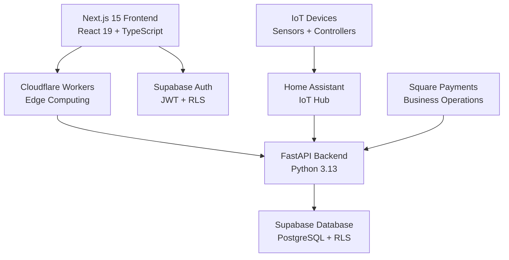

# Vertical Farm Documentation

Welcome to the comprehensive documentation for the Vertical Farm Management Platform - a full-stack IoT solution combining Next.js 15, FastAPI, Supabase, and Cloudflare Workers for smart agriculture automation.

## 🚀 Quick Start

**New to the project?** Start here based on your role:

- **👩‍💻 Developer** → [Getting Started Guide](getting-started/README.md)
- **🔧 DevOps Engineer** → [Operations Overview](operations/README.md) 
- **📚 API Consumer** → [API Reference](reference/api/README.md)
- **🎨 Frontend Developer** → [Frontend Guide](guides/features/README.md)

## ⚡ Development Setup

```bash
# Prerequisites: Node.js 18+, Python 3.13+, Docker
# Install Supabase CLI
brew install supabase/tap/supabase

# Start development environment (recommended)
make up

# Access the application
# Frontend: http://localhost:3000
# Backend: http://localhost:8000
# Supabase Studio: http://localhost:54323
```

**Alternative setup methods:**
- **Docker Compose**: `docker-compose up --build`
- **Manual setup**: See [Environment Setup](getting-started/environment-setup.md)
- **Detailed workflow**: [Docker Workflow Guide](development/docker-workflow.md)

## 📚 Documentation Structure

### 🎯 [Getting Started](getting-started/)
Your entry point to the platform - setup, architecture overview, and quick tutorials.

### 📖 [Reference](reference/)
Technical specifications, API documentation, and system architecture details.

### 📋 [Guides](guides/)
Task-oriented how-to guides for features, integrations, and troubleshooting.

### 🛠️ [Development](development/)
Contribution guidelines, coding standards, and development workflows.

### 🚀 [Operations](operations/)
Production deployment, monitoring, security, and infrastructure management.

### 📦 [Archive](archive/)
Historical reports, completed migrations, and legacy documentation.

## 🔍 Find What You Need

| I want to... | Go to |
|--------------|-------|
| Set up my development environment | [Quickstart Guide](getting-started/quickstart.md) |
| Understand the system architecture | [Architecture Overview](getting-started/architecture-overview.md) |
| Learn about the API | [API Reference](reference/api/) |
| Deploy to production | [Deployment Guide](operations/deployment/) |
| Integrate Home Assistant | [Home Assistant Guide](guides/integrations/home-assistant.md) |
| Run tests | [Testing Guide](development/testing-guide.md) |
| Report a bug | [Contributing](development/contributing.md) |

## 🏗️ Platform Architecture

**Tech Stack**: Next.js 15 + React 19 + TypeScript + Python 3.13 + FastAPI + Supabase + Cloudflare Workers



**Project Structure**:
```
vertical-farm/
├── frontend/          # Next.js 15 application
├── backend/           # FastAPI Python backend  
├── cloudflare/        # Edge functions and workers
├── supabase/          # Database migrations and functions
├── scripts/           # Automation and deployment scripts
├── monitoring/        # Datadog dashboards and alerts
├── tests/             # Cross-platform integration tests
└── docs/              # This comprehensive documentation
```

## 📊 Key Features

### 🌱 **Agriculture Management**
- **Multi-tier Farm Hierarchy**: Farms → Rows → Racks → Shelves organization
- **Grow Recipe System**: Automated growing parameters and schedules
- **Plant Lifecycle Tracking**: From seed to harvest monitoring

### 🏭 **IoT & Automation**
- **Real-time Device Control**: Sensors, fans, lights, pumps integration
- **Home Assistant Integration**: Comprehensive IoT device management
- **Visual Layer Overlay System**: Multi-layer farm visualization
- **Automated Responses**: Condition-based device automation

### 📊 **Business Operations** 
- **Square Payment Integration**: Revenue tracking and payment processing
- **Performance Analytics**: Yield optimization and cost analysis
- **Multi-user Support**: Role-based access control with RLS
- **Datadog Monitoring**: Production-grade observability

### 💻 **Technical Excellence**
- **Service Layer Architecture**: Mandatory pattern for all data operations
- **PWA Support**: Mobile-first design with offline capabilities
- **Edge Computing**: Cloudflare Workers for global performance
- **Modern Stack**: Next.js 15, React 19, Python 3.13, TypeScript

## 🤝 Contributing to Documentation

Found something unclear or missing? See our [Documentation Guidelines](development/contributing.md#documentation) to contribute.

## 📞 Support

- **Issues**: [GitHub Issues](../CONTRIBUTING.md)
- **Discussions**: [GitHub Discussions](../CONTRIBUTING.md)
- **Architecture Questions**: See [Architecture Reference](reference/architecture/)

---

*Last Updated: January 2025 | Active Documents: 44 | Structure Version: 2.0 | [Migration Guide](archive/migrations/MIGRATION_FROM_OLD_STRUCTURE.md)*