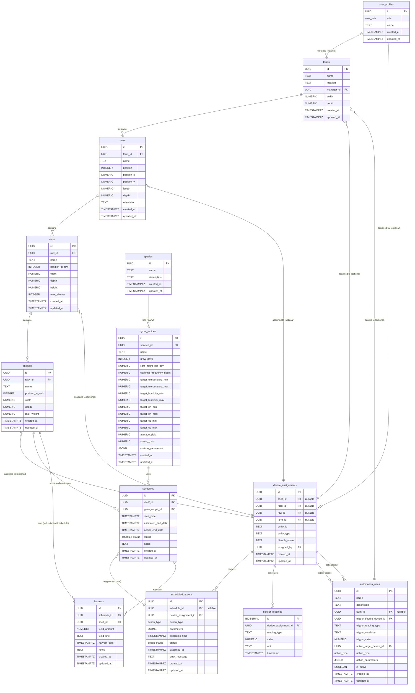

# Vertical Farm Database Schema

## Introduction
This document outlines the database schema for the Vertical Farm project. The schema is designed for use with Supabase (PostgreSQL) and supports all core functionalities including farm layout management, device assignment, grow recipe management, scheduling, automation, and role-based access control.

## Entity Relationship Diagram (ERD)



---

## Table Definitions & SQL

This section contains the SQL DDL statements for creating the database schema. It is intended to be used for Supabase migrations.

```sql
-- Enable UUID extension if not already enabled
CREATE EXTENSION IF NOT EXISTS "uuid-ossp";

-- Enum for user roles
CREATE TYPE user_role AS ENUM ('farm_manager', 'operator', 'ha_power_user', 'admin');

-- Table for user profiles, linking to Supabase auth.users
CREATE TABLE public.user_profiles (
  id UUID PRIMARY KEY REFERENCES auth.users(id) ON DELETE CASCADE,
  role user_role NOT NULL DEFAULT 'operator',
  name TEXT,
  created_at TIMESTAMP WITH TIME ZONE DEFAULT NOW(),
  updated_at TIMESTAMP WITH TIME ZONE DEFAULT NOW()
);

-- Indexes for user_profiles
CREATE INDEX idx_user_profiles_role ON public.user_profiles(role);

-- RLS Policies for user_profiles (Example - apply as needed in a separate migration or step)
-- ALTER TABLE public.user_profiles ENABLE ROW LEVEL SECURITY;
-- CREATE POLICY "Users can view their own profile" ON public.user_profiles FOR SELECT USING (auth.uid() = id);
-- CREATE POLICY "Admins can manage all profiles" ON public.user_profiles FOR ALL USING (EXISTS (SELECT 1 FROM public.user_profiles WHERE id = auth.uid() AND role = 'admin'));


-- Farm Hierarchy Tables
CREATE TABLE public.farms (
  id UUID PRIMARY KEY DEFAULT uuid_generate_v4(),
  name TEXT NOT NULL UNIQUE,
  location TEXT,
  manager_id UUID REFERENCES public.user_profiles(id) ON DELETE SET NULL,
  width NUMERIC,
  depth NUMERIC,
  created_at TIMESTAMP WITH TIME ZONE DEFAULT NOW(),
  updated_at TIMESTAMP WITH TIME ZONE DEFAULT NOW()
);
CREATE INDEX idx_farms_manager_id ON public.farms(manager_id);


CREATE TABLE public.rows (
  id UUID PRIMARY KEY DEFAULT uuid_generate_v4(),
  farm_id UUID NOT NULL REFERENCES public.farms(id) ON DELETE CASCADE,
  name TEXT NOT NULL,
  position INTEGER NOT NULL, -- Order of the row within the farm
  position_x NUMERIC,
  position_y NUMERIC,
  length NUMERIC,
  depth NUMERIC, -- Can be different from length based on representation
  orientation TEXT, -- e.g., 'horizontal', 'vertical'
  created_at TIMESTAMP WITH TIME ZONE DEFAULT NOW(),
  updated_at TIMESTAMP WITH TIME ZONE DEFAULT NOW(),
  UNIQUE (farm_id, name),
  UNIQUE (farm_id, position)
);
CREATE INDEX idx_rows_farm_id ON public.rows(farm_id);


CREATE TABLE public.racks (
  id UUID PRIMARY KEY DEFAULT uuid_generate_v4(),
  row_id UUID NOT NULL REFERENCES public.rows(id) ON DELETE CASCADE,
  name TEXT NOT NULL,
  position_in_row INTEGER NOT NULL,
  width NUMERIC,
  depth NUMERIC,
  height NUMERIC,
  max_shelves INTEGER,
  created_at TIMESTAMP WITH TIME ZONE DEFAULT NOW(),
  updated_at TIMESTAMP WITH TIME ZONE DEFAULT NOW(),
  UNIQUE (row_id, name),
  UNIQUE (row_id, position_in_row)
);
CREATE INDEX idx_racks_row_id ON public.racks(row_id);


CREATE TABLE public.shelves (
  id UUID PRIMARY KEY DEFAULT uuid_generate_v4(),
  rack_id UUID NOT NULL REFERENCES public.racks(id) ON DELETE CASCADE,
  name TEXT NOT NULL,
  position_in_rack INTEGER NOT NULL,
  width NUMERIC,
  depth NUMERIC,
  max_weight NUMERIC,
  created_at TIMESTAMP WITH TIME ZONE DEFAULT NOW(),
  updated_at TIMESTAMP WITH TIME ZONE DEFAULT NOW(),
  UNIQUE (rack_id, name),
  UNIQUE (rack_id, position_in_rack)
);
CREATE INDEX idx_shelves_rack_id ON public.shelves(rack_id);


-- Device Assignment
CREATE TABLE public.device_assignments (
  id UUID PRIMARY KEY DEFAULT uuid_generate_v4(),
  shelf_id UUID REFERENCES public.shelves(id) ON DELETE CASCADE,
  rack_id UUID REFERENCES public.racks(id) ON DELETE CASCADE,
  row_id UUID REFERENCES public.rows(id) ON DELETE CASCADE,
  farm_id UUID REFERENCES public.farms(id) ON DELETE CASCADE,
  entity_id TEXT NOT NULL, -- ID from Home Assistant or other source
  entity_type TEXT NOT NULL, -- e.g., 'sensor', 'switch', 'light'
  friendly_name TEXT,
  assigned_by UUID REFERENCES public.user_profiles(id) ON DELETE SET NULL,
  created_at TIMESTAMP WITH TIME ZONE DEFAULT NOW(),
  updated_at TIMESTAMP WITH TIME ZONE DEFAULT NOW(),
  CONSTRAINT chk_device_assignment_level
    CHECK (
      (shelf_id IS NOT NULL AND rack_id IS NULL AND row_id IS NULL AND farm_id IS NULL) OR
      (shelf_id IS NULL AND rack_id IS NOT NULL AND row_id IS NULL AND farm_id IS NULL) OR
      (shelf_id IS NULL AND rack_id IS NULL AND row_id IS NOT NULL AND farm_id IS NULL) OR
      (shelf_id IS NULL AND rack_id IS NULL AND row_id IS NULL AND farm_id IS NOT NULL)
    )
);
CREATE INDEX idx_device_assignments_shelf_id ON public.device_assignments(shelf_id);
CREATE INDEX idx_device_assignments_rack_id ON public.device_assignments(rack_id);
CREATE INDEX idx_device_assignments_row_id ON public.device_assignments(row_id);
CREATE INDEX idx_device_assignments_farm_id ON public.device_assignments(farm_id);
CREATE INDEX idx_device_assignments_entity_id ON public.device_assignments(entity_id);


-- Species (for plants/crops)
CREATE TABLE public.species (
  id UUID PRIMARY KEY DEFAULT uuid_generate_v4(),
  name TEXT NOT NULL UNIQUE,
  description TEXT,
  created_at TIMESTAMP WITH TIME ZONE DEFAULT NOW(),
  updated_at TIMESTAMP WITH TIME ZONE DEFAULT NOW()
);


-- Grow Recipes
CREATE TABLE public.grow_recipes (
  id UUID PRIMARY KEY DEFAULT uuid_generate_v4(),
  species_id UUID NOT NULL REFERENCES public.species(id) ON DELETE RESTRICT,
  name TEXT NOT NULL,
  grow_days INTEGER,
  light_hours_per_day NUMERIC,
  watering_frequency_hours NUMERIC,
  target_temperature_min NUMERIC,
  target_temperature_max NUMERIC,
  target_humidity_min NUMERIC,
  target_humidity_max NUMERIC,
  target_ph_min NUMERIC,
  target_ph_max NUMERIC,
  target_ec_min NUMERIC,
  target_ec_max NUMERIC,
  average_yield NUMERIC,
  sowing_rate NUMERIC,
  custom_parameters JSONB,
  created_at TIMESTAMP WITH TIME ZONE DEFAULT NOW(),
  updated_at TIMESTAMP WITH TIME ZONE DEFAULT NOW(),
  UNIQUE (species_id, name)
);
CREATE INDEX idx_grow_recipes_species_id ON public.grow_recipes(species_id);


-- Schedules (for what's growing on a shelf)
CREATE TYPE schedule_status AS ENUM ('planned', 'active', 'completed', 'aborted');

CREATE TABLE public.schedules (
  id UUID PRIMARY KEY DEFAULT uuid_generate_v4(),
  shelf_id UUID NOT NULL REFERENCES public.shelves(id) ON DELETE CASCADE,
  grow_recipe_id UUID NOT NULL REFERENCES public.grow_recipes(id) ON DELETE RESTRICT,
  start_date TIMESTAMP WITH TIME ZONE NOT NULL,
  estimated_end_date TIMESTAMP WITH TIME ZONE,
  actual_end_date TIMESTAMP WITH TIME ZONE,
  status schedule_status NOT NULL DEFAULT 'planned',
  notes TEXT,
  created_at TIMESTAMP WITH TIME ZONE DEFAULT NOW(),
  updated_at TIMESTAMP WITH TIME ZONE DEFAULT NOW()
);
CREATE INDEX idx_schedules_shelf_id ON public.schedules(shelf_id);
CREATE INDEX idx_schedules_grow_recipe_id ON public.schedules(grow_recipe_id);
CREATE INDEX idx_schedules_status ON public.schedules(status);


-- Scheduled Actions (for automation)
CREATE TYPE action_type AS ENUM ('light_on', 'light_off', 'water_pump_on', 'water_pump_off', 'nutrient_dose', 'fan_on', 'fan_off', 'alert');
CREATE TYPE action_status AS ENUM ('pending', 'executed', 'failed', 'skipped', 'cancelled');

CREATE TABLE public.scheduled_actions (
  id UUID PRIMARY KEY DEFAULT uuid_generate_v4(),
  schedule_id UUID REFERENCES public.schedules(id) ON DELETE CASCADE,
  device_assignment_id UUID REFERENCES public.device_assignments(id) ON DELETE CASCADE,
  action_type action_type NOT NULL,
  parameters JSONB,
  execution_time TIMESTAMP WITH TIME ZONE NOT NULL,
  status action_status NOT NULL DEFAULT 'pending',
  executed_at TIMESTAMP WITH TIME ZONE,
  error_message TEXT,
  created_at TIMESTAMP WITH TIME ZONE DEFAULT NOW(),
  updated_at TIMESTAMP WITH TIME ZONE DEFAULT NOW()
);
CREATE INDEX idx_scheduled_actions_schedule_id ON public.scheduled_actions(schedule_id);
CREATE INDEX idx_scheduled_actions_device_assignment_id ON public.scheduled_actions(device_assignment_id);
CREATE INDEX idx_scheduled_actions_execution_time ON public.scheduled_actions(execution_time);
CREATE INDEX idx_scheduled_actions_status ON public.scheduled_actions(status);


-- Sensor Readings (formerly Sensor History)
CREATE TABLE public.sensor_readings (
  id BIGSERIAL PRIMARY KEY,
  device_assignment_id UUID NOT NULL REFERENCES public.device_assignments(id) ON DELETE CASCADE,
  reading_type TEXT NOT NULL, -- e.g., 'temperature', 'humidity', 'ph', 'ec'
  value NUMERIC NOT NULL,
  unit TEXT, -- e.g., 'C', '%', 'ppm'
  timestamp TIMESTAMP WITH TIME ZONE NOT NULL DEFAULT NOW()
);
CREATE INDEX idx_sensor_readings_device_assignment_id_timestamp ON public.sensor_readings(device_assignment_id, timestamp DESC);
CREATE INDEX idx_sensor_readings_timestamp ON public.sensor_readings(timestamp DESC);
-- Consider TimescaleDB for sensor_readings if volume is very high:
-- SELECT create_hypertable('sensor_readings', 'timestamp');


-- Harvests
CREATE TABLE public.harvests (
  id UUID PRIMARY KEY DEFAULT uuid_generate_v4(),
  schedule_id UUID NOT NULL REFERENCES public.schedules(id) ON DELETE RESTRICT,
  shelf_id UUID NOT NULL REFERENCES public.shelves(id) ON DELETE RESTRICT, -- Consider if needed, as schedule has shelf_id
  yield_amount NUMERIC NOT NULL,
  yield_unit TEXT NOT NULL, -- e.g., 'grams', 'kg', 'heads'
  harvest_date TIMESTAMP WITH TIME ZONE NOT NULL DEFAULT NOW(),
  notes TEXT,
  created_at TIMESTAMP WITH TIME ZONE DEFAULT NOW(),
  updated_at TIMESTAMP WITH TIME ZONE DEFAULT NOW()
);
CREATE INDEX idx_harvests_schedule_id ON public.harvests(schedule_id);
CREATE INDEX idx_harvests_shelf_id ON public.harvests(shelf_id);


-- Automation Rules
CREATE TABLE public.automation_rules (
    id UUID PRIMARY KEY DEFAULT uuid_generate_v4(),
    name TEXT NOT NULL UNIQUE,
    description TEXT,
    farm_id UUID REFERENCES public.farms(id) ON DELETE CASCADE,
    trigger_source_device_id UUID REFERENCES public.device_assignments(id) ON DELETE CASCADE,
    trigger_reading_type TEXT,
    trigger_condition TEXT, -- e.g., '>', '<', '='
    trigger_value NUMERIC,
    action_target_device_id UUID REFERENCES public.device_assignments(id) ON DELETE CASCADE,
    action_type action_type,
    action_parameters JSONB,
    is_active BOOLEAN DEFAULT TRUE,
    created_at TIMESTAMP WITH TIME ZONE DEFAULT NOW(),
    updated_at TIMESTAMP WITH TIME ZONE DEFAULT NOW()
);
CREATE INDEX idx_automation_rules_farm_id ON public.automation_rules(farm_id);
CREATE INDEX idx_automation_rules_is_active ON public.automation_rules(is_active);

```

---
## Notes & Considerations
- **RLS Policies:** Row Level Security policies are commented out in the SQL DDL. These should be reviewed, tailored, and applied in a subsequent migration or step, once the basic schema is confirmed.
- **Physical Dimensions:** Added `width`, `depth`, `height`, `position_x`, `position_y`, `length`, `orientation`, `max_shelves`, `max_weight` to the farm hierarchy tables (`farms`, `rows`, `racks`, `shelves`) to support detailed layout configuration and visualization.
- **Device Assignment:** Modified `device_assignments` to allow linking devices at `farm`, `row`, `rack`, or `shelf` level using a check constraint.
- **Sensor Readings:** Renamed `sensor_history` to `sensor_readings` for clarity and used `BIGSERIAL` for its primary key.
- **ENUM Types:** Defined `user_role`, `schedule_status`, `action_type`, and `action_status` as ENUM types.
- **Default Values:** `DEFAULT uuid_generate_v4()` for UUID primary keys and `DEFAULT NOW()` for `created_at`/`updated_at` timestamps are used.
- **Indexes:** Basic indexes are included for foreign keys and commonly queried columns. More specific or composite indexes might be needed based on query patterns.
- **TimescaleDB:** A comment is included regarding the potential use of TimescaleDB for the `sensor_readings` table if data volume becomes very large.
