# CI/CD Workflow Diagram

This diagram illustrates the continuous integration and deployment (CI/CD) process for the Vertical Farm project, focusing on Docker-based unRAID deployment.

```mermaid
graph TD
  A[Push to main branch or PR] --> B[GitHub Actions: build-push.yml]
  B --> C1[Build & Push Backend Docker Image\nto GHCR]
  B --> C2[Build & Push Frontend Docker Image\nto GHCR]
  C1 & C2 --> D[unraid-deploy.yml on workflow_run]
  D --> E1[Pull & Restart Backend Container\non unRAID]
  D --> E2[Pull & Restart Frontend Container\non unRAID]
  D --> E3[Pull & Restart Datadog Agent\non unRAID]

  %% Secrets and environment
  subgraph GitHub Secrets
    S1[GHCR_TOKEN]
    S2[NEXT_PUBLIC_SUPABASE_URL, etc.]
  end
  S1 --> B
  S2 --> B
  S2 --> D

  %% Monitoring
  E3 --> H[Datadog Cloud]
```

**Legend:**
- **GHCR**: GitHub Container Registry
- **unRAID**: Self-hosted server for local/edge deployment
- **Datadog**: Monitoring/logging

---

- For details, see `.github/workflows/build-push.yml` and `.github/workflows/unraid-deploy.yml`.
- Environment variables and secrets are managed via GitHub repository settings.
