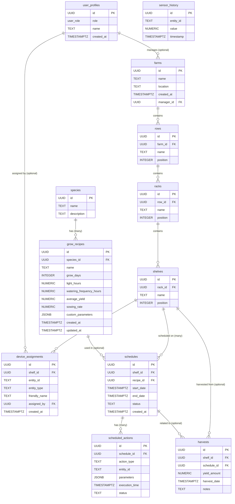

# Vertical Farm Database Schema

## Introduction
This document outlines the database schema for the Vertical Farm project. The schema is designed for use with Supabase (PostgreSQL) and supports all core functionalities including farm layout management, device assignment, grow recipe management, scheduling, automation, and role-based access control.

## Entity Relationship Diagram (ERD)



---

## Table Definitions & SQL

### 1. User Profiles & Roles
Manages user-specific information and their roles within the system.
```sql
-- Enum for user roles
CREATE TYPE user_role AS ENUM ('farm_manager', 'operator', 'ha_power_user', 'admin');

-- Table for user profiles, linking to Supabase auth.users
CREATE TABLE user_profiles (
  id UUID PRIMARY KEY REFERENCES auth.users(id) ON DELETE CASCADE,
  role user_role NOT NULL DEFAULT 'operator',
  name TEXT,
  created_at TIMESTAMP WITH TIME ZONE DEFAULT NOW(),
  updated_at TIMESTAMP WITH TIME ZONE DEFAULT NOW()
);

-- Indexes
CREATE INDEX idx_user_profiles_role ON user_profiles(role);

-- RLS Policies (Examples - adapt as needed)
ALTER TABLE user_profiles ENABLE ROW LEVEL SECURITY;
CREATE POLICY "Users can view their own profile" ON user_profiles FOR SELECT USING (auth.uid() = id);
CREATE POLICY "Admins can manage all profiles" ON user_profiles FOR ALL USING (EXISTS (SELECT 1 FROM user_profiles WHERE id = auth.uid() AND role = 'admin'));
```

### 2. Farm Hierarchy
Defines the physical layout of the vertical farm.
```sql
CREATE TABLE farms (
  id UUID PRIMARY KEY DEFAULT uuid_generate_v4(),
  name TEXT NOT NULL UNIQUE,
  location TEXT,
  manager_id UUID REFERENCES user_profiles(id) ON DELETE SET NULL, -- Farm can exist without a manager
  created_at TIMESTAMP WITH TIME ZONE DEFAULT NOW(),
  updated_at TIMESTAMP WITH TIME ZONE DEFAULT NOW()
);

CREATE TABLE rows (
  id UUID PRIMARY KEY DEFAULT uuid_generate_v4(),
  farm_id UUID NOT NULL REFERENCES farms(id) ON DELETE CASCADE,
  name TEXT NOT NULL,
  position INTEGER NOT NULL, -- Order of the row within the farm
  created_at TIMESTAMP WITH TIME ZONE DEFAULT NOW(),
  updated_at TIMESTAMP WITH TIME ZONE DEFAULT NOW(),
  UNIQUE (farm_id, name), -- Row names unique within a farm
  UNIQUE (farm_id, position) -- Row positions unique within a farm
);

CREATE TABLE racks (
  id UUID PRIMARY KEY DEFAULT uuid_generate_v4(),
  row_id UUID NOT NULL REFERENCES rows(id) ON DELETE CASCADE,
  name TEXT NOT NULL,
  position INTEGER NOT NULL, -- Order of the rack within the row
  created_at TIMESTAMP WITH TIME ZONE DEFAULT NOW(),
  updated_at TIMESTAMP WITH TIME ZONE DEFAULT NOW(),
  UNIQUE (row_id, name),
  UNIQUE (row_id, position)
);

CREATE TABLE shelves (
  id UUID PRIMARY KEY DEFAULT uuid_generate_v4(),
  rack_id UUID NOT NULL REFERENCES racks(id) ON DELETE CASCADE,
  name TEXT NOT NULL,
  position INTEGER NOT NULL, -- Order of the shelf within the rack
  created_at TIMESTAMP WITH TIME ZONE DEFAULT NOW(),
  updated_at TIMESTAMP WITH TIME ZONE DEFAULT NOW(),
  UNIQUE (rack_id, name),
  UNIQUE (rack_id, position)
);

-- Indexes for hierarchy tables
CREATE INDEX idx_farms_manager_id ON farms(manager_id);
CREATE INDEX idx_rows_farm_id ON rows(farm_id);
CREATE INDEX idx_racks_row_id ON racks(row_id);
CREATE INDEX idx_shelves_rack_id ON shelves(rack_id);
```

### 3. Device Assignment
Links physical devices (from Home Assistant or other sources) to specific shelves.
```sql
CREATE TABLE device_assignments (
  id UUID PRIMARY KEY DEFAULT uuid_generate_v4(),
  shelf_id UUID NOT NULL REFERENCES shelves(id) ON DELETE CASCADE,
  entity_id TEXT NOT NULL, -- e.g., 'sensor.temperature_shelf_1' from Home Assistant
  entity_type TEXT NOT NULL, -- e.g., 'sensor', 'light', 'switch', 'solenoid'
  friendly_name TEXT,
  assigned_by UUID REFERENCES user_profiles(id) ON DELETE SET NULL,
  custom_config JSONB, -- For device-specific settings
  created_at TIMESTAMP WITH TIME ZONE DEFAULT NOW(),
  updated_at TIMESTAMP WITH TIME ZONE DEFAULT NOW(),
  UNIQUE (shelf_id, entity_id) -- An entity can only be assigned once to a shelf
);

-- Indexes
CREATE INDEX idx_device_assignments_shelf_id ON device_assignments(shelf_id);
CREATE INDEX idx_device_assignments_entity_type ON device_assignments(entity_type);
```

### 4. Species & Grow Recipes
Manages plant species and their specific growing instructions.
```sql
CREATE TABLE species (
  id UUID PRIMARY KEY DEFAULT uuid_generate_v4(),
  name TEXT NOT NULL UNIQUE,
  description TEXT,
  created_at TIMESTAMP WITH TIME ZONE DEFAULT NOW(),
  updated_at TIMESTAMP WITH TIME ZONE DEFAULT NOW()
);

CREATE TABLE grow_recipes (
  id UUID PRIMARY KEY DEFAULT uuid_generate_v4(),
  species_id UUID REFERENCES species(id) ON DELETE SET NULL,
  name TEXT NOT NULL UNIQUE, -- Recipe names should be unique
  description TEXT,
  grow_days INTEGER NOT NULL CHECK (grow_days > 0),
  light_hours NUMERIC(4,2) NOT NULL CHECK (light_hours >= 0 AND light_hours <= 24),
  watering_frequency_hours NUMERIC(5,2) NOT NULL CHECK (watering_frequency_hours > 0),
  average_yield NUMERIC(8,2) CHECK (average_yield >= 0),
  sowing_rate NUMERIC(8,2) CHECK (sowing_rate >= 0),
  custom_parameters JSONB, -- e.g., nutrient solution details, CO2 levels
  created_at TIMESTAMP WITH TIME ZONE DEFAULT NOW(),
  updated_at TIMESTAMP WITH TIME ZONE DEFAULT NOW()
);

-- Indexes
CREATE INDEX idx_grow_recipes_species_id ON grow_recipes(species_id);
```

### 5. Scheduling & Automation
Manages scheduled tasks based on grow recipes for automated operations.
```sql
CREATE TYPE schedule_status AS ENUM ('pending', 'active', 'completed', 'paused', 'cancelled');
CREATE TYPE action_status AS ENUM ('pending', 'in_progress', 'completed', 'failed', 'skipped');

CREATE TABLE schedules (
  id UUID PRIMARY KEY DEFAULT uuid_generate_v4(),
  shelf_id UUID NOT NULL REFERENCES shelves(id) ON DELETE CASCADE,
  recipe_id UUID REFERENCES grow_recipes(id) ON DELETE SET NULL, -- A schedule might not always have a recipe initially
  name TEXT NOT NULL,
  start_date TIMESTAMP WITH TIME ZONE NOT NULL,
  end_date TIMESTAMP WITH TIME ZONE, -- Can be NULL for ongoing schedules or calculated from recipe
  status schedule_status NOT NULL DEFAULT 'pending',
  created_at TIMESTAMP WITH TIME ZONE DEFAULT NOW(),
  updated_at TIMESTAMP WITH TIME ZONE DEFAULT NOW(),
  CHECK (end_date IS NULL OR end_date > start_date)
);

CREATE TABLE scheduled_actions (
  id UUID PRIMARY KEY DEFAULT uuid_generate_v4(),
  schedule_id UUID NOT NULL REFERENCES schedules(id) ON DELETE CASCADE,
  action_type TEXT NOT NULL, -- e.g., 'turn_light_on', 'water_plants', 'adjust_temp'
  device_assignment_id UUID REFERENCES device_assignments(id) ON DELETE SET NULL, -- Link to the specific device if applicable
  parameters JSONB, -- e.g., {"duration_minutes": 30} or {"temperature_celsius": 22}
  execution_time TIMESTAMP WITH TIME ZONE NOT NULL,
  status action_status NOT NULL DEFAULT 'pending',
  notes TEXT, -- For logging execution details or errors
  created_at TIMESTAMP WITH TIME ZONE DEFAULT NOW(),
  updated_at TIMESTAMP WITH TIME ZONE DEFAULT NOW()
);

-- Indexes
CREATE INDEX idx_schedules_shelf_id ON schedules(shelf_id);
CREATE INDEX idx_schedules_recipe_id ON schedules(recipe_id);
CREATE INDEX idx_schedules_status ON schedules(status);
CREATE INDEX idx_scheduled_actions_schedule_id ON scheduled_actions(schedule_id);
CREATE INDEX idx_scheduled_actions_execution_time ON scheduled_actions(execution_time);
CREATE INDEX idx_scheduled_actions_status ON scheduled_actions(status);
CREATE INDEX idx_scheduled_actions_device_assignment_id ON scheduled_actions(device_assignment_id);
```

### 6. Monitoring & Analytics
Stores historical sensor data and harvest records for analysis and reporting.
```sql
CREATE TABLE sensor_history (
  id BIGSERIAL PRIMARY KEY, -- Using BIGSERIAL for high-frequency data
  device_assignment_id UUID REFERENCES device_assignments(id) ON DELETE CASCADE, -- Link to the device
  timestamp TIMESTAMP WITH TIME ZONE NOT NULL DEFAULT NOW(),
  metric_name TEXT NOT NULL, -- e.g., 'temperature', 'humidity', 'ph', 'ec'
  value NUMERIC NOT NULL,
  unit TEXT -- e.g., 'C', '%', 'pH'
);

-- Create a hypertable for TimescaleDB if used for sensor_history
-- SELECT create_hypertable('sensor_history', 'timestamp');

CREATE INDEX idx_sensor_history_device_assignment_id_timestamp ON sensor_history(device_assignment_id, timestamp DESC);
CREATE INDEX idx_sensor_history_metric_name ON sensor_history(metric_name);

CREATE TABLE harvests (
  id UUID PRIMARY KEY DEFAULT uuid_generate_v4(),
  shelf_id UUID NOT NULL REFERENCES shelves(id) ON DELETE CASCADE,
  schedule_id UUID REFERENCES schedules(id) ON DELETE SET NULL, -- Harvest may or may not be tied to a specific schedule
  species_id UUID REFERENCES species(id) ON DELETE SET NULL,
  yield_amount NUMERIC(10,2) NOT NULL CHECK (yield_amount >= 0),
  yield_unit TEXT NOT NULL DEFAULT 'grams', -- e.g., grams, kg, count
  harvest_date TIMESTAMP WITH TIME ZONE NOT NULL DEFAULT NOW(),
  notes TEXT,
  created_at TIMESTAMP WITH TIME ZONE DEFAULT NOW(),
  updated_at TIMESTAMP WITH TIME ZONE DEFAULT NOW()
);

-- Indexes
CREATE INDEX idx_harvests_shelf_id ON harvests(shelf_id);
CREATE INDEX idx_harvests_schedule_id ON harvests(schedule_id);
CREATE INDEX idx_harvests_species_id ON harvests(species_id);
CREATE INDEX idx_harvests_harvest_date ON harvests(harvest_date);
```

### 2.5. Access Control and Permissions

To manage user access to specific farms and their entities, a dedicated permissions system is implemented.

#### 2.5.1. Permission Levels (ENUM)

A PostgreSQL ENUM type `permission_level_enum` defines the possible permission levels a user can have for a farm:

```sql
-- Create enum type for permission levels
CREATE TYPE permission_level_enum AS ENUM (
  'viewer',  -- Can view farm layout and settings. Cannot make changes.
  'editor',  -- Can create/update/delete farm entities (layout, components, etc.) for assigned farms. Cannot manage user permissions for the farm.
  'manager'  -- All 'editor' capabilities, PLUS can manage user permissions ('viewer', 'editor') for that farm.
);
```
These levels are hierarchical (`manager` > `editor` > `viewer`).

#### 2.5.2. `farm_user_permissions` Table

This table links users to farms and assigns them a specific permission level.

```sql
CREATE TABLE farm_user_permissions (
  id UUID PRIMARY KEY DEFAULT gen_random_uuid(),
  farm_id UUID NOT NULL REFERENCES farms(id) ON DELETE CASCADE,
  user_id UUID NOT NULL REFERENCES auth.users(id) ON DELETE CASCADE, -- Assuming users are in Supabase's auth.users table
  permission permission_level_enum NOT NULL,
  created_at TIMESTAMPTZ DEFAULT now(),
  updated_at TIMESTAMPTZ DEFAULT now(),
  UNIQUE (farm_id, user_id) -- Ensures a user has only one permission level per farm
);

-- Indexes for query performance
CREATE INDEX idx_farm_user_permissions_farm_id ON farm_user_permissions(farm_id);
CREATE INDEX idx_farm_user_permissions_user_id ON farm_user_permissions(user_id);
CREATE INDEX idx_farm_user_permissions_farm_user_permission ON farm_user_permissions(farm_id, user_id, permission);
```

#### 2.5.3. Row Level Security (RLS) Policies for `farms` Table

RLS policies on the `farms` table control access based on the `farm_user_permissions` table.

```sql
-- Ensure RLS is enabled on the farms table
ALTER TABLE farms ENABLE ROW LEVEL SECURITY;

-- Policy for SELECT operations (Read access)
CREATE POLICY "Allow farm read based on farm_user_permissions"
ON farms
FOR SELECT
USING (
  EXISTS (
    SELECT 1
    FROM farm_user_permissions fup
    WHERE fup.farm_id = farms.id
      AND fup.user_id = auth.uid() -- auth.uid() is the currently authenticated user
  )
  OR is_platform_admin() -- Placeholder for platform-wide admin access
);

-- Policy for UPDATE operations
-- Note: Most updates will go through the FastAPI backend, but this provides defense-in-depth.
CREATE POLICY "Allow farm update based on farm_user_permissions"
ON farms
FOR UPDATE
USING (
  EXISTS (
    SELECT 1
    FROM farm_user_permissions fup
    WHERE fup.farm_id = farms.id
      AND fup.user_id = auth.uid()
      AND fup.permission IN ('editor', 'manager')
  )
  OR is_platform_admin()
)
WITH CHECK ( -- Applies to new data being inserted/updated
  EXISTS (
    SELECT 1
    FROM farm_user_permissions fup
    WHERE fup.farm_id = farms.id
      AND fup.user_id = auth.uid()
      AND fup.permission IN ('editor', 'manager')
  )
  OR is_platform_admin()
);


-- Policy for DELETE operations
-- Note: Most deletes will go through the FastAPI backend.
CREATE POLICY "Allow farm delete based on farm_user_permissions"
ON farms
FOR DELETE
USING (
  EXISTS (
    SELECT 1
    FROM farm_user_permissions fup
    WHERE fup.farm_id = farms.id
      AND fup.user_id = auth.uid()
      AND fup.permission = 'manager'
  )
  OR is_platform_admin()
);
```

#### 2.5.4. Platform Admin Check Function (Placeholder)

This function is a placeholder for identifying platform administrators who might have unrestricted access. Its actual implementation will depend on how platform admins are defined (e.g., a separate table, custom JWT claims).

```sql
-- Placeholder function to check if the current user is a platform admin
CREATE OR REPLACE FUNCTION is_platform_admin()
RETURNS BOOLEAN
LANGUAGE plpgsql
SECURITY DEFINER -- Important for RLS policies that might use this
AS $$
BEGIN
  -- Actual implementation will depend on how admins are identified.
  -- For example, check against a dedicated 'platform_admins' table
  -- or a custom claim in the user's JWT.
  -- For now, it returns false to prevent unintended broad access.
  IF current_setting('request.jwt.claims', true)::jsonb ->> 'app_metadata'::text ->> 'is_platform_admin' = 'true' THEN
    RETURN true;
  END IF;
  RETURN false; 
END;
$$;
```
**Note on `is_platform_admin()`:** The example above shows one way to check a custom claim. This function must be carefully designed and secured. `SECURITY DEFINER` is used so that it can, if necessary, access tables or settings not normally available to the calling user, but this must be handled with extreme caution to prevent privilege escalation vulnerabilities.

## 3. API Endpoints (Placeholder)
