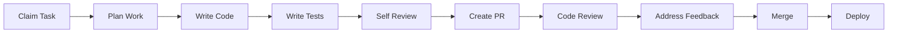

# Development Documentation

Comprehensive development guide for the Vertical Farm platform.

## 📚 Documentation Structure

| Document | Purpose | When to Use |
|----------|---------|-------------|
| **[Contributing Guide](contributing.md)** | Complete onboarding and workflow | Starting development, understanding process |
| **[Coding Standards](coding-standards.md)** | Style guide and design patterns | Writing new code, reviewing PRs |
| **[Testing Guide](testing-guide.md)** | Testing strategy and implementation | Writing tests, debugging failures |
| **[Debugging Guide](debugging.md)** | Debugging techniques and tools | Troubleshooting issues |
| **[Pull Request Guide](pull-request-guide.md)** | PR process and best practices | Creating or reviewing PRs |

## 🚀 Quick Start Path

### For New Contributors

1. **Start Here** → [Contributing Guide](contributing.md)
   - Environment setup
   - Development workflow
   - How to claim and complete tasks

2. **Understand Standards** → [Coding Standards](coding-standards.md)
   - Architecture patterns (Service Layer is MANDATORY!)
   - Frontend patterns (Next.js 15, React 19)
   - Backend patterns (FastAPI, Python 3.13)

3. **Write Tests** → [Testing Guide](testing-guide.md)
   - Test organization
   - Writing effective tests
   - Coverage requirements

4. **Submit Work** → [Pull Request Guide](pull-request-guide.md)
   - PR creation process
   - Review guidelines
   - Merge requirements

## 🏗️ Technology Stack

### Frontend
- **Framework:** Next.js 15 (App Router)
- **UI Library:** React 19
- **Language:** TypeScript
- **Styling:** Tailwind CSS with custom design system
- **State:** Supabase client, React Context
- **Testing:** Jest, React Testing Library, Playwright

### Backend
- **Framework:** FastAPI
- **Language:** Python 3.13
- **Database:** PostgreSQL via Supabase
- **Authentication:** JWT + Supabase Auth
- **Testing:** pytest, pytest-asyncio
- **Type Checking:** mypy, Pydantic

### Infrastructure
- **Database:** Supabase (PostgreSQL + Auth + Realtime)
- **Deployment:** Docker, GitHub Actions
- **Monitoring:** Datadog (production)
- **Edge:** Cloudflare Workers

## 🎯 Critical Architecture Rules

### 🚨 Service Layer Pattern (MANDATORY)

**NEVER bypass the service layer for data operations!**

```typescript
// ✅ CORRECT - Always use service layer
const farmService = FarmService.getInstance()
const farms = await farmService.getFarmsByUser(userId)

// ❌ WRONG - Never direct database calls in components
const { data } = await supabase.from('farms').select('*')  // FORBIDDEN!
```

### 🔐 Security Requirements

- **RLS (Row Level Security)** on every database table
- **JWT authentication** for all API endpoints
- **Input validation** at service layer
- **Never expose** service keys to frontend

### ⚡ Performance Standards

- **API Response:** <200ms (p95)
- **Page Load:** <2 seconds
- **Test Execution:** <5 minutes
- **Bundle Size:** Monitor and optimize

## 📋 Development Workflow



## 🧪 Quality Gates

All code must pass:

- ✅ **Linting** (ESLint, Black, isort)
- ✅ **Type Checking** (TypeScript, mypy)
- ✅ **Unit Tests** (>80% coverage)
- ✅ **Integration Tests** (critical paths)
- ✅ **Code Review** (at least 1 approval)
- ✅ **CI/CD Pipeline** (all checks green)

## 🛠️ Developer Tools

### Required Tools
- **Git** - Version control
- **Docker** - Containerization
- **Node.js 18+** - Frontend runtime
- **Python 3.13+** - Backend runtime
- **Supabase CLI** - Local database

### Recommended IDE Setup
- **Cursor IDE** or **VS Code**
- **Extensions:**
  - Python (Pylance)
  - ESLint
  - Prettier
  - Tailwind CSS IntelliSense
  - GitLens

### MCP Servers (for Cursor)
- GitHub MCP server
- Sequential Thinking MCP server
- Context7 MCP Server
- Playwright MCP server
- Supabase MCP server

## 📊 Current Status

### Test Coverage
| Component | Target | Current | Status |
|-----------|--------|---------|--------|
| Backend | 80% | 75% | 🟡 |
| Frontend | 70% | 45% | 🔴 |
| E2E | 100% | 80% | 🟡 |

### Code Quality Metrics
- **Linting Compliance:** 95%
- **Type Coverage:** 90%
- **Documentation:** 85%
- **PR Review Time:** <24 hours

## 🚨 Common Issues

### Service Layer Violations
```typescript
// Problem: Direct Supabase call in component
// Solution: Move to service layer
// See: coding-standards.md#service-layer-pattern
```

### Test Failures
```bash
# Problem: Tests failing locally
# Solution: Check test database setup
# See: testing-guide.md#troubleshooting
```

### Merge Conflicts
```bash
# Problem: Conflicts with main branch
# Solution: Rebase and resolve
# See: pull-request-guide.md#handling-conflicts
```

## 📚 Additional Resources

### Internal Documentation
- [Architecture Overview](../01-architecture/README.md)
- [API Reference](../03-api/README.md)
- [Deployment Guide](../04-deployment/README.md)
- [Security Model](../06-security/README.md)

### External Resources
- [Next.js 15 Documentation](https://nextjs.org/docs)
- [FastAPI Documentation](https://fastapi.tiangolo.com/)
- [Supabase Documentation](https://supabase.com/docs)
- [React 19 Beta Docs](https://react.dev/)

## 🤝 Getting Help

1. **Check Documentation** - Most answers are here
2. **Search Issues** - Someone may have had the same problem
3. **Ask Team** - Post in discussions or Discord
4. **Create Issue** - If you've found a bug or need a feature

## 📈 Continuous Improvement

We regularly review and update our development practices:

- **Weekly:** Team sync on blockers
- **Monthly:** Process improvements
- **Quarterly:** Architecture review
- **Annually:** Tech stack evaluation

---

*This documentation is maintained by the development team. Last updated: January 2025*

*Have suggestions? Submit a PR to improve our docs!*