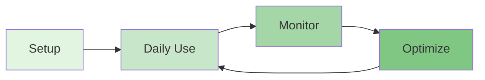

# User Guides

Practical, task-oriented guides for using the Vertical Farm Management Platform. These guides focus on helping users accomplish specific tasks and make the most of platform features.

## 📚 Guide Categories

### [Features](./features/)
Core platform features and how to use them effectively:
- **[Farm Management](./features/farm-management.md)** - Create, organize, and manage farms and grow sites
- **[Device Control](./features/device-control.md)** - Monitor and control IoT devices and automation
- **[Analytics & Reporting](./features/analytics-reporting.md)** - Generate insights and track performance
- **[User Management](./features/user-management.md)** - Manage teams, permissions, and access control
- **[Mobile Features](./features/mobile-pwa.md)** - Use the mobile app and offline features

### [Integrations](./integrations/)
Connect and configure external services:
- **[Home Assistant Setup](./integrations/home-assistant.md)** - IoT automation and device integration
- **[Square Payments](./integrations/square-payments.md)** - Payment processing and billing
- **[Supabase Queues](./integrations/supabase-queues.md)** - Background job processing
- **[Notifications](./integrations/push-notifications.md)** - Push notifications and alerts
- **[Data Export](./integrations/data-export.md)** - Export data to external systems

### [Troubleshooting](./troubleshooting/)
Solutions to common issues:
- **[Common Issues](./troubleshooting/common-issues.md)** - Frequently encountered problems and solutions
- **[Debugging Guide](./troubleshooting/debugging-guide.md)** - How to identify and fix issues
- **[Performance Issues](./troubleshooting/performance.md)** - Optimize slow performance
- **[Connection Problems](./troubleshooting/connectivity.md)** - Network and connectivity troubleshooting
- **[Data Sync Issues](./troubleshooting/data-sync.md)** - Resolve data synchronization problems

## 🚀 Quick Start Guides

### For New Users
1. [Getting Started](./features/getting-started.md) - First steps with the platform
2. [Create Your First Farm](./features/farm-management.md#create-farm) - Set up your initial farm
3. [Add Devices](./features/device-control.md#add-devices) - Connect your first devices
4. [View Analytics](./features/analytics-reporting.md#basic-reports) - Understanding your data

### For Farm Managers
1. [Daily Operations](./features/daily-operations.md) - Daily tasks and workflows
2. [Team Management](./features/user-management.md#teams) - Managing your team
3. [Automation Setup](./integrations/home-assistant.md#automation) - Automate routine tasks
4. [Performance Monitoring](./features/analytics-reporting.md#monitoring) - Track farm performance

### For Administrators
1. [System Configuration](./features/system-configuration.md) - Platform settings
2. [User Access Control](./features/user-management.md#permissions) - Security and permissions
3. [Integration Management](./integrations/) - Configure external services
4. [Backup & Recovery](./features/backup-recovery.md) - Data protection

## 📋 How to Use These Guides

### Guide Structure
Each guide follows a consistent format:
- **Overview** - What the feature does and why it's useful
- **Prerequisites** - What you need before starting
- **Step-by-Step Instructions** - Clear, numbered steps with screenshots
- **Tips & Best Practices** - Expert recommendations
- **Common Issues** - Troubleshooting specific to the feature
- **Related Guides** - Links to relevant documentation

### Finding What You Need
- **By Task**: Browse the categories above to find guides for specific tasks
- **By Role**: Check the Quick Start sections for role-specific guides
- **By Problem**: Visit [Troubleshooting](./troubleshooting/) for issue resolution
- **Search**: Use the documentation search to find specific topics

## 🔄 Platform Workflow

### Typical User Journey
1. **Initial Setup** - Configure farms, add devices, set up integrations
2. **Daily Operations** - Monitor conditions, control devices, track growth
3. **Data Analysis** - Review reports, identify trends, make decisions
4. **Optimization** - Adjust settings, improve efficiency, scale operations

## 📱 Mobile App Guide

The platform includes a Progressive Web App (PWA) for mobile access:
- Install the app on your phone for offline access
- Receive push notifications for critical alerts
- Control devices remotely
- View real-time data on the go

See [Mobile Features Guide](./features/mobile-pwa.md) for detailed instructions.

## 🔔 Notifications & Alerts

Stay informed with real-time notifications:
- **Critical Alerts** - Temperature extremes, equipment failures
- **Warnings** - Approaching thresholds, maintenance due
- **Information** - Daily summaries, harvest reminders

Configure in [Notification Settings](./integrations/push-notifications.md).

## 💡 Tips for Success

### Best Practices
1. **Regular Monitoring** - Check your dashboard daily
2. **Proactive Maintenance** - Schedule regular equipment checks
3. **Data-Driven Decisions** - Use analytics to guide operations
4. **Team Communication** - Keep your team informed with shared reports
5. **Continuous Learning** - Stay updated with new features and guides

### Power User Features
- **Keyboard Shortcuts** - Speed up navigation (press `?` for help)
- **Bulk Operations** - Manage multiple entities efficiently
- **Custom Reports** - Create tailored analytics views
- **API Access** - Integrate with your own systems

## 🆘 Getting Help

### Support Resources
- **In-App Help** - Click the help icon for contextual assistance
- **[Troubleshooting Guides](./troubleshooting/)** - Self-service problem solving
- **[API Documentation](/reference/api/)** - For developers and integrators
- **Community Forum** - Connect with other users

### Contact Support
For issues not covered in these guides:
1. Check the [Troubleshooting section](./troubleshooting/)
2. Search existing documentation
3. Contact support with:
   - Description of the issue
   - Steps to reproduce
   - Screenshots if applicable
   - Your environment details

## 📝 Guide Maintenance

These guides are regularly updated to reflect:
- New features and improvements
- User feedback and common questions
- Best practices and tips from experienced users
- Platform updates and changes

**Last Updated**: December 2024
**Version**: 2.0

---

*For technical documentation, see [Developer Guides](/development/) | For platform operations, see [Operations Guide](/operations/)*