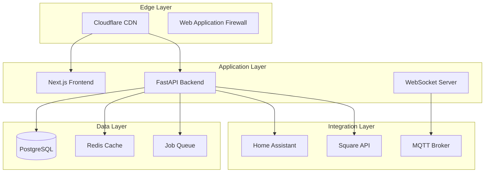

# Operations Documentation

Comprehensive guide for deploying, monitoring, securing, and maintaining the Vertical Farm Management Platform in production environments.

## 📋 Operations Overview

This documentation covers all aspects of platform operations, from initial deployment through ongoing maintenance and incident response. It's designed for DevOps engineers, system administrators, and platform operators.

## 🚀 Deployment

### [Deployment Overview](./deployment/)
Complete deployment guides for all environments and platforms.

#### Production Deployment
- **[Docker Deployment](./deployment/docker.md)** - Container-based deployment with Docker Compose
- **[Cloudflare Setup](./deployment/cloudflare.md)** - CDN, caching, and security configuration
- **[Render Deployment](./deployment/render.md)** - Platform-as-a-Service deployment
- **[Environment Configuration](./deployment/environments.md)** - Managing multiple environments

#### Infrastructure as Code
- **[Terraform Configuration](./deployment/terraform.md)** - Infrastructure automation
- **[GitHub Actions](./deployment/github-actions.md)** - CI/CD pipelines and automation
- **[Deployment Workflows](./deployment/workflows.md)** - Automated deployment processes

## 📊 Monitoring & Observability

### [Monitoring Overview](./monitoring/)
Comprehensive monitoring setup for platform health and performance.

#### Monitoring Stack
- **[Datadog Integration](./monitoring/datadog.md)** - APM, logs, and metrics
- **[Health Checks](./monitoring/health-checks.md)** - Service health monitoring
- **[Alerting Rules](./monitoring/alerts.md)** - Alert configuration and escalation
- **[Custom Metrics](./monitoring/metrics.md)** - Application-specific monitoring

#### Performance Monitoring
- **[Performance Baselines](./monitoring/performance.md)** - Expected performance metrics
- **[Resource Monitoring](./monitoring/resources.md)** - CPU, memory, disk usage
- **[Database Monitoring](./monitoring/database.md)** - Query performance and optimization
- **[Cache Performance](./monitoring/caching.md)** - Cache hit rates and efficiency

## 🔒 Security Operations

### [Security Overview](./security/)
Security policies, procedures, and incident response.

#### Security Implementation
- **[Authentication & Authorization](./security/auth.md)** - Supabase Auth and JWT configuration
- **[Network Security](./security/network.md)** - Firewall rules and network segmentation
- **[Secrets Management](./security/secrets.md)** - Managing API keys and credentials
- **[Vulnerability Management](./security/vulnerabilities.md)** - Scanning and patching procedures

#### Compliance & Auditing
- **[Security Auditing](./security/auditing.md)** - Access logs and audit trails
- **[Compliance Requirements](./security/compliance.md)** - Regulatory compliance
- **[Incident Response](./security/incident-response.md)** - Security incident procedures
- **[Disaster Recovery](./security/disaster-recovery.md)** - Backup and recovery plans

## 🔧 Maintenance Operations

### Routine Maintenance
- **[Update Procedures](./maintenance/updates.md)** - Platform and dependency updates
- **[Database Maintenance](./maintenance/database.md)** - Optimization and cleanup
- **[Log Management](./maintenance/logs.md)** - Log rotation and retention
- **[Backup Operations](./maintenance/backups.md)** - Automated backup procedures

### Performance Optimization
- **[Caching Strategy](./maintenance/caching.md)** - Three-layer cache optimization
- **[Database Tuning](./maintenance/db-tuning.md)** - Query optimization
- **[Resource Scaling](./maintenance/scaling.md)** - Horizontal and vertical scaling
- **[Cost Optimization](./maintenance/cost.md)** - Cloud resource optimization

## 📈 Platform Architecture

### System Components



### Key Metrics & SLAs

| Service | Availability Target | Response Time | Error Rate |
|---------|-------------------|---------------|------------|
| API | 99.9% | < 200ms p95 | < 1% |
| Frontend | 99.9% | < 1s FCP | < 1% |
| Database | 99.95% | < 50ms p95 | < 0.1% |
| Cache | 99.99% | < 10ms p95 | < 0.01% |

## 🚨 Incident Management

### Incident Response Process

1. **Detection** - Automated monitoring alerts
2. **Triage** - Severity assessment and initial response
3. **Investigation** - Root cause analysis
4. **Resolution** - Fix deployment and verification
5. **Post-Mortem** - Documentation and improvement

### Severity Levels

- **Critical (P1)** - Complete service outage, data loss risk
- **High (P2)** - Major feature unavailable, significant degradation
- **Medium (P3)** - Minor feature issues, workarounds available
- **Low (P4)** - Cosmetic issues, no user impact

### On-Call Procedures

- [On-Call Handbook](./incident/on-call.md)
- [Escalation Matrix](./incident/escalation.md)
- [Runbook Library](./incident/runbooks/)
- [Post-Mortem Template](./incident/post-mortem-template.md)

## 📊 Operational Dashboards

### Primary Dashboards

1. **System Health Dashboard**
   - Service status overview
   - Resource utilization
   - Active alerts
   - Recent deployments

2. **Performance Dashboard**
   - API response times
   - Database query performance
   - Cache hit rates
   - Error rates

3. **Business Metrics Dashboard**
   - Active users
   - API usage
   - Feature adoption
   - Growth metrics

## 🔄 Deployment Pipeline

### CI/CD Workflow

```yaml
# Simplified deployment pipeline
stages:
  - test:
      - unit_tests
      - integration_tests
      - security_scan
  
  - build:
      - docker_build
      - artifact_creation
  
  - deploy_staging:
      - deploy_to_staging
      - smoke_tests
      - performance_tests
  
  - deploy_production:
      - blue_green_deployment
      - health_checks
      - rollback_ready
```

### Deployment Checklist

**Pre-Deployment**
- [ ] Code review completed
- [ ] Tests passing (>80% coverage)
- [ ] Security scan clean
- [ ] Performance benchmarks met
- [ ] Documentation updated

**During Deployment**
- [ ] Backup current state
- [ ] Enable maintenance mode
- [ ] Deploy to staging first
- [ ] Run smoke tests
- [ ] Monitor error rates

**Post-Deployment**
- [ ] Verify all services healthy
- [ ] Check performance metrics
- [ ] Monitor error logs
- [ ] Update status page
- [ ] Document deployment

## 🛠️ Operational Tools

### Required Tools

**Monitoring & Logging**
- Datadog Agent - Metrics and APM
- CloudWatch - AWS monitoring
- Sentry - Error tracking
- ELK Stack - Log aggregation

**Deployment & Management**
- Docker & Docker Compose
- Terraform - Infrastructure as Code
- GitHub Actions - CI/CD
- kubectl - Kubernetes management

**Security & Compliance**
- Vault - Secrets management
- OWASP ZAP - Security scanning
- SonarQube - Code quality
- Dependabot - Dependency updates

## 📚 Runbooks

### Common Operations

- [Service Restart Procedures](./runbooks/service-restart.md)
- [Database Migration](./runbooks/database-migration.md)
- [Cache Invalidation](./runbooks/cache-invalidation.md)
- [SSL Certificate Renewal](./runbooks/ssl-renewal.md)
- [Scaling Operations](./runbooks/scaling.md)

### Emergency Procedures

- [Service Outage Response](./runbooks/outage-response.md)
- [Data Recovery](./runbooks/data-recovery.md)
- [Security Breach Response](./runbooks/security-breach.md)
- [DDoS Mitigation](./runbooks/ddos-mitigation.md)

## 📈 Capacity Planning

### Resource Planning

**Current Capacity**
- Users: 1,000 concurrent
- API Requests: 10,000 req/min
- Data Storage: 500 GB
- Bandwidth: 1 TB/month

**Scaling Triggers**
- CPU > 70% sustained
- Memory > 80% sustained
- Response time > 500ms p95
- Error rate > 2%

### Growth Projections

Plan for 3x growth annually:
- Monitor trending metrics
- Plan infrastructure upgrades
- Budget for increased costs
- Schedule performance testing

## 🔐 Security Operations Center (SOC)

### Security Monitoring

**24/7 Monitoring**
- Intrusion detection
- Anomaly detection
- Compliance monitoring
- Vulnerability scanning

**Security Metrics**
- Failed login attempts
- API abuse detection
- Data access patterns
- Certificate expiration

## 📝 Compliance & Governance

### Regulatory Compliance
- GDPR compliance for EU users
- SOC 2 Type II certification
- ISO 27001 standards
- Industry-specific requirements

### Documentation Requirements
- Change management logs
- Access audit trails
- Incident reports
- Compliance certificates

## 🚀 Quick Start for Operators

### Day 1 - Initial Setup
1. [Review architecture](./deployment/architecture.md)
2. [Set up monitoring](./monitoring/datadog.md)
3. [Configure alerts](./monitoring/alerts.md)
4. [Review security policies](./security/)

### Week 1 - Familiarization
1. [Deploy to staging](./deployment/environments.md)
2. [Run health checks](./monitoring/health-checks.md)
3. [Review runbooks](./runbooks/)
4. [Test incident response](./incident/on-call.md)

### Month 1 - Optimization
1. [Analyze performance metrics](./monitoring/performance.md)
2. [Optimize configurations](./maintenance/optimization.md)
3. [Plan capacity](./capacity-planning.md)
4. [Document procedures](./runbooks/)

## 📞 Support & Escalation

### Internal Support
- **L1 Support** - Basic troubleshooting
- **L2 Support** - Advanced technical issues
- **L3 Support** - Engineering team
- **Architecture Team** - Design decisions

### External Support
- **Supabase Support** - Database issues
- **Cloudflare Support** - CDN/Security
- **Render Support** - Platform issues
- **Datadog Support** - Monitoring

## 🔄 Continuous Improvement

### Regular Reviews
- **Weekly** - Performance metrics review
- **Monthly** - Security audit
- **Quarterly** - Architecture review
- **Annually** - Disaster recovery drill

### Feedback Loop
1. Collect operational metrics
2. Identify improvement areas
3. Implement changes
4. Measure impact
5. Document learnings

---

*For development documentation, see [Development Guide](/development/) | For user guides, see [User Documentation](/guides/)*