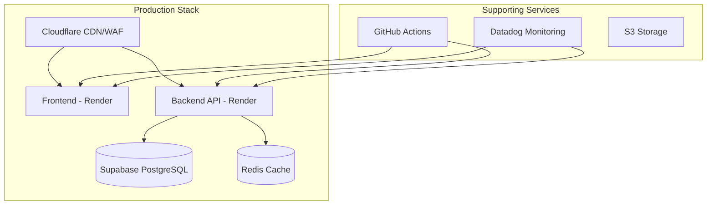

# Deployment Documentation

Comprehensive deployment guides for the Vertical Farm Management Platform across different environments and platforms.

## Deployment Overview

The platform supports multiple deployment strategies to meet different operational needs:

- **Development** - Local Docker Compose environment
- **Staging** - Pre-production testing environment
- **Production** - High-availability production deployment

## Deployment Architecture



## Quick Deploy

### Local Development
```bash
# Clone repository
git clone https://github.com/your-org/vertical-farm.git
cd vertical-farm

# Setup environment
cp .env.example .env
# Edit .env with your values

# Start services
docker-compose up -d

# Access at http://localhost:3000
```

### Production Deploy
```bash
# Via GitHub Actions (recommended)
git push origin main

# Manual deploy to Render
render deploy --service frontend
render deploy --service backend
```

## Deployment Guides

### Platform Deployments
- **[Docker Deployment](./docker.md)** - Container-based deployment
- **[Render Deployment](./render.md)** - Platform-as-a-Service deployment
- **[Kubernetes Deployment](./kubernetes.md)** - Container orchestration
- **[AWS Deployment](./aws.md)** - Amazon Web Services

### Infrastructure Components
- **[Cloudflare Configuration](./cloudflare.md)** - CDN and security setup
- **[Database Setup](./database.md)** - Supabase configuration
- **[Redis Cache](./redis.md)** - Caching layer setup
- **[MQTT Broker](./mqtt.md)** - IoT messaging setup

### CI/CD & Automation
- **[GitHub Actions](./github-actions.md)** - Automated workflows
- **[Environment Management](./environments.md)** - Multi-environment setup
- **[Infrastructure as Code](./terraform.md)** - Terraform configuration
- **[Deployment Workflows](./workflows.md)** - Automated processes

## Environment Configuration

### Required Environment Variables

**Frontend (.env.local)**
```bash
# Supabase
NEXT_PUBLIC_SUPABASE_URL=https://xxx.supabase.co
NEXT_PUBLIC_SUPABASE_ANON_KEY=xxx

# Features
NEXT_PUBLIC_ENABLE_PWA=true
NEXT_PUBLIC_ENABLE_ANALYTICS=true

# API
NEXT_PUBLIC_API_URL=https://api.yourdomain.com
```

**Backend (.env)**
```bash
# Supabase
SUPABASE_URL=https://xxx.supabase.co
SUPABASE_SERVICE_KEY=xxx
SUPABASE_JWT_SECRET=xxx

# Home Assistant (optional)
HOME_ASSISTANT_ENABLED=true
HOME_ASSISTANT_URL=https://ha.yourdomain.com
HOME_ASSISTANT_TOKEN=xxx

# Square (optional)
SQUARE_ENABLED=true
SQUARE_APPLICATION_ID=xxx
SQUARE_ACCESS_TOKEN=xxx

# Monitoring
DATADOG_API_KEY=xxx
SENTRY_DSN=xxx
```

## Deployment Checklist

### Pre-Deployment
- [ ] Code review completed
- [ ] All tests passing
- [ ] Security scan clean
- [ ] Environment variables set
- [ ] Database migrations ready
- [ ] Backup current state

### Deployment Steps
- [ ] Deploy to staging first
- [ ] Run smoke tests
- [ ] Verify health checks
- [ ] Deploy to production
- [ ] Monitor metrics
- [ ] Verify functionality

### Post-Deployment
- [ ] All services healthy
- [ ] Performance metrics normal
- [ ] No error spike
- [ ] User access verified
- [ ] Documentation updated
- [ ] Team notified

## Infrastructure Requirements

### Minimum Requirements

**Frontend**
- CPU: 1 vCPU
- Memory: 512 MB
- Storage: 1 GB
- Node.js: 20.x

**Backend**
- CPU: 2 vCPU
- Memory: 1 GB
- Storage: 5 GB
- Python: 3.13+

**Database**
- PostgreSQL: 15+
- Storage: 10 GB (minimum)
- Connections: 100
- Backup: Daily

### Recommended Production

**Frontend**
- CPU: 2 vCPU
- Memory: 2 GB
- Instances: 2 (load balanced)
- CDN: Cloudflare

**Backend**
- CPU: 4 vCPU
- Memory: 4 GB
- Instances: 3 (load balanced)
- Auto-scaling enabled

**Database**
- PostgreSQL: Managed service
- Storage: 100 GB (auto-scaling)
- Connections: 500
- Read replicas: 2
- Backup: Continuous

## Network Architecture

### Security Zones

```yaml
DMZ:
  - Cloudflare CDN
  - Load Balancers
  - WAF Rules

Application:
  - Frontend servers
  - API servers
  - WebSocket servers

Data:
  - PostgreSQL database
  - Redis cache
  - File storage

Integration:
  - Home Assistant
  - Square API
  - MQTT broker
```

### Port Configuration

| Service | Port | Protocol | Access |
|---------|------|----------|---------|
| Frontend | 3000 | HTTP/HTTPS | Public |
| Backend API | 8000 | HTTP/HTTPS | Public |
| PostgreSQL | 5432 | TCP | Private |
| Redis | 6379 | TCP | Private |
| MQTT | 1883/8883 | TCP/TLS | Private |

## SSL/TLS Configuration

### Certificate Management
```bash
# Cloudflare (automatic)
- Edge certificates managed by Cloudflare
- Origin certificates for backend

# Let's Encrypt (alternative)
certbot certonly --webroot \
  -w /var/www/html \
  -d yourdomain.com \
  -d www.yourdomain.com
```

### Security Headers
```nginx
# Nginx configuration
add_header Strict-Transport-Security "max-age=31536000; includeSubDomains" always;
add_header X-Content-Type-Options "nosniff" always;
add_header X-Frame-Options "SAMEORIGIN" always;
add_header X-XSS-Protection "1; mode=block" always;
add_header Content-Security-Policy "default-src 'self'" always;
```

## Monitoring Setup

### Health Checks
```yaml
frontend:
  endpoint: /api/health
  interval: 30s
  timeout: 10s
  success_threshold: 2
  failure_threshold: 3

backend:
  endpoint: /health
  interval: 30s
  timeout: 10s
  success_threshold: 2
  failure_threshold: 3
```

### Key Metrics
- Response time < 200ms (p95)
- Error rate < 1%
- Uptime > 99.9%
- Cache hit rate > 80%

## Scaling Strategy

### Horizontal Scaling

**Auto-scaling Rules**
```yaml
scale_up:
  cpu_threshold: 70%
  memory_threshold: 80%
  request_rate: 1000/min
  scale_factor: 2
  max_instances: 10

scale_down:
  cpu_threshold: 30%
  memory_threshold: 40%
  request_rate: 100/min
  scale_factor: 0.5
  min_instances: 2
```

### Database Scaling
- Read replicas for read-heavy workloads
- Connection pooling
- Query optimization
- Partitioning for large tables

## Backup & Recovery

### Backup Strategy
```yaml
database:
  frequency: daily
  retention: 30 days
  type: incremental
  location: s3://backups/database/

files:
  frequency: weekly
  retention: 90 days
  type: full
  location: s3://backups/files/

configuration:
  frequency: on_change
  retention: unlimited
  type: versioned
  location: git repository
```

### Recovery Procedures
1. [Database Recovery](../maintenance/database-recovery.md)
2. [Application Recovery](../maintenance/app-recovery.md)
3. [Configuration Recovery](../maintenance/config-recovery.md)

## Deployment Automation

### CI/CD Pipeline
```yaml
name: Deploy Production

on:
  push:
    branches: [main]

jobs:
  test:
    runs-on: ubuntu-latest
    steps:
      - uses: actions/checkout@v2
      - run: npm test
      - run: npm run lint

  build:
    needs: test
    runs-on: ubuntu-latest
    steps:
      - uses: actions/checkout@v2
      - run: docker build -t app:latest .
      - run: docker push registry/app:latest

  deploy:
    needs: build
    runs-on: ubuntu-latest
    steps:
      - run: render deploy --service frontend
      - run: render deploy --service backend
      - run: npm run smoke-test
```

## Rollback Procedures

### Automatic Rollback
```yaml
triggers:
  - error_rate > 5%
  - response_time > 1000ms
  - health_check_failures > 3

actions:
  - revert_to_previous
  - alert_team
  - create_incident
```

### Manual Rollback
```bash
# Render platform
render rollback --service frontend --to-deployment $DEPLOYMENT_ID

# Docker
docker-compose down
docker-compose up -d --scale app=0
docker tag app:previous app:latest
docker-compose up -d
```

## Troubleshooting Deployments

### Common Issues

**Build Failures**
- Check build logs
- Verify dependencies
- Test locally first
- Check environment variables

**Health Check Failures**
- Verify endpoints
- Check database connectivity
- Review logs
- Test manually

**Performance Issues**
- Monitor resource usage
- Check database queries
- Review cache hit rates
- Profile application

## Security Considerations

### Deployment Security
- Use CI/CD for deployments
- Implement approval workflows
- Audit deployment access
- Rotate credentials regularly
- Monitor deployment logs

### Secret Management
- Never commit secrets
- Use environment variables
- Implement secret rotation
- Use managed secret stores
- Audit secret access

## Related Documentation

- [Monitoring Setup](../monitoring/)
- [Security Configuration](../security/)
- [Maintenance Procedures](../maintenance/)
- [Incident Response](../incident/)

---

*For development setup, see [Development Guide](/development/) | For architecture details, see [Architecture Documentation](/architecture/)*