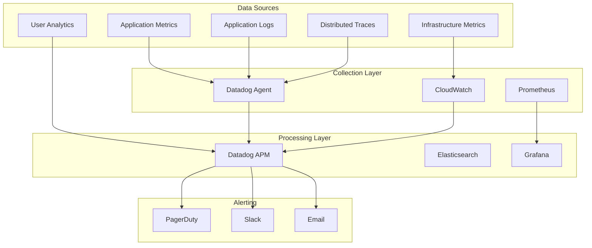

# Monitoring & Observability

Comprehensive monitoring setup for the Vertical Farm platform, covering metrics, logs, traces, and alerting.

## Monitoring Stack Overview



## Quick Start

### 1. Install Monitoring Agents

```bash
# Datadog Agent
DD_AGENT_MAJOR_VERSION=7 DD_API_KEY=YOUR_API_KEY \
DD_SITE="datadoghq.com" bash -c "$(curl -L \
https://s3.amazonaws.com/dd-agent/scripts/install_script.sh)"

# Configure agent
sudo nano /etc/datadog-agent/datadog.yaml
```

### 2. Application Instrumentation

**Frontend (Next.js)**
```typescript
// lib/monitoring.ts
import { datadogRum } from '@datadog/browser-rum';

datadogRum.init({
  applicationId: 'YOUR_APP_ID',
  clientToken: 'YOUR_CLIENT_TOKEN',
  site: 'datadoghq.com',
  service: 'vertical-farm-frontend',
  env: process.env.NODE_ENV,
  version: '1.0.0',
  sessionSampleRate: 100,
  trackInteractions: true,
  defaultPrivacyLevel: 'mask-user-input'
});
```

**Backend (FastAPI)**
```python
# app/monitoring.py
from ddtrace import patch_all, tracer
from datadog import initialize, statsd

# Initialize Datadog
initialize(
    api_key=os.getenv('DD_API_KEY'),
    app_key=os.getenv('DD_APP_KEY')
)

# Enable APM
patch_all()
tracer.configure(
    hostname='localhost',
    port=8126,
    service='vertical-farm-backend',
    env=os.getenv('ENVIRONMENT', 'production')
)
```

## Key Metrics

### Application Metrics

**Frontend Metrics**
```yaml
User Experience:
  - First Contentful Paint (FCP): < 1.8s
  - Largest Contentful Paint (LCP): < 2.5s
  - First Input Delay (FID): < 100ms
  - Cumulative Layout Shift (CLS): < 0.1

Performance:
  - Page Load Time: < 3s
  - API Response Time: < 200ms
  - JavaScript Error Rate: < 1%
  - Cache Hit Rate: > 80%
```

**Backend Metrics**
```yaml
API Performance:
  - Request Rate: requests/second
  - Response Time: p50, p95, p99
  - Error Rate: 4xx, 5xx errors
  - Throughput: requests/minute

Database:
  - Query Time: p50, p95, p99
  - Connection Pool: active/idle
  - Transaction Rate: commits/second
  - Lock Wait Time: seconds
```

### Infrastructure Metrics

```yaml
System Resources:
  CPU:
    - Utilization: < 70%
    - Load Average: < cores * 0.7
    - Context Switches: rate
  
  Memory:
    - Used: < 80%
    - Available: > 20%
    - Swap: < 10%
  
  Disk:
    - Usage: < 80%
    - IOPS: read/write
    - Latency: < 10ms
  
  Network:
    - Bandwidth: in/out Mbps
    - Packet Loss: < 0.1%
    - Latency: < 50ms
```

## Monitoring Guides

### Component Monitoring
- **[Datadog Setup](./datadog.md)** - Complete APM and monitoring setup
- **[Health Checks](./health-checks.md)** - Service health monitoring
- **[Custom Metrics](./metrics.md)** - Application-specific metrics
- **[Log Aggregation](./logging.md)** - Centralized logging

### Performance Monitoring
- **[Performance Baselines](./performance.md)** - Expected performance metrics
- **[Database Monitoring](./database.md)** - Query performance and optimization
- **[Cache Monitoring](./caching.md)** - Cache effectiveness
- **[API Monitoring](./api-monitoring.md)** - Endpoint performance

### Alerting & Incidents
- **[Alert Configuration](./alerts.md)** - Setting up alerts
- **[Escalation Policies](./escalation.md)** - Alert routing
- **[Incident Response](./incident-response.md)** - Handling alerts
- **[On-Call Setup](./on-call.md)** - Rotation management

## Dashboard Examples

### System Overview Dashboard

```json
{
  "title": "Vertical Farm - System Overview",
  "widgets": [
    {
      "type": "timeseries",
      "title": "API Response Time",
      "query": "avg:trace.fastapi.request.duration{service:vertical-farm-backend}"
    },
    {
      "type": "query_value",
      "title": "Current Error Rate",
      "query": "sum:trace.fastapi.request.errors{*}.as_rate()"
    },
    {
      "type": "heatmap",
      "title": "Response Time Distribution",
      "query": "avg:trace.fastapi.request.duration{*} by {endpoint}"
    },
    {
      "type": "toplist",
      "title": "Slowest Endpoints",
      "query": "avg:trace.fastapi.request.duration{*} by {resource_name}"
    }
  ]
}
```

### Business Metrics Dashboard

```yaml
Widgets:
  - Active Users (Real-time)
  - API Usage (Requests/minute)
  - Feature Adoption (By feature)
  - Farm Operations (CRUD operations)
  - Device Status (Online/Offline)
  - Data Volume (GB stored)
  - Error Budget (SLA tracking)
```

## Alerting Strategy

### Alert Severity Levels

```yaml
Critical (P1):
  Description: Service down, data loss risk
  Response: Immediate, wake up on-call
  Examples:
    - API down (all endpoints)
    - Database unreachable
    - Data corruption detected
    - Security breach

High (P2):
  Description: Major degradation
  Response: Within 15 minutes
  Examples:
    - Error rate > 5%
    - Response time > 1s
    - Memory > 90%
    - Queue backup > 1000

Medium (P3):
  Description: Minor issues
  Response: Business hours
  Examples:
    - Error rate > 2%
    - Cache hit rate < 70%
    - Disk usage > 70%

Low (P4):
  Description: Informational
  Response: Next business day
  Examples:
    - Certificate expiring (30 days)
    - Deprecated API usage
    - Performance degradation trend
```

### Alert Configuration Examples

**High Error Rate Alert**
```yaml
name: High API Error Rate
query: |
  sum(last_5m):sum:trace.fastapi.request.errors{env:production}.as_rate() 
  / sum:trace.fastapi.request.hits{env:production}.as_rate() > 0.05
message: |
  API error rate is {{value}}% (threshold: 5%)
  
  Dashboard: https://app.datadoghq.com/dashboard/xxx
  Runbook: https://docs.internal/runbooks/high-error-rate
  
  @pagerduty-critical @slack-alerts
tags:
  - service:api
  - team:backend
  - severity:high
```

**Database Connection Pool Alert**
```yaml
name: Database Connection Pool Exhausted
query: |
  avg(last_5m):postgresql.connections.active{env:production} 
  / postgresql.connections.max{env:production} > 0.9
message: |
  Database connection pool is {{value}}% utilized
  
  Actions:
  1. Check for connection leaks
  2. Review slow queries
  3. Consider scaling database
  
  @pagerduty-high @slack-database
```

## Logging Strategy

### Log Levels and Usage

```python
# Logging configuration
import logging

logging.basicConfig(
    level=logging.INFO,
    format='%(asctime)s - %(name)s - %(levelname)s - %(message)s',
    handlers=[
        logging.StreamHandler(),
        DatadogLogHandler(api_key=DD_API_KEY)
    ]
)

# Usage examples
logger.debug("Detailed diagnostic info")  # Development only
logger.info("Normal flow: user_id=%s action=login", user_id)
logger.warning("Deprecated API called: endpoint=%s", endpoint)
logger.error("Operation failed: error=%s", str(e), exc_info=True)
logger.critical("System failure: component=%s", component)
```

### Structured Logging

```python
# Structured log example
import json

def log_event(level, event_type, **kwargs):
    log_data = {
        "timestamp": datetime.utcnow().isoformat(),
        "level": level,
        "event": event_type,
        "service": "vertical-farm-backend",
        "environment": os.getenv("ENVIRONMENT"),
        **kwargs
    }
    logger.info(json.dumps(log_data))

# Usage
log_event(
    "INFO",
    "api_request",
    user_id=user.id,
    endpoint="/api/v1/farms",
    method="GET",
    duration_ms=123,
    status_code=200
)
```

## Distributed Tracing

### Trace Instrumentation

```python
# FastAPI tracing
from ddtrace import tracer

@app.get("/api/v1/farms/{farm_id}")
@tracer.wrap(service="vertical-farm-api", resource="get_farm")
async def get_farm(farm_id: str):
    span = tracer.current_span()
    span.set_tag("farm.id", farm_id)
    
    with tracer.trace("database.query"):
        farm = await fetch_farm(farm_id)
    
    with tracer.trace("cache.set"):
        await cache.set(f"farm:{farm_id}", farm)
    
    return farm
```

### Trace Sampling

```yaml
# Sampling configuration
sampling_rules:
  - service: vertical-farm-backend
    name: healthcheck
    sample_rate: 0.01  # 1% for health checks
  
  - service: vertical-farm-backend
    name: api.request
    sample_rate: 0.1   # 10% for normal requests
  
  - service: vertical-farm-backend
    error: true
    sample_rate: 1.0   # 100% for errors
```

## Synthetic Monitoring

### API Monitors

```javascript
// Datadog Synthetic API test
{
  "name": "API Health Check",
  "type": "api",
  "subtype": "http",
  "config": {
    "request": {
      "method": "GET",
      "url": "https://api.vertical-farm.com/health"
    },
    "assertions": [
      {
        "type": "statusCode",
        "operator": "is",
        "target": 200
      },
      {
        "type": "responseTime",
        "operator": "lessThan",
        "target": 1000
      },
      {
        "type": "body",
        "operator": "contains",
        "target": "healthy"
      }
    ]
  },
  "locations": ["aws:us-west-2", "aws:eu-west-1"],
  "options": {
    "tick_every": 300,
    "min_failure_duration": 3
  }
}
```

### Browser Tests

```javascript
// Synthetic browser test
const synthetics = require('Synthetics');
const page = synthetics.getPage();

const test = async function() {
  await synthetics.executeStep('Load homepage', async () => {
    await page.goto('https://vertical-farm.com');
    await page.waitForSelector('#root');
  });
  
  await synthetics.executeStep('Login', async () => {
    await page.type('#email', 'test@example.com');
    await page.type('#password', 'password');
    await page.click('#login-button');
    await page.waitForNavigation();
  });
  
  await synthetics.executeStep('View farms', async () => {
    await page.click('[data-testid="farms-link"]');
    await page.waitForSelector('.farm-card');
    const farms = await page.$$('.farm-card');
    assert(farms.length > 0, 'No farms found');
  });
};

exports.handler = async () => {
  return await synthetics.executeTest(test);
};
```

## Cost Optimization

### Monitoring Costs

```yaml
Cost Factors:
  - Host monitoring: $15/host/month
  - APM: $31/host/month
  - Logs: $0.10/GB ingested
  - Metrics: $0.05/1000 metrics
  - Synthetics: $5/10k tests

Optimization Strategies:
  - Use log sampling for high-volume logs
  - Implement metric aggregation
  - Set appropriate data retention
  - Use tags for cost allocation
  - Monitor unused metrics
```

### Retention Policies

```yaml
Data Retention:
  Metrics:
    High-resolution (1min): 15 days
    Rolled-up (1hr): 15 months
  
  Logs:
    Hot tier: 3 days
    Warm tier: 15 days
    Archive: 1 year (S3)
  
  Traces:
    Indexed: 15 days
    Full traces: 30 days
  
  Incidents:
    Active: Indefinite
    Resolved: 90 days
```

## Troubleshooting

### Common Issues

**Missing Metrics**
```bash
# Check agent status
sudo datadog-agent status

# Verify API key
sudo datadog-agent configcheck

# Test connectivity
sudo datadog-agent diagnose
```

**High Cardinality**
```sql
-- Find high cardinality tags
SELECT tag_name, COUNT(DISTINCT tag_value) as cardinality
FROM metrics_tags
GROUP BY tag_name
ORDER BY cardinality DESC
LIMIT 10;
```

**Alert Fatigue**
- Review alert thresholds
- Implement alert suppression
- Use composite monitors
- Add context to alerts
- Implement auto-remediation

## Best Practices

### Monitoring Standards

1. **Every service must have**:
   - Health check endpoint
   - Structured logging
   - Distributed tracing
   - Custom metrics
   - Error tracking

2. **Alert hygiene**:
   - Include runbook links
   - Set appropriate severity
   - Test alerts regularly
   - Review and tune thresholds
   - Document remediation steps

3. **Dashboard design**:
   - Start with overview
   - Drill down capability
   - Include relevant links
   - Use consistent naming
   - Add descriptions

4. **Cost management**:
   - Regular cost reviews
   - Tag everything
   - Optimize cardinality
   - Use appropriate retention
   - Archive old data

## Related Documentation

- [Deployment Guide](../deployment/)
- [Security Operations](../security/)
- [Incident Response](../incident/)
- [Performance Tuning](../maintenance/performance.md)

---

*For monitoring best practices, see [Datadog Best Practices](https://docs.datadoghq.com/getting_started/best_practices/) | For support, contact the DevOps team*