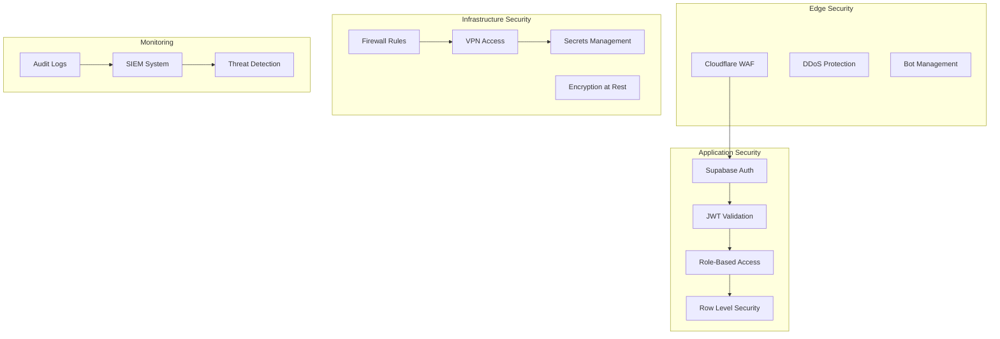
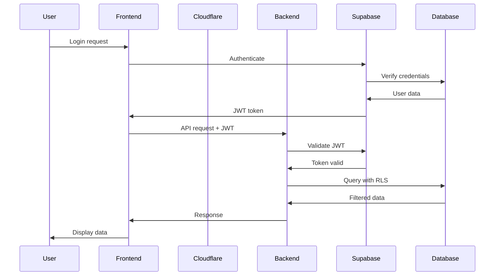

# Security Operations

Comprehensive security documentation for the Vertical Farm platform, covering authentication, authorization, threat protection, and incident response.

## Security Architecture



## Security Layers

### Layer 1: Edge Security (Cloudflare)
- **WAF** - Web Application Firewall
- **DDoS** - Distributed Denial of Service protection
- **Bot Management** - Bot detection and mitigation
- **SSL/TLS** - End-to-end encryption
- **Zero Trust** - Access control

### Layer 2: Application Security
- **Authentication** - Supabase Auth with MFA
- **Authorization** - JWT tokens and RBAC
- **Data Protection** - Row Level Security (RLS)
- **Input Validation** - Request sanitization
- **Session Management** - Secure session handling

### Layer 3: Infrastructure Security
- **Network Security** - Firewalls and VLANs
- **Secrets Management** - Encrypted credential storage
- **Access Control** - SSH keys and VPN
- **Encryption** - Data at rest and in transit
- **Backup Security** - Encrypted backups

## Security Guides

### Authentication & Authorization
- **[Authentication Setup](./auth.md)** - Supabase Auth configuration
- **[JWT Management](./jwt.md)** - Token validation and rotation
- **[RBAC Implementation](./rbac.md)** - Role-based access control
- **[MFA Configuration](./mfa.md)** - Multi-factor authentication

### Data Security
- **[Row Level Security](./rls.md)** - Database access control
- **[Encryption](./encryption.md)** - Data protection methods
- **[Data Classification](./data-classification.md)** - Sensitivity levels
- **[Privacy Compliance](./privacy.md)** - GDPR and data privacy

### Infrastructure Security
- **[Network Security](./network.md)** - Firewall and network configuration
- **[Secrets Management](./secrets.md)** - API keys and credentials
- **[Access Control](./access-control.md)** - User and service access
- **[Container Security](./container.md)** - Docker security

### Threat Protection
- **[Vulnerability Management](./vulnerabilities.md)** - Scanning and patching
- **[Threat Detection](./threat-detection.md)** - Monitoring and alerts
- **[Incident Response](./incident-response.md)** - Security incidents
- **[Disaster Recovery](./disaster-recovery.md)** - Backup and recovery

## Authentication Flow



## Security Policies

### Password Policy
```yaml
Requirements:
  minimum_length: 12
  require_uppercase: true
  require_lowercase: true
  require_numbers: true
  require_special_chars: true
  prevent_reuse: 5  # Last 5 passwords
  max_age_days: 90
  min_age_hours: 24
  
Account_Lockout:
  failed_attempts: 5
  lockout_duration: 30  # minutes
  reset_counter_after: 30  # minutes
```

### Session Management
```yaml
Session_Configuration:
  timeout_minutes: 30
  absolute_timeout_hours: 12
  renewal_threshold: 5  # minutes before expiry
  concurrent_sessions: 3
  
Cookie_Settings:
  secure: true
  httpOnly: true
  sameSite: strict
  domain: .vertical-farm.com
```

### API Security
```yaml
Rate_Limiting:
  anonymous: 100/hour
  authenticated: 1000/hour
  admin: 10000/hour
  
API_Key_Policy:
  rotation_days: 90
  entropy_bits: 256
  scope_required: true
  ip_whitelist: optional
```

## Security Implementation

### Supabase RLS Policies

```sql
-- Enable RLS on all tables
ALTER TABLE farms ENABLE ROW LEVEL SECURITY;
ALTER TABLE devices ENABLE ROW LEVEL SECURITY;
ALTER TABLE sensor_data ENABLE ROW LEVEL SECURITY;

-- Farm access policy
CREATE POLICY "Users can view their farms"
ON farms FOR SELECT
TO authenticated
USING (
  user_id = auth.uid() OR
  EXISTS (
    SELECT 1 FROM farm_users
    WHERE farm_id = farms.id
    AND user_id = auth.uid()
  )
);

-- Device control policy
CREATE POLICY "Users can control their devices"
ON devices FOR ALL
TO authenticated
USING (
  farm_id IN (
    SELECT id FROM farms
    WHERE user_id = auth.uid()
  )
);

-- Sensor data read policy
CREATE POLICY "Users can read their sensor data"
ON sensor_data FOR SELECT
TO authenticated
USING (
  device_id IN (
    SELECT id FROM devices
    WHERE farm_id IN (
      SELECT id FROM farms
      WHERE user_id = auth.uid()
    )
  )
);
```

### JWT Validation

```python
# Backend JWT validation
from jose import jwt, JWTError
from fastapi import HTTPException, Security
from fastapi.security import HTTPBearer, HTTPAuthorizationCredentials

security = HTTPBearer()

async def verify_token(credentials: HTTPAuthorizationCredentials = Security(security)):
    token = credentials.credentials
    
    try:
        # Verify JWT signature
        payload = jwt.decode(
            token,
            SUPABASE_JWT_SECRET,
            algorithms=["HS256"],
            audience="authenticated"
        )
        
        # Check token expiration
        if payload.get("exp") < time.time():
            raise HTTPException(status_code=401, detail="Token expired")
        
        # Validate user exists
        user_id = payload.get("sub")
        if not await validate_user(user_id):
            raise HTTPException(status_code=401, detail="Invalid user")
        
        return payload
        
    except JWTError:
        raise HTTPException(status_code=401, detail="Invalid token")
```

### Input Validation

```python
# Request validation with Pydantic
from pydantic import BaseModel, validator, constr, conint
from typing import Optional
import re

class FarmCreate(BaseModel):
    name: constr(min_length=1, max_length=100)
    address: constr(min_length=1, max_length=500)
    size: conint(gt=0, le=1000000)
    description: Optional[constr(max_length=1000)]
    
    @validator('name')
    def validate_name(cls, v):
        # Prevent injection attacks
        if re.search(r'[<>\"\'%;()&+]', v):
            raise ValueError('Invalid characters in name')
        return v
    
    @validator('address')
    def validate_address(cls, v):
        # Basic XSS prevention
        if '<script' in v.lower():
            raise ValueError('Invalid address format')
        return v
```

## Security Monitoring

### Security Events to Monitor

```yaml
Authentication Events:
  - Failed login attempts
  - Successful logins from new locations
  - Password changes
  - MFA changes
  - Account lockouts

Authorization Events:
  - Privilege escalations
  - Access denied events
  - Role changes
  - Permission modifications

Data Access Events:
  - Bulk data exports
  - Sensitive data access
  - Unusual query patterns
  - Cross-tenant access attempts

System Events:
  - Configuration changes
  - Service account usage
  - API key generation
  - Certificate changes
```

### Security Alerts

```yaml
Critical Alerts:
  - Multiple failed login attempts (>10 in 5 min)
  - Successful login from blocked country
  - Data exfiltration attempt
  - SQL injection detected
  - Privilege escalation attempt

High Priority:
  - New admin account created
  - Mass data deletion
  - API rate limit exceeded
  - Certificate expiring (<7 days)
  - Vulnerable dependency detected

Medium Priority:
  - Unusual access pattern
  - Failed MFA attempts
  - Deprecated API usage
  - Weak password detected
```

## Vulnerability Management

### Scanning Schedule

```yaml
Continuous:
  - Dependency scanning (Dependabot)
  - Container image scanning
  - Secret scanning

Daily:
  - OWASP Top 10 scan
  - SSL/TLS configuration check
  - Security header validation

Weekly:
  - Full vulnerability scan
  - Penetration testing (automated)
  - Code security analysis

Monthly:
  - Manual security review
  - Access audit
  - Compliance check
```

### Patch Management

```yaml
Patch Priority:
  Critical (CVSS 9-10):
    - Apply within 24 hours
    - Emergency maintenance window
    
  High (CVSS 7-8.9):
    - Apply within 7 days
    - Scheduled maintenance
    
  Medium (CVSS 4-6.9):
    - Apply within 30 days
    - Regular update cycle
    
  Low (CVSS 0-3.9):
    - Apply within 90 days
    - Quarterly updates
```

## Incident Response

### Incident Classification

```yaml
Security Incidents:
  Class 1 - Critical:
    - Data breach
    - System compromise
    - Ransomware
    Response: Immediate, all hands
    
  Class 2 - High:
    - Unauthorized access
    - DDoS attack
    - Malware detection
    Response: Within 15 minutes
    
  Class 3 - Medium:
    - Phishing attempt
    - Policy violation
    - Suspicious activity
    Response: Within 1 hour
    
  Class 4 - Low:
    - Failed attack
    - Security scan finding
    Response: Next business day
```

### Response Procedures

```yaml
1. Detection & Analysis:
   - Verify the incident
   - Determine scope
   - Preserve evidence
   - Notify stakeholders

2. Containment:
   - Isolate affected systems
   - Prevent spread
   - Backup affected data
   - Document actions

3. Eradication:
   - Remove threat
   - Patch vulnerabilities
   - Update security controls
   - Verify clean state

4. Recovery:
   - Restore services
   - Monitor for recurrence
   - Validate functionality
   - Update documentation

5. Lessons Learned:
   - Post-incident review
   - Update procedures
   - Implement improvements
   - Share knowledge
```

## Compliance & Auditing

### Compliance Requirements

```yaml
GDPR (EU):
  - Data privacy rights
  - Consent management
  - Right to deletion
  - Data portability
  - Breach notification (72 hours)

SOC 2 Type II:
  - Security controls
  - Availability monitoring
  - Processing integrity
  - Confidentiality measures
  - Privacy protection

Industry Standards:
  - OWASP Top 10
  - CIS Controls
  - NIST Framework
  - ISO 27001
```

### Audit Logging

```python
# Audit log structure
{
    "timestamp": "2024-01-20T10:30:00Z",
    "event_type": "data_access",
    "user_id": "user_123",
    "ip_address": "192.168.1.1",
    "user_agent": "Mozilla/5.0...",
    "resource": "/api/v1/farms/456",
    "action": "READ",
    "result": "SUCCESS",
    "metadata": {
        "farm_id": "456",
        "data_classification": "internal",
        "rows_accessed": 42
    }
}
```

## Security Tools

### Required Security Tools

```yaml
Scanning & Testing:
  - OWASP ZAP - Web application security
  - Trivy - Container scanning
  - Snyk - Dependency scanning
  - SonarQube - Code analysis

Monitoring & Detection:
  - Datadog Security Monitoring
  - Cloudflare Analytics
  - AWS GuardDuty
  - Sentry - Error tracking

Secrets & Certificates:
  - HashiCorp Vault
  - AWS Secrets Manager
  - Let's Encrypt
  - Certificate Transparency monitoring

Incident Response:
  - PagerDuty - Alerting
  - Slack - Communication
  - Jira - Ticket tracking
  - S3 - Evidence storage
```

## Security Best Practices

### Development Security

1. **Secure Coding**:
   - Input validation
   - Output encoding
   - Parameterized queries
   - Error handling
   - Secure defaults

2. **Code Review**:
   - Security-focused reviews
   - Automated scanning
   - Dependency checking
   - Secret detection
   - License compliance

3. **Testing**:
   - Security unit tests
   - Integration security tests
   - Penetration testing
   - Load testing for DDoS
   - Compliance validation

### Operational Security

1. **Access Control**:
   - Principle of least privilege
   - Regular access reviews
   - MFA enforcement
   - Session management
   - API key rotation

2. **Monitoring**:
   - Real-time alerts
   - Anomaly detection
   - Log aggregation
   - Threat intelligence
   - Incident tracking

3. **Response**:
   - Incident playbooks
   - Communication plans
   - Evidence preservation
   - Recovery procedures
   - Post-mortem process

## Security Checklist

### Daily Tasks
- [ ] Review security alerts
- [ ] Check failed login attempts
- [ ] Monitor API usage
- [ ] Verify backup completion
- [ ] Review access logs

### Weekly Tasks
- [ ] Run vulnerability scans
- [ ] Review user permissions
- [ ] Update security patches
- [ ] Test incident response
- [ ] Audit configuration changes

### Monthly Tasks
- [ ] Security metrics review
- [ ] Compliance check
- [ ] Penetration test results
- [ ] Access certification
- [ ] Training updates

### Quarterly Tasks
- [ ] Security assessment
- [ ] Policy review
- [ ] Disaster recovery test
- [ ] Vendor security review
- [ ] Risk assessment update

## Related Documentation

- [Deployment Security](../deployment/security.md)
- [Monitoring & Alerts](../monitoring/alerts.md)
- [Incident Response](../incident/)
- [Compliance Guide](./compliance.md)

---

*For security incidents, contact security@vertical-farm.com | For vulnerabilities, use responsible disclosure at security.txt*