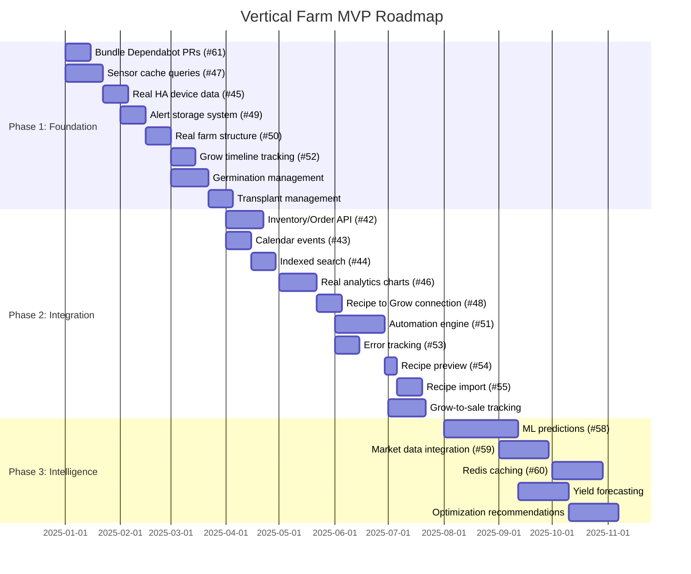

# Product Vision - Vertical Farm Platform

> A unified platform for small-business vertical farm operations combining grow management, IoT automation, and business analytics.

---

## Executive Summary

**Project Purpose:** Full-stack vertical farm management platform for small business commercial operations (microgreens, herbs, produce for local sales/restaurants).

**Target Outcome:** A gamified vertical farming app with complete Grow Operations and Business Operations suites, providing a holistic business overview with actionable recommendations.

**Current Stage:** Early prototype with strong architectural foundation (60-70% frontend, 70-80% backend production-ready).

**Key Differentiator:** Unified platform where farm operations and business metrics work together to maximize profitability through the complete seed-to-sale lifecycle.

---

## Current Version Goals

**Target:** MVP for Small Business Operations
**Stage:** Early Prototype

### Priority 1: Complete Core Data Integration
Replace all mock/placeholder data with real database queries to establish a foundation of truth.

- **Status:** 6 GitHub issues open (#45, #47, #49, #50, #52, #61)
- **Impact:** Enables all downstream features to work with real data
- **Blockers:** None - infrastructure ready

### Priority 2: Full IoT Pipeline
Home Assistant sensor data flowing to dashboards with real-time device control and monitoring.

- **Status:** 85% complete - HA client mature, Supabase Realtime not yet integrated
- **Impact:** Environmental automation and monitoring capabilities
- **Blockers:** Supabase Realtime implementation needed

### Priority 3: Business Operations Foundation
Square POS data syncing and displaying with grow-to-sale tracking capability.

- **Status:** 90% complete - Square integration shipped (PR #68)
- **Impact:** Business analytics and revenue tracking
- **Blockers:** Grow-to-sale connection not yet built

---

## Success Metrics

| Metric | Target | Current | Gap |
|--------|--------|---------|-----|
| Mock data placeholders | 0 | ~12 locations | High |
| Home Assistant integration | Full | 85% | Low |
| Square POS sync | Complete | 90% | Low |
| Core workflows functional | 100% | 70% | Medium |
| Service layer coverage | 100% | 95% | Low |
| E2E test coverage | 70% | Disabled | High |
| API response time | <200ms | Not measured | Unknown |

---

## Current State Snapshot

### Features Complete (95%+ functional)

| Feature | Evidence | Notes |
|---------|----------|-------|
| Farm hierarchy (Farm > Row > Rack > Shelf) | `FarmService.ts` (270 lines) | Full CRUD, capacity tracking |
| Grow lifecycle management | `GrowService.ts` (510 lines) | Planned > Active > Harvested > Failed |
| Home Assistant integration | `HomeAssistantClient` (845 lines) | WebSocket, REST, caching, error handling |
| Square POS integration | PR #68 merged | Customers, orders, payments, refunds, disputes |
| Service layer architecture | 5,616 lines frontend services | BaseService, BaseCRUDService, BaseRealtimeService |
| Database schema | 50 tables | Comprehensive RLS policies |
| CI/CD pipeline | 12 GitHub Actions workflows | Security scanning, parallel testing |

### Features In Progress (50-85% functional)

| Feature | Status | Gap |
|---------|--------|-----|
| Dashboard views | 80% | Some mock data in Operations, Analytics |
| Device management | 75% | Mock data in some views (#45) |
| Grow recipes | 60% | Hardcoded sample data, no backend sync |
| Alert system | 50% | No real alert generation (#49) |
| Sensor cache | 50% | TODO markers in backend (#47) |

### Features Placeholder Only (<50% functional)

| Feature | Status | Gap |
|---------|--------|-----|
| Germination management | Placeholder | "Coming in next phase" message |
| Transplant management | Placeholder | "Coming in next phase" message |
| Analytics aggregation | Mock data | No backend aggregation |
| Calendar/Scheduling | Route exists | No implementation |
| Inventory/Procurement | Mock data | No backend operations |
| AI/ML features | Route exists | Empty page |

---

## Vision Gaps

### Gap 1: Mock Data Throughout UI
- **Current State:** ~12 locations with placeholder/mock data
- **Desired State:** All UI elements pulling from real database
- **Issues:** #45, #49, #50, #52
- **Research Needed:** No - patterns established

### Gap 2: Grow Lifecycle Incomplete
- **Current State:** Active grows work, germination/transplant are placeholders
- **Desired State:** Complete seed-to-harvest workflow with all stages
- **Issues:** None created yet
- **Research Needed:** No - extend existing GrowService patterns

### Gap 3: Real-time Updates Missing
- **Current State:** Polling-based updates, no Supabase Realtime
- **Desired State:** Live sensor data, device state changes
- **Issues:** #47 partially addresses
- **Research Needed:** Yes - Supabase Realtime integration patterns

### Gap 4: Grow-to-Sale Tracking
- **Current State:** Grows and Square data are separate silos
- **Desired State:** Connect harvests to Square orders for profitability analysis
- **Issues:** None created yet
- **Research Needed:** Yes - data model for linking grows to sales

### Gap 5: Analytics Backend
- **Current State:** Frontend charts with mock data generation
- **Desired State:** Historical data aggregation, trend analysis
- **Issues:** #46
- **Research Needed:** Yes - aggregation queries and caching strategy

---

## Three-Phase Roadmap

### Phase 1: Foundation (Short-term)
**Focus:** Complete core workflows, replace all mock data

#### GitHub Issues
| Issue | Title | Priority | Effort |
|-------|-------|----------|--------|
| #61 | Bundle Dependabot PRs | High (security) | Small |
| #47 | Implement Supabase queries for sensor cache | High | Medium |
| #45 | Replace mock devices with real HA data | High | Medium |
| #49 | Connect to real alert storage system | Medium | Medium |
| #50 | Replace mock farm structure with real data | Medium | Small |
| #52 | Replace mock grow timeline with real tracking | Medium | Medium |

#### Additional Work (Issues to Create)
- [ ] Complete grow recipe backend sync
- [ ] Implement germination management tab
- [ ] Implement transplant management tab
- [ ] Enable Supabase Realtime for device updates

#### Success Criteria
- Zero mock/placeholder data in core workflows
- All sensor data from real HA devices
- Complete grow lifecycle (seed > germination > transplant > active > harvest)

---

### Phase 2: Integration (Medium-term)
**Focus:** Full IoT + Business integration working together

#### GitHub Issues
| Issue | Title | Priority | Effort |
|-------|-------|----------|--------|
| #42 | Replace mock inventory/order data with real API | High | Large |
| #43 | Implement real calendar events from database | High | Medium |
| #44 | Replace mock search with indexed data | Medium | Medium |
| #46 | Replace placeholder charts with real data | Medium | Large |
| #48 | Connect recipe selection to grow creation | Medium | Medium |
| #51 | Replace mock automation with real engine | Medium | Large |
| #53 | Integrate real error tracking service | Medium | Medium |
| #54 | Implement recipe preview modal | Low | Small |
| #55 | Implement CSV/JSON recipe import | Low | Medium |

#### Additional Work (Issues to Create)
- [ ] Grow-to-sale tracking (connect grows to Square orders)
- [ ] Harvest tracking with yield analytics
- [ ] Mobile optimization for harvest workflows

#### Success Criteria
- Complete grow-to-sale workflow functional
- Real-time automation responding to sensor thresholds
- Calendar showing actual grow schedules and events

---

### Phase 3: Intelligence (Long-term)
**Focus:** Automation and optimization

#### GitHub Issues
| Issue | Title | Priority | Effort |
|-------|-------|----------|--------|
| #58 | Replace mock AI predictions with ML models | High | XL |
| #59 | Implement real market data integration | Medium | Large |
| #60 | Integrate Redis for caching | Medium | Large |

#### Additional Work (Issues to Create)
- [ ] Predictive analytics (yield forecasting)
- [ ] Automated grow parameter optimization
- [ ] Cost/revenue correlation analysis
- [ ] Multi-grow batch recommendations

#### Success Criteria
- ML-powered yield predictions with >80% accuracy
- Automated optimization recommendations
- Business intelligence dashboard with actionable insights

---

## Technical Debt Registry

### High Priority (Address in Phase 1)

| Issue | Location | Impact |
|-------|----------|--------|
| Direct Supabase queries in pages | `frontend/src/app/(app)/farms/page.tsx:55-136` | Bypasses service layer patterns |
| E2E tests disabled | GitHub Actions | No end-to-end validation (artifact size issue) |
| Dependabot PR backlog | 9 open PRs | Security vulnerabilities |

### Medium Priority (Address in Phase 2)

| Issue | Location | Impact |
|-------|----------|--------|
| Legacy services outside domain structure | `frontend/src/services/businessDataService.ts` | Inconsistent architecture |
| Sensor cache TODOs | `backend/app/services/sensor_cache_service.py` | Incomplete metrics calculations |
| Device assignment service location | `frontend/src/services/deviceAssignmentService.ts` | Should be in domain/ |

### Low Priority (Address in Phase 3)

| Issue | Location | Impact |
|-------|----------|--------|
| Legacy device layer types | `frontend/src/types/index.ts:74` | TODO marker for migration |

---

## Architecture Principles

These principles guide all development decisions:

1. **Service Layer Required** - ALL data operations through `services/domain/*`
2. **PostgREST for CRUD** - FastAPI only for external integrations (HA, Square)
3. **RLS on All Tables** - Farm data isolated by `user_id`
4. **Type Everything** - No `any` types, use proper interfaces
5. **Server Components Default** - Only add `"use client"` when needed
6. **No Over-Engineering** - Minimum complexity for current requirements

---

## Constraints

- **Solo developer bandwidth** - Prioritize high-impact work
- **Both integrations equally important** - HA (IoT) and Square (Business) must progress together
- **Self-hosted deployment target** - Docker-based, runs on Unraid
- **No time estimates** - Focus on what, not when

---

## Open Questions & Future Considerations

### Decisions Needed
1. **Multi-user/team support** - When to add organization-level accounts?
2. **Mobile strategy** - PWA optimization vs native app?
3. **Deployment scaling** - Self-hosted only or cloud option?

### Future Horizons (Beyond Phase 3)
- Multi-farm management
- Marketplace for grow recipes
- Integration with additional POS systems
- Supplier/procurement integrations
- Customer-facing ordering portal

---

*Last Updated: 2025-12-17*
