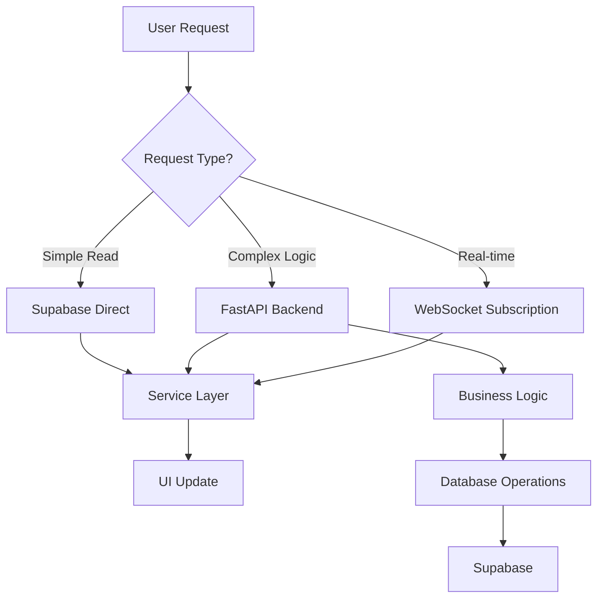
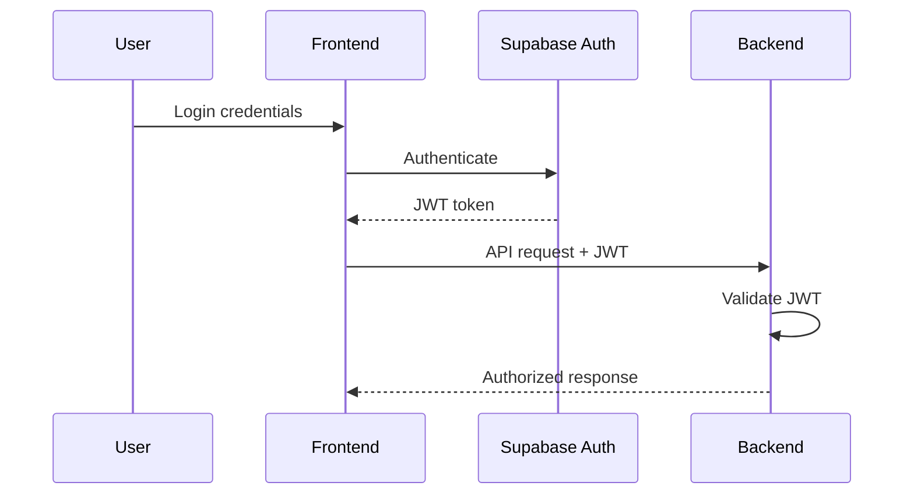
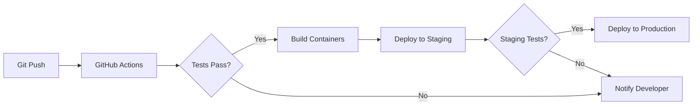

# System Architecture

## Overview

VerticalFarm OS is a modern, full-stack vertical farming management platform that combines a sophisticated web application with IoT device control, real-time monitoring, and automated farm operations. The system follows a modular, service-oriented architecture with clear separation of concerns.

## Architecture Principles

### Core Principles
1. **Service Layer Abstraction** - All data operations go through a service layer
2. **Multi-Tenant Isolation** - Complete data and operation isolation per farm
3. **Real-time First** - Live updates for critical operational data
4. **Edge Computing** - Distributed processing for performance
5. **Security by Design** - Multiple layers of security enforcement

### Design Philosophy
- **Developer Experience** - Clear patterns and conventions
- **Scalability** - Horizontal scaling capabilities
- **Reliability** - Fault tolerance and graceful degradation
- **Performance** - Sub-second response times
- **Maintainability** - Clean code organization

## System Components

### Frontend (Next.js 15)

The frontend is a modern React application using Next.js 15's App Router with Server Components by default.

```typescript
// Component Architecture
frontend/src/
├── app/                    // App Router (Server Components)
│   ├── (auth)/            // Public routes
│   ├── (app)/             // Protected routes
│   └── api/               // API routes
├── components/
│   ├── features/          // Business domain components
│   ├── ui/                // Reusable UI components
│   └── layout/            // Layout components
├── services/              // Service layer (CRITICAL)
│   ├── core/             // Base services
│   └── domain/           // Business services
└── types/                // TypeScript definitions
```

**Key Technologies:**
- React 19 with Concurrent Features
- TypeScript for type safety
- Tailwind CSS for styling
- shadcn/ui for components
- Supabase Client SDK

### Backend (FastAPI)

The backend provides business logic, complex operations, and device integration.

```python
# Service Architecture
backend/app/
├── api/v1/endpoints/      # RESTful endpoints
│   ├── farms.py          # Farm management
│   ├── devices.py        # Device control
│   └── users.py          # User management
├── services/             # Business logic
├── crud/                 # Data access layer
├── models/               # Database models
└── schemas/              # Pydantic schemas
```

**Key Features:**
- Async request handling
- JWT authentication
- Comprehensive validation
- Automatic API documentation
- Datadog monitoring integration

### Database (PostgreSQL/Supabase)

The database layer provides persistent storage with real-time capabilities.

```sql
-- Core Schema Structure
farms -> rows -> racks -> shelves
  |        |       |         |
  └────────┴───────┴─────────┴─> device_assignments
                                        |
                                  sensor_readings
                                  scheduled_actions
```

**Key Features:**
- Row Level Security (RLS)
- Real-time subscriptions
- Optimized indexes
- JSONB for flexible data
- Database functions for complex operations

### Edge Computing Layer

Distributed computing for performance and scalability.

#### Cloudflare Workers
- **sensor-processor** - IoT data processing
- **main-api-cache** - API response caching
- **static-assets-cache** - CDN functionality
- **health-check-cache** - Distributed monitoring

#### Supabase Edge Functions
- **background-task-processor** - Async job processing
- **queue-scheduler** - Cron job management
- **automation-executor** - Farm automation

## Data Flow Architecture

### Request Flow Patterns



### Service Layer Pattern

The service layer is the **most critical architectural pattern** in the system:

```typescript
// Service Implementation
export class FarmService extends BaseCRUDService<Farm> {
  private static instance: FarmService
  
  private constructor() {
    super('farms')
  }
  
  static getInstance(): FarmService {
    if (!FarmService.instance) {
      FarmService.instance = new FarmService()
    }
    return FarmService.instance
  }
  
  async getFarmsByUser(userId: string): Promise<Farm[]> {
    // Business logic
    // Validation
    // Caching
    // Error handling
    return this.query()
      .eq('user_id', userId)
      .order('created_at', { ascending: false })
  }
}
```

### Real-time Architecture

```typescript
// Real-time Subscription Pattern
const subscription = supabase
  .channel('farm-updates')
  .on('postgres_changes', {
    event: '*',
    schema: 'public',
    table: 'sensor_readings',
    filter: `farm_id=eq.${farmId}`
  }, (payload) => {
    updateSensorDisplay(payload.new)
  })
  .subscribe()
```

## Security Architecture

### Multi-Layer Security Model

```
Layer 1: Authentication (Supabase Auth)
  ├── JWT token generation
  ├── Session management
  └── OAuth providers

Layer 2: Authorization (RLS + Application)
  ├── Row Level Security policies
  ├── Role-based access control
  └── Farm-level isolation

Layer 3: Validation (Application Layer)
  ├── Input sanitization
  ├── Type validation
  └── Business rule enforcement

Layer 4: Monitoring (Observability)
  ├── Audit logging
  ├── Anomaly detection
  └── Security alerts
```

### Authentication Flow



## Scalability Architecture

### Horizontal Scaling Strategy

```
Load Balancer
     |
     ├── Frontend Instance 1 ──┐
     ├── Frontend Instance 2 ──┼── Shared State (Supabase)
     └── Frontend Instance N ──┘
     
     ├── Backend Instance 1 ───┐
     ├── Backend Instance 2 ───┼── Database Pool
     └── Backend Instance N ───┘
     
     ├── Edge Worker 1 ────────┐
     ├── Edge Worker 2 ────────┼── Global Distribution
     └── Edge Worker N ────────┘
```

### Performance Optimization

1. **Caching Strategy**
   - Static assets: Cloudflare CDN
   - API responses: Edge caching
   - Database queries: Service layer cache
   - Session data: In-memory cache

2. **Database Optimization**
   - Indexed queries
   - Materialized views
   - Connection pooling
   - Query optimization

3. **Frontend Optimization**
   - Server Components
   - Code splitting
   - Lazy loading
   - Image optimization

## Deployment Architecture

### Container Architecture

```yaml
# Docker Compose Structure
services:
  frontend:
    build: ./frontend
    environment:
      - NEXT_PUBLIC_SUPABASE_URL
      - NEXT_PUBLIC_SUPABASE_ANON_KEY
    
  backend:
    build: ./backend
    environment:
      - SUPABASE_URL
      - SUPABASE_SERVICE_KEY
      - JWT_SECRET_KEY
    
  datadog-agent:
    image: datadog/agent
    environment:
      - DD_API_KEY
```

### CI/CD Pipeline



## Monitoring & Observability

### Metrics Collection

```typescript
// Application Metrics
- Request latency
- Error rates
- Database query time
- Cache hit rates
- WebSocket connections
- Background job status

// Infrastructure Metrics
- CPU utilization
- Memory usage
- Network throughput
- Container health
- Database connections
```

### Logging Strategy

```python
# Structured Logging
logger.info("action_completed", {
    "action": "device_control",
    "farm_id": farm_id,
    "device_id": device_id,
    "user_id": user_id,
    "duration_ms": duration,
    "status": "success"
})
```

## Error Handling Architecture

### Error Propagation

```typescript
// Service Layer Error Handling
try {
  const result = await farmService.createFarm(data)
  return { success: true, data: result }
} catch (error) {
  logger.error('Farm creation failed', { error, data })
  
  if (error instanceof ValidationError) {
    return { success: false, error: 'Invalid farm data' }
  }
  
  if (error instanceof AuthorizationError) {
    return { success: false, error: 'Unauthorized' }
  }
  
  // Generic error
  return { success: false, error: 'Operation failed' }
}
```

### Fault Tolerance

- **Retry Logic** - Exponential backoff for transient failures
- **Circuit Breakers** - Prevent cascade failures
- **Graceful Degradation** - Partial functionality during failures
- **Fallback Strategies** - Alternative paths for critical operations

## Technology Decisions

### Why These Technologies?

| Technology | Reason | Alternatives Considered |
|------------|--------|------------------------|
| Next.js 15 | Server Components, performance, DX | Remix, SvelteKit |
| FastAPI | Async Python, automatic docs, performance | Django, Flask |
| PostgreSQL | Reliability, features, ecosystem | MongoDB, MySQL |
| Supabase | Real-time, auth, managed infrastructure | Firebase, custom |
| Cloudflare | Global edge network, performance | AWS CloudFront |
| Docker | Containerization standard | Kubernetes native |

### Trade-offs

1. **Complexity vs. Capability**
   - More complex than monolithic architecture
   - Provides better scalability and maintainability

2. **Cost vs. Performance**
   - Higher infrastructure costs
   - Superior user experience and reliability

3. **Flexibility vs. Convention**
   - Strict service layer enforcement
   - Consistent, maintainable codebase

## Future Architecture Considerations

### Planned Enhancements
- GraphQL API layer for mobile apps
- Microservices for specific domains
- Event sourcing for audit trail
- Machine learning pipeline integration
- Multi-region deployment

### Scaling Considerations
- Database sharding strategy
- Message queue implementation
- Caching layer expansion
- CDN optimization
- Service mesh adoption

---

*This document represents the current state of the VerticalFarm OS architecture. It should be updated as the system evolves and new patterns are adopted.*