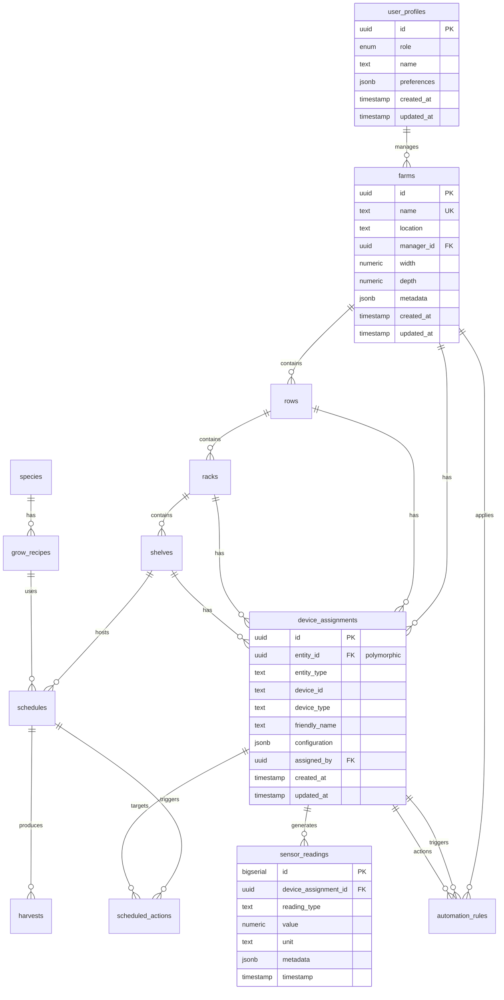

# Database Design

## Overview

The VerticalFarm OS database is built on PostgreSQL (via Supabase) and designed to support a multi-tenant vertical farming management system with real-time capabilities, comprehensive audit trails, and scalable performance. The schema follows best practices for relational database design while leveraging PostgreSQL's advanced features.

## Core Design Principles

### 1. **Multi-Tenant Isolation**
- Complete data isolation at the farm level
- Row Level Security (RLS) policies enforce access control
- No data leakage between tenants

### 2. **Hierarchical Data Model**
- Natural representation of physical farm structure
- Efficient querying of parent-child relationships
- Cascading operations where appropriate

### 3. **Audit & Traceability**
- All tables include `created_at` and `updated_at` timestamps
- Soft deletes for critical data
- Comprehensive activity logging

### 4. **Performance Optimization**
- Strategic indexing on foreign keys and query patterns
- JSONB for flexible, schema-less data
- Materialized views for complex aggregations

### 5. **Real-time Ready**
- Tables designed for Supabase Realtime subscriptions
- Optimized for frequent updates
- Efficient change detection

## Entity Relationship Diagram



## Schema Details

### Core Tables

#### `user_profiles`
Links to Supabase Auth and stores additional user information.

```sql
CREATE TABLE public.user_profiles (
    id UUID PRIMARY KEY REFERENCES auth.users(id) ON DELETE CASCADE,
    role user_role NOT NULL DEFAULT 'operator',
    name TEXT,
    organization TEXT,
    phone TEXT,
    preferences JSONB DEFAULT '{}',
    notification_settings JSONB DEFAULT '{"email": true, "sms": false, "push": true}',
    created_at TIMESTAMP WITH TIME ZONE DEFAULT NOW(),
    updated_at TIMESTAMP WITH TIME ZONE DEFAULT NOW()
);

-- Indexes
CREATE INDEX idx_user_profiles_role ON public.user_profiles(role);
CREATE INDEX idx_user_profiles_organization ON public.user_profiles(organization);

-- RLS Policies
ALTER TABLE public.user_profiles ENABLE ROW LEVEL SECURITY;

CREATE POLICY "Users can view own profile" 
    ON public.user_profiles FOR SELECT 
    USING (auth.uid() = id);

CREATE POLICY "Users can update own profile" 
    ON public.user_profiles FOR UPDATE 
    USING (auth.uid() = id);
```

#### `farms`
Top-level entity representing a vertical farm facility.

```sql
CREATE TABLE public.farms (
    id UUID PRIMARY KEY DEFAULT uuid_generate_v4(),
    name TEXT NOT NULL,
    location TEXT,
    manager_id UUID REFERENCES public.user_profiles(id) ON DELETE SET NULL,
    organization_id UUID REFERENCES public.organizations(id),
    
    -- Physical dimensions
    width NUMERIC,
    depth NUMERIC,
    height NUMERIC,
    unit_system TEXT DEFAULT 'metric', -- 'metric' or 'imperial'
    
    -- Configuration
    timezone TEXT DEFAULT 'UTC',
    currency TEXT DEFAULT 'USD',
    
    -- Metadata
    metadata JSONB DEFAULT '{}',
    tags TEXT[] DEFAULT '{}',
    
    -- Status
    status TEXT DEFAULT 'active', -- 'active', 'maintenance', 'inactive'
    commissioned_at TIMESTAMP WITH TIME ZONE,
    
    created_at TIMESTAMP WITH TIME ZONE DEFAULT NOW(),
    updated_at TIMESTAMP WITH TIME ZONE DEFAULT NOW(),
    
    CONSTRAINT farms_name_org_unique UNIQUE(name, organization_id)
);

-- Indexes
CREATE INDEX idx_farms_manager_id ON public.farms(manager_id);
CREATE INDEX idx_farms_organization_id ON public.farms(organization_id);
CREATE INDEX idx_farms_status ON public.farms(status);
CREATE INDEX idx_farms_tags ON public.farms USING GIN(tags);

-- RLS Policies
ALTER TABLE public.farms ENABLE ROW LEVEL SECURITY;

CREATE POLICY "Users see own farms" 
    ON public.farms FOR SELECT 
    USING (
        manager_id = auth.uid() 
        OR 
        id IN (
            SELECT farm_id FROM public.farm_members 
            WHERE user_id = auth.uid()
        )
    );
```

### Farm Hierarchy Tables

#### `rows`
Physical rows within a farm facility.

```sql
CREATE TABLE public.rows (
    id UUID PRIMARY KEY DEFAULT uuid_generate_v4(),
    farm_id UUID NOT NULL REFERENCES public.farms(id) ON DELETE CASCADE,
    name TEXT NOT NULL,
    position INTEGER NOT NULL,
    
    -- Physical layout
    position_x NUMERIC,
    position_y NUMERIC,
    length NUMERIC,
    width NUMERIC,
    orientation TEXT, -- 'horizontal', 'vertical', 'diagonal'
    
    -- Visual representation
    color TEXT,
    icon TEXT,
    
    metadata JSONB DEFAULT '{}',
    created_at TIMESTAMP WITH TIME ZONE DEFAULT NOW(),
    updated_at TIMESTAMP WITH TIME ZONE DEFAULT NOW(),
    
    CONSTRAINT rows_farm_name_unique UNIQUE(farm_id, name),
    CONSTRAINT rows_farm_position_unique UNIQUE(farm_id, position)
);

-- Indexes
CREATE INDEX idx_rows_farm_id ON public.rows(farm_id);
CREATE INDEX idx_rows_position ON public.rows(position);
```

#### `racks`
Vertical growing structures within rows.

```sql
CREATE TABLE public.racks (
    id UUID PRIMARY KEY DEFAULT uuid_generate_v4(),
    row_id UUID NOT NULL REFERENCES public.rows(id) ON DELETE CASCADE,
    name TEXT NOT NULL,
    position_in_row INTEGER NOT NULL,
    
    -- Physical specifications
    width NUMERIC,
    depth NUMERIC,
    height NUMERIC,
    max_shelves INTEGER,
    shelf_height NUMERIC, -- Default height between shelves
    
    -- Type and configuration
    rack_type TEXT, -- 'static', 'mobile', 'rotating'
    lighting_type TEXT, -- 'LED', 'fluorescent', 'HPS'
    irrigation_type TEXT, -- 'drip', 'ebb-flow', 'NFT'
    
    metadata JSONB DEFAULT '{}',
    created_at TIMESTAMP WITH TIME ZONE DEFAULT NOW(),
    updated_at TIMESTAMP WITH TIME ZONE DEFAULT NOW(),
    
    CONSTRAINT racks_row_name_unique UNIQUE(row_id, name),
    CONSTRAINT racks_row_position_unique UNIQUE(row_id, position_in_row)
);

-- Indexes
CREATE INDEX idx_racks_row_id ON public.racks(row_id);
CREATE INDEX idx_racks_rack_type ON public.racks(rack_type);
```

#### `shelves`
Individual growing levels within racks.

```sql
CREATE TABLE public.shelves (
    id UUID PRIMARY KEY DEFAULT uuid_generate_v4(),
    rack_id UUID NOT NULL REFERENCES public.racks(id) ON DELETE CASCADE,
    name TEXT NOT NULL,
    position_in_rack INTEGER NOT NULL,
    
    -- Physical specifications
    width NUMERIC,
    depth NUMERIC,
    usable_area NUMERIC, -- Actual growing area
    max_weight NUMERIC,
    
    -- Growing configuration
    grow_medium TEXT, -- 'soil', 'hydroponic', 'aeroponic'
    container_type TEXT, -- 'tray', 'pot', 'channel'
    container_count INTEGER,
    
    -- Current status
    status TEXT DEFAULT 'available', -- 'available', 'occupied', 'maintenance'
    
    metadata JSONB DEFAULT '{}',
    created_at TIMESTAMP WITH TIME ZONE DEFAULT NOW(),
    updated_at TIMESTAMP WITH TIME ZONE DEFAULT NOW(),
    
    CONSTRAINT shelves_rack_name_unique UNIQUE(rack_id, name),
    CONSTRAINT shelves_rack_position_unique UNIQUE(rack_id, position_in_rack)
);

-- Indexes
CREATE INDEX idx_shelves_rack_id ON public.shelves(rack_id);
CREATE INDEX idx_shelves_status ON public.shelves(status);
```

### Device Management

#### `device_assignments`
Flexible device assignment to any level of the farm hierarchy.

```sql
CREATE TABLE public.device_assignments (
    id UUID PRIMARY KEY DEFAULT uuid_generate_v4(),
    
    -- Polymorphic association (only one should be set)
    shelf_id UUID REFERENCES public.shelves(id) ON DELETE CASCADE,
    rack_id UUID REFERENCES public.racks(id) ON DELETE CASCADE,
    row_id UUID REFERENCES public.rows(id) ON DELETE CASCADE,
    farm_id UUID REFERENCES public.farms(id) ON DELETE CASCADE,
    
    -- Device identification
    entity_id TEXT NOT NULL, -- External device ID (e.g., Home Assistant entity)
    entity_type TEXT NOT NULL, -- 'sensor', 'switch', 'light', 'pump', 'fan'
    friendly_name TEXT,
    
    -- Device details
    manufacturer TEXT,
    model TEXT,
    serial_number TEXT,
    
    -- Configuration
    configuration JSONB DEFAULT '{}',
    calibration JSONB DEFAULT '{}',
    
    -- Assignment tracking
    assigned_by UUID REFERENCES public.user_profiles(id) ON DELETE SET NULL,
    assigned_at TIMESTAMP WITH TIME ZONE DEFAULT NOW(),
    
    -- Status
    status TEXT DEFAULT 'active', -- 'active', 'inactive', 'maintenance', 'error'
    last_seen TIMESTAMP WITH TIME ZONE,
    
    created_at TIMESTAMP WITH TIME ZONE DEFAULT NOW(),
    updated_at TIMESTAMP WITH TIME ZONE DEFAULT NOW(),
    
    -- Ensure device is assigned to exactly one level
    CONSTRAINT chk_device_assignment_level CHECK (
        (shelf_id IS NOT NULL)::int +
        (rack_id IS NOT NULL)::int +
        (row_id IS NOT NULL)::int +
        (farm_id IS NOT NULL)::int = 1
    )
);

-- Indexes
CREATE INDEX idx_device_assignments_shelf_id ON public.device_assignments(shelf_id);
CREATE INDEX idx_device_assignments_rack_id ON public.device_assignments(rack_id);
CREATE INDEX idx_device_assignments_row_id ON public.device_assignments(row_id);
CREATE INDEX idx_device_assignments_farm_id ON public.device_assignments(farm_id);
CREATE INDEX idx_device_assignments_entity_id ON public.device_assignments(entity_id);
CREATE INDEX idx_device_assignments_entity_type ON public.device_assignments(entity_type);
CREATE INDEX idx_device_assignments_status ON public.device_assignments(status);
```

### Sensor Data

#### `sensor_readings`
High-volume time-series data for sensor readings.

```sql
CREATE TABLE public.sensor_readings (
    id BIGSERIAL PRIMARY KEY,
    device_assignment_id UUID NOT NULL REFERENCES public.device_assignments(id) ON DELETE CASCADE,
    
    -- Reading data
    reading_type TEXT NOT NULL, -- 'temperature', 'humidity', 'ph', 'ec', 'co2', 'light'
    value NUMERIC NOT NULL,
    unit TEXT, -- 'celsius', 'fahrenheit', '%', 'ppm', 'lux'
    
    -- Quality indicators
    quality TEXT DEFAULT 'good', -- 'good', 'questionable', 'bad'
    raw_value NUMERIC, -- Original value before calibration
    
    -- Metadata
    metadata JSONB DEFAULT '{}',
    
    timestamp TIMESTAMP WITH TIME ZONE NOT NULL DEFAULT NOW()
);

-- Indexes for efficient querying
CREATE INDEX idx_sensor_readings_device_timestamp 
    ON public.sensor_readings(device_assignment_id, timestamp DESC);
CREATE INDEX idx_sensor_readings_timestamp 
    ON public.sensor_readings(timestamp DESC);
CREATE INDEX idx_sensor_readings_type_timestamp 
    ON public.sensor_readings(reading_type, timestamp DESC);

-- Partition by month for better performance (optional)
-- CREATE TABLE sensor_readings_2024_01 PARTITION OF sensor_readings
-- FOR VALUES FROM ('2024-01-01') TO ('2024-02-01');
```

### Growing Operations

#### `species`
Plant species catalog.

```sql
CREATE TABLE public.species (
    id UUID PRIMARY KEY DEFAULT uuid_generate_v4(),
    name TEXT NOT NULL UNIQUE,
    scientific_name TEXT,
    category TEXT, -- 'leafy_greens', 'herbs', 'vegetables', 'fruits'
    
    -- Growing characteristics
    grow_days_min INTEGER,
    grow_days_max INTEGER,
    difficulty TEXT, -- 'easy', 'medium', 'hard'
    
    -- Environmental preferences
    temp_min NUMERIC,
    temp_max NUMERIC,
    humidity_min NUMERIC,
    humidity_max NUMERIC,
    ph_min NUMERIC,
    ph_max NUMERIC,
    ec_min NUMERIC,
    ec_max NUMERIC,
    
    -- Light requirements
    light_hours_min NUMERIC,
    light_hours_max NUMERIC,
    light_intensity_min NUMERIC, -- in PPFD
    light_intensity_max NUMERIC,
    
    -- Yield expectations
    yield_per_sqm_min NUMERIC,
    yield_per_sqm_max NUMERIC,
    yield_unit TEXT,
    
    metadata JSONB DEFAULT '{}',
    created_at TIMESTAMP WITH TIME ZONE DEFAULT NOW(),
    updated_at TIMESTAMP WITH TIME ZONE DEFAULT NOW()
);

-- Indexes
CREATE INDEX idx_species_category ON public.species(category);
CREATE INDEX idx_species_name_trgm ON public.species USING gin(name gin_trgm_ops);
```

#### `grow_recipes`
Detailed growing protocols for species.

```sql
CREATE TABLE public.grow_recipes (
    id UUID PRIMARY KEY DEFAULT uuid_generate_v4(),
    species_id UUID NOT NULL REFERENCES public.species(id) ON DELETE RESTRICT,
    name TEXT NOT NULL,
    description TEXT,
    
    -- Growing timeline
    grow_days INTEGER,
    germination_days INTEGER,
    vegetative_days INTEGER,
    flowering_days INTEGER,
    
    -- Environmental parameters
    stages JSONB, -- Array of growth stages with specific parameters
    
    -- Standard parameters (for simple recipes)
    light_hours_per_day NUMERIC,
    light_intensity NUMERIC,
    day_temperature NUMERIC,
    night_temperature NUMERIC,
    humidity NUMERIC,
    co2_ppm NUMERIC,
    
    -- Irrigation
    watering_frequency_hours NUMERIC,
    water_amount_ml NUMERIC,
    nutrient_recipe JSONB,
    
    -- Expected results
    expected_yield NUMERIC,
    expected_quality TEXT,
    
    -- Recipe metadata
    author TEXT,
    source TEXT,
    verified BOOLEAN DEFAULT FALSE,
    success_rate NUMERIC,
    
    custom_parameters JSONB DEFAULT '{}',
    created_at TIMESTAMP WITH TIME ZONE DEFAULT NOW(),
    updated_at TIMESTAMP WITH TIME ZONE DEFAULT NOW(),
    
    CONSTRAINT grow_recipes_species_name_unique UNIQUE(species_id, name)
);

-- Indexes
CREATE INDEX idx_grow_recipes_species_id ON public.grow_recipes(species_id);
CREATE INDEX idx_grow_recipes_verified ON public.grow_recipes(verified);
```

#### `schedules`
Active growing schedules on shelves.

```sql
CREATE TABLE public.schedules (
    id UUID PRIMARY KEY DEFAULT uuid_generate_v4(),
    shelf_id UUID NOT NULL REFERENCES public.shelves(id) ON DELETE CASCADE,
    grow_recipe_id UUID NOT NULL REFERENCES public.grow_recipes(id) ON DELETE RESTRICT,
    
    -- Timeline
    start_date TIMESTAMP WITH TIME ZONE NOT NULL,
    estimated_end_date TIMESTAMP WITH TIME ZONE,
    actual_end_date TIMESTAMP WITH TIME ZONE,
    
    -- Status tracking
    status schedule_status NOT NULL DEFAULT 'planned',
    current_stage TEXT,
    days_elapsed INTEGER GENERATED ALWAYS AS (
        EXTRACT(EPOCH FROM (COALESCE(actual_end_date, NOW()) - start_date)) / 86400
    ) STORED,
    
    -- Batch information
    batch_code TEXT,
    seed_lot TEXT,
    plant_count INTEGER,
    
    -- Performance tracking
    germination_rate NUMERIC,
    survival_rate NUMERIC,
    growth_rate_factor NUMERIC DEFAULT 1.0, -- Actual vs expected growth rate
    
    notes TEXT,
    metadata JSONB DEFAULT '{}',
    created_at TIMESTAMP WITH TIME ZONE DEFAULT NOW(),
    updated_at TIMESTAMP WITH TIME ZONE DEFAULT NOW()
);

-- Indexes
CREATE INDEX idx_schedules_shelf_id ON public.schedules(shelf_id);
CREATE INDEX idx_schedules_grow_recipe_id ON public.schedules(grow_recipe_id);
CREATE INDEX idx_schedules_status ON public.schedules(status);
CREATE INDEX idx_schedules_start_date ON public.schedules(start_date);
CREATE INDEX idx_schedules_batch_code ON public.schedules(batch_code);
```

### Automation

#### `automation_rules`
Conditional automation rules for farm operations.

```sql
CREATE TABLE public.automation_rules (
    id UUID PRIMARY KEY DEFAULT uuid_generate_v4(),
    name TEXT NOT NULL,
    description TEXT,
    
    -- Scope
    farm_id UUID REFERENCES public.farms(id) ON DELETE CASCADE,
    applies_to TEXT, -- 'farm', 'row', 'rack', 'shelf'
    target_ids UUID[], -- Specific IDs if not farm-wide
    
    -- Trigger configuration
    trigger_type TEXT NOT NULL, -- 'sensor', 'schedule', 'manual', 'cascade'
    trigger_source_device_id UUID REFERENCES public.device_assignments(id),
    trigger_conditions JSONB, -- Complex condition logic
    
    -- Simple triggers (for backward compatibility)
    trigger_reading_type TEXT,
    trigger_operator TEXT, -- '>', '<', '=', '>=', '<=', '!='
    trigger_value NUMERIC,
    
    -- Action configuration
    action_type TEXT NOT NULL, -- 'device_control', 'notification', 'log', 'cascade'
    action_target_device_id UUID REFERENCES public.device_assignments(id),
    action_parameters JSONB,
    
    -- Execution control
    cooldown_minutes INTEGER DEFAULT 5, -- Minimum time between executions
    max_executions_per_day INTEGER,
    
    -- Scheduling
    active_hours JSONB, -- Time windows when rule is active
    active_days INTEGER[], -- Days of week (1-7)
    
    -- Status
    is_active BOOLEAN DEFAULT TRUE,
    last_triggered TIMESTAMP WITH TIME ZONE,
    trigger_count INTEGER DEFAULT 0,
    
    created_by UUID REFERENCES public.user_profiles(id),
    created_at TIMESTAMP WITH TIME ZONE DEFAULT NOW(),
    updated_at TIMESTAMP WITH TIME ZONE DEFAULT NOW(),
    
    CONSTRAINT automation_rules_farm_name_unique UNIQUE(farm_id, name)
);

-- Indexes
CREATE INDEX idx_automation_rules_farm_id ON public.automation_rules(farm_id);
CREATE INDEX idx_automation_rules_is_active ON public.automation_rules(is_active);
CREATE INDEX idx_automation_rules_trigger_type ON public.automation_rules(trigger_type);
CREATE INDEX idx_automation_rules_trigger_source ON public.automation_rules(trigger_source_device_id);
```

#### `scheduled_actions`
Pre-scheduled or triggered actions for devices.

```sql
CREATE TABLE public.scheduled_actions (
    id UUID PRIMARY KEY DEFAULT uuid_generate_v4(),
    
    -- Source of action
    schedule_id UUID REFERENCES public.schedules(id) ON DELETE CASCADE,
    automation_rule_id UUID REFERENCES public.automation_rules(id) ON DELETE CASCADE,
    manual_trigger_by UUID REFERENCES public.user_profiles(id),
    
    -- Target device
    device_assignment_id UUID REFERENCES public.device_assignments(id) ON DELETE CASCADE,
    
    -- Action details
    action_type action_type NOT NULL,
    parameters JSONB DEFAULT '{}',
    
    -- Scheduling
    execution_time TIMESTAMP WITH TIME ZONE NOT NULL,
    execution_window_minutes INTEGER DEFAULT 5, -- Acceptable delay
    
    -- Execution tracking
    status action_status NOT NULL DEFAULT 'pending',
    executed_at TIMESTAMP WITH TIME ZONE,
    execution_duration_ms INTEGER,
    
    -- Retry logic
    retry_count INTEGER DEFAULT 0,
    max_retries INTEGER DEFAULT 3,
    next_retry_at TIMESTAMP WITH TIME ZONE,
    
    -- Error handling
    error_message TEXT,
    error_details JSONB,
    
    created_at TIMESTAMP WITH TIME ZONE DEFAULT NOW(),
    updated_at TIMESTAMP WITH TIME ZONE DEFAULT NOW()
);

-- Indexes
CREATE INDEX idx_scheduled_actions_schedule_id ON public.scheduled_actions(schedule_id);
CREATE INDEX idx_scheduled_actions_device_assignment_id ON public.scheduled_actions(device_assignment_id);
CREATE INDEX idx_scheduled_actions_execution_time ON public.scheduled_actions(execution_time);
CREATE INDEX idx_scheduled_actions_status ON public.scheduled_actions(status);
CREATE INDEX idx_scheduled_actions_next_retry ON public.scheduled_actions(next_retry_at) 
    WHERE status = 'pending' AND next_retry_at IS NOT NULL;
```

### Analytics & Reporting

#### `harvests`
Harvest records for yield tracking.

```sql
CREATE TABLE public.harvests (
    id UUID PRIMARY KEY DEFAULT uuid_generate_v4(),
    schedule_id UUID NOT NULL REFERENCES public.schedules(id) ON DELETE RESTRICT,
    shelf_id UUID NOT NULL REFERENCES public.shelves(id) ON DELETE RESTRICT,
    
    -- Harvest data
    harvest_date TIMESTAMP WITH TIME ZONE NOT NULL DEFAULT NOW(),
    harvest_type TEXT, -- 'final', 'partial', 'thinning'
    
    -- Yield data
    fresh_weight NUMERIC NOT NULL,
    dry_weight NUMERIC,
    marketable_weight NUMERIC,
    waste_weight NUMERIC,
    weight_unit TEXT NOT NULL DEFAULT 'grams',
    
    -- Quality metrics
    quality_grade TEXT, -- 'A', 'B', 'C', 'reject'
    brix_level NUMERIC,
    color_score NUMERIC,
    size_uniformity NUMERIC,
    defect_rate NUMERIC,
    
    -- Economic data
    market_price_per_unit NUMERIC,
    total_value NUMERIC,
    currency TEXT DEFAULT 'USD',
    
    -- Labor tracking
    harvest_duration_minutes INTEGER,
    harvester_count INTEGER,
    labor_cost NUMERIC,
    
    notes TEXT,
    photos JSONB, -- Array of photo URLs
    metadata JSONB DEFAULT '{}',
    
    created_by UUID REFERENCES public.user_profiles(id),
    created_at TIMESTAMP WITH TIME ZONE DEFAULT NOW(),
    updated_at TIMESTAMP WITH TIME ZONE DEFAULT NOW()
);

-- Indexes
CREATE INDEX idx_harvests_schedule_id ON public.harvests(schedule_id);
CREATE INDEX idx_harvests_shelf_id ON public.harvests(shelf_id);
CREATE INDEX idx_harvests_harvest_date ON public.harvests(harvest_date);
CREATE INDEX idx_harvests_quality_grade ON public.harvests(quality_grade);
```

## Advanced Features

### Row Level Security (RLS)

```sql
-- Enable RLS on all tables
ALTER TABLE public.farms ENABLE ROW LEVEL SECURITY;
ALTER TABLE public.rows ENABLE ROW LEVEL SECURITY;
ALTER TABLE public.racks ENABLE ROW LEVEL SECURITY;
ALTER TABLE public.shelves ENABLE ROW LEVEL SECURITY;

-- Farm-level isolation policy
CREATE POLICY "farm_isolation" ON public.rows
    FOR ALL
    USING (
        farm_id IN (
            SELECT id FROM public.farms
            WHERE manager_id = auth.uid()
            OR id IN (
                SELECT farm_id FROM public.farm_members
                WHERE user_id = auth.uid()
            )
        )
    );

-- Cascade the policy pattern to child tables
CREATE POLICY "rack_isolation" ON public.racks
    FOR ALL
    USING (
        row_id IN (
            SELECT id FROM public.rows
            WHERE farm_id IN (
                SELECT id FROM public.farms
                WHERE manager_id = auth.uid()
                OR id IN (
                    SELECT farm_id FROM public.farm_members
                    WHERE user_id = auth.uid()
                )
            )
        )
    );
```

### Database Functions

```sql
-- Function to calculate farm health score
CREATE OR REPLACE FUNCTION calculate_farm_health_score(p_farm_id UUID)
RETURNS NUMERIC AS $$
DECLARE
    v_score NUMERIC := 100;
    v_active_alerts INTEGER;
    v_device_offline INTEGER;
    v_schedule_delays INTEGER;
BEGIN
    -- Count active alerts
    SELECT COUNT(*) INTO v_active_alerts
    FROM alerts
    WHERE farm_id = p_farm_id
    AND status = 'active';
    
    -- Count offline devices
    SELECT COUNT(*) INTO v_device_offline
    FROM device_assignments
    WHERE farm_id = p_farm_id
    AND last_seen < NOW() - INTERVAL '1 hour';
    
    -- Count delayed schedules
    SELECT COUNT(*) INTO v_schedule_delays
    FROM schedules s
    JOIN shelves sh ON s.shelf_id = sh.id
    JOIN racks r ON sh.rack_id = r.id
    JOIN rows ro ON r.row_id = ro.id
    WHERE ro.farm_id = p_farm_id
    AND s.status = 'active'
    AND s.estimated_end_date < NOW();
    
    -- Calculate score
    v_score := v_score - (v_active_alerts * 5);
    v_score := v_score - (v_device_offline * 3);
    v_score := v_score - (v_schedule_delays * 2);
    
    RETURN GREATEST(0, v_score);
END;
$$ LANGUAGE plpgsql;

-- Function to get latest sensor readings for a shelf
CREATE OR REPLACE FUNCTION get_latest_shelf_sensors(p_shelf_id UUID)
RETURNS TABLE (
    reading_type TEXT,
    value NUMERIC,
    unit TEXT,
    timestamp TIMESTAMP WITH TIME ZONE
) AS $$
BEGIN
    RETURN QUERY
    WITH latest_readings AS (
        SELECT 
            sr.reading_type,
            sr.value,
            sr.unit,
            sr.timestamp,
            ROW_NUMBER() OVER (PARTITION BY sr.reading_type ORDER BY sr.timestamp DESC) as rn
        FROM sensor_readings sr
        JOIN device_assignments da ON sr.device_assignment_id = da.id
        WHERE da.shelf_id = p_shelf_id
        AND sr.timestamp > NOW() - INTERVAL '1 hour'
    )
    SELECT 
        lr.reading_type,
        lr.value,
        lr.unit,
        lr.timestamp
    FROM latest_readings lr
    WHERE lr.rn = 1;
END;
$$ LANGUAGE plpgsql;
```

### Triggers

```sql
-- Update timestamp trigger
CREATE OR REPLACE FUNCTION update_updated_at_column()
RETURNS TRIGGER AS $$
BEGIN
    NEW.updated_at = NOW();
    RETURN NEW;
END;
$$ LANGUAGE plpgsql;

-- Apply to all tables
CREATE TRIGGER update_farms_updated_at BEFORE UPDATE ON public.farms
    FOR EACH ROW EXECUTE FUNCTION update_updated_at_column();

CREATE TRIGGER update_rows_updated_at BEFORE UPDATE ON public.rows
    FOR EACH ROW EXECUTE FUNCTION update_updated_at_column();

-- Add more triggers for other tables...

-- Shelf status update trigger
CREATE OR REPLACE FUNCTION update_shelf_status()
RETURNS TRIGGER AS $$
BEGIN
    IF TG_OP = 'INSERT' THEN
        -- Mark shelf as occupied when schedule starts
        UPDATE shelves 
        SET status = 'occupied'
        WHERE id = NEW.shelf_id;
    ELSIF TG_OP = 'UPDATE' THEN
        -- Mark shelf as available when schedule completes
        IF NEW.status = 'completed' AND OLD.status != 'completed' THEN
            UPDATE shelves 
            SET status = 'available'
            WHERE id = NEW.shelf_id;
        END IF;
    END IF;
    RETURN NEW;
END;
$$ LANGUAGE plpgsql;

CREATE TRIGGER update_shelf_on_schedule
    AFTER INSERT OR UPDATE ON public.schedules
    FOR EACH ROW EXECUTE FUNCTION update_shelf_status();
```

### Materialized Views

```sql
-- Farm statistics view
CREATE MATERIALIZED VIEW farm_statistics AS
SELECT 
    f.id as farm_id,
    f.name as farm_name,
    COUNT(DISTINCT r.id) as row_count,
    COUNT(DISTINCT ra.id) as rack_count,
    COUNT(DISTINCT s.id) as shelf_count,
    COUNT(DISTINCT da.id) as device_count,
    COUNT(DISTINCT CASE WHEN sc.status = 'active' THEN sc.id END) as active_schedules,
    AVG(h.marketable_weight) as avg_yield,
    SUM(h.total_value) as total_revenue
FROM farms f
LEFT JOIN rows r ON f.id = r.farm_id
LEFT JOIN racks ra ON r.id = ra.row_id
LEFT JOIN shelves s ON ra.id = s.rack_id
LEFT JOIN device_assignments da ON f.id = da.farm_id
LEFT JOIN schedules sc ON s.id = sc.shelf_id
LEFT JOIN harvests h ON sc.id = h.schedule_id
GROUP BY f.id, f.name;

-- Refresh periodically
CREATE INDEX idx_farm_statistics_farm_id ON farm_statistics(farm_id);

-- Sensor aggregates view
CREATE MATERIALIZED VIEW hourly_sensor_aggregates AS
SELECT 
    device_assignment_id,
    reading_type,
    DATE_TRUNC('hour', timestamp) as hour,
    AVG(value) as avg_value,
    MIN(value) as min_value,
    MAX(value) as max_value,
    COUNT(*) as reading_count
FROM sensor_readings
WHERE timestamp > NOW() - INTERVAL '7 days'
GROUP BY device_assignment_id, reading_type, DATE_TRUNC('hour', timestamp);

CREATE INDEX idx_hourly_sensor_device_hour 
    ON hourly_sensor_aggregates(device_assignment_id, hour);
```

## Performance Optimization

### Indexing Strategy

```sql
-- Composite indexes for common query patterns
CREATE INDEX idx_sensor_readings_device_type_time 
    ON sensor_readings(device_assignment_id, reading_type, timestamp DESC);

CREATE INDEX idx_schedules_shelf_status_date 
    ON schedules(shelf_id, status, start_date);

CREATE INDEX idx_device_assignments_farm_type_status 
    ON device_assignments(farm_id, entity_type, status);

-- Partial indexes for filtered queries
CREATE INDEX idx_active_schedules 
    ON schedules(shelf_id, start_date) 
    WHERE status = 'active';

CREATE INDEX idx_pending_actions 
    ON scheduled_actions(execution_time) 
    WHERE status = 'pending';

-- Text search indexes
CREATE EXTENSION IF NOT EXISTS pg_trgm;

CREATE INDEX idx_farms_name_search 
    ON farms USING gin(name gin_trgm_ops);

CREATE INDEX idx_species_name_search 
    ON species USING gin(name gin_trgm_ops);
```

### Partitioning Strategy

```sql
-- Partition sensor_readings by month
CREATE TABLE sensor_readings_2024_01 
    PARTITION OF sensor_readings
    FOR VALUES FROM ('2024-01-01') TO ('2024-02-01');

CREATE TABLE sensor_readings_2024_02 
    PARTITION OF sensor_readings
    FOR VALUES FROM ('2024-02-01') TO ('2024-03-01');

-- Automated partition creation
CREATE OR REPLACE FUNCTION create_monthly_partition()
RETURNS void AS $$
DECLARE
    partition_date DATE;
    partition_name TEXT;
    start_date DATE;
    end_date DATE;
BEGIN
    partition_date := DATE_TRUNC('month', NOW() + INTERVAL '1 month');
    partition_name := 'sensor_readings_' || TO_CHAR(partition_date, 'YYYY_MM');
    start_date := partition_date;
    end_date := partition_date + INTERVAL '1 month';
    
    EXECUTE format('CREATE TABLE IF NOT EXISTS %I PARTITION OF sensor_readings FOR VALUES FROM (%L) TO (%L)',
        partition_name, start_date, end_date);
END;
$$ LANGUAGE plpgsql;

-- Schedule monthly execution
-- Run this function via pg_cron or external scheduler
```

## Migration Strategy

### Version Control

```sql
-- Migration tracking table
CREATE TABLE IF NOT EXISTS schema_migrations (
    version TEXT PRIMARY KEY,
    applied_at TIMESTAMP WITH TIME ZONE DEFAULT NOW(),
    applied_by TEXT DEFAULT current_user
);

-- Example migration
BEGIN;

-- Check if migration already applied
DO $$
BEGIN
    IF NOT EXISTS (SELECT 1 FROM schema_migrations WHERE version = '001_initial_schema') THEN
        -- Run migration
        CREATE TABLE public.farms (...);
        -- ... more DDL
        
        -- Record migration
        INSERT INTO schema_migrations (version) VALUES ('001_initial_schema');
    END IF;
END $$;

COMMIT;
```

### Backup Strategy

```sql
-- Regular backup via pg_dump
-- pg_dump -h localhost -U postgres -d verticalfarm -f backup_$(date +%Y%m%d).sql

-- Point-in-time recovery setup
-- Enable in postgresql.conf:
-- wal_level = replica
-- archive_mode = on
-- archive_command = 'cp %p /backup/archive/%f'

-- Logical replication for real-time backup
CREATE PUBLICATION verticalfarm_pub FOR ALL TABLES;
```

## Security Considerations

### Data Encryption

```sql
-- Encrypt sensitive columns
CREATE EXTENSION IF NOT EXISTS pgcrypto;

-- Example: Encrypt API keys
ALTER TABLE integrations 
    ADD COLUMN api_key_encrypted BYTEA;

UPDATE integrations 
    SET api_key_encrypted = pgp_sym_encrypt(api_key, 'encryption_key');

-- Decrypt when needed
SELECT pgp_sym_decrypt(api_key_encrypted, 'encryption_key') as api_key
FROM integrations;
```

### Audit Logging

```sql
-- Audit log table
CREATE TABLE audit_log (
    id BIGSERIAL PRIMARY KEY,
    table_name TEXT NOT NULL,
    operation TEXT NOT NULL,
    user_id UUID,
    record_id UUID,
    old_data JSONB,
    new_data JSONB,
    timestamp TIMESTAMP WITH TIME ZONE DEFAULT NOW()
);

-- Generic audit trigger
CREATE OR REPLACE FUNCTION audit_trigger()
RETURNS TRIGGER AS $$
BEGIN
    INSERT INTO audit_log (table_name, operation, user_id, record_id, old_data, new_data)
    VALUES (
        TG_TABLE_NAME,
        TG_OP,
        auth.uid(),
        COALESCE(NEW.id, OLD.id),
        to_jsonb(OLD),
        to_jsonb(NEW)
    );
    RETURN NEW;
END;
$$ LANGUAGE plpgsql;

-- Apply to sensitive tables
CREATE TRIGGER audit_farms 
    AFTER INSERT OR UPDATE OR DELETE ON farms
    FOR EACH ROW EXECUTE FUNCTION audit_trigger();
```

## Summary

The database design provides:
- **Scalability** through partitioning and indexing
- **Performance** via materialized views and optimized queries
- **Security** with RLS and encryption
- **Flexibility** using JSONB for extensible data
- **Reliability** through constraints and triggers
- **Maintainability** with clear structure and documentation

This schema supports all current requirements while allowing for future expansion and optimization.

---

*For database-specific questions or schema changes, consult the database team or submit migration proposals for review.*